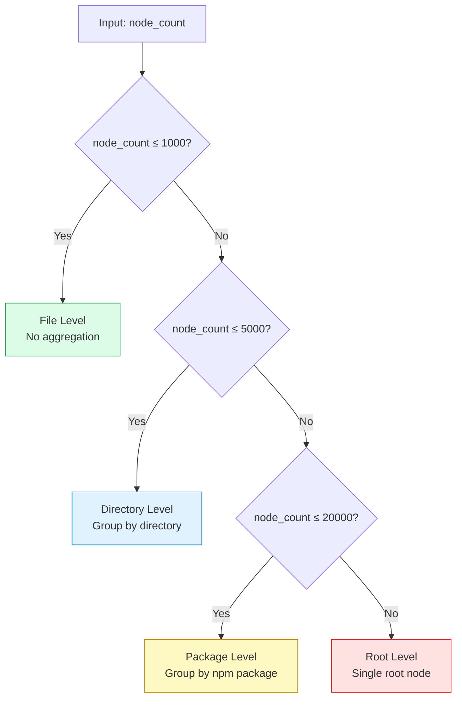
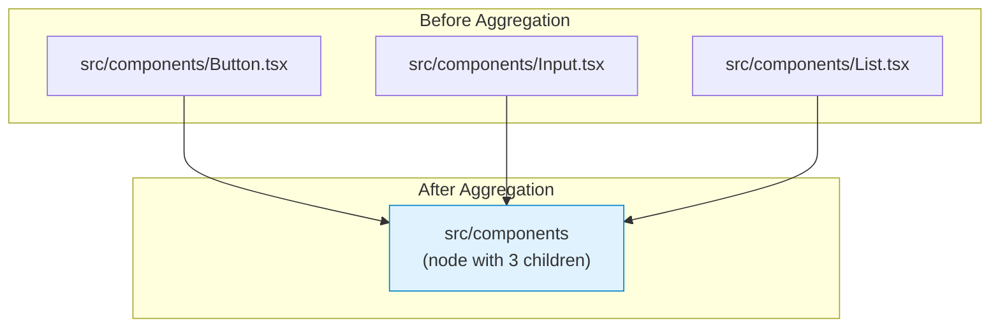
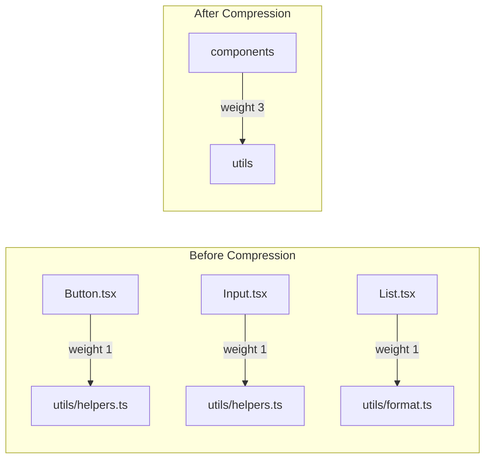
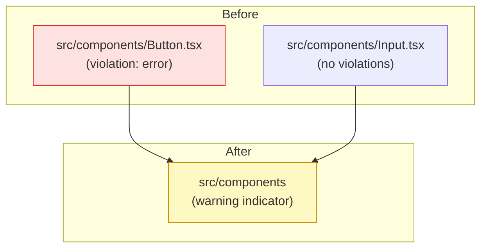
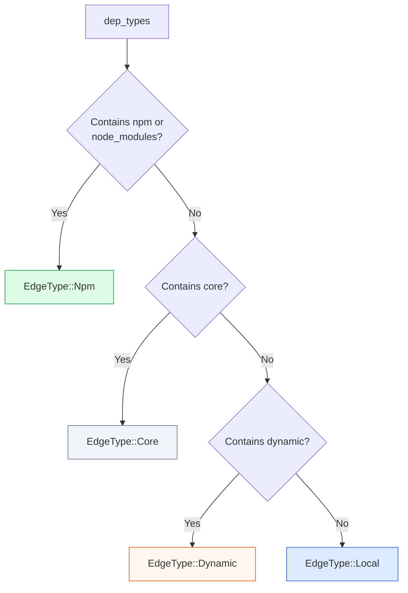
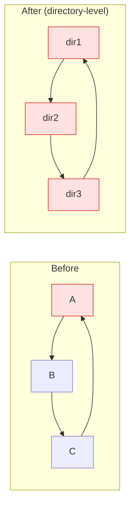

# Aggregation Strategy

## Overview

The Rust preprocessing engine automatically aggregates nodes based on count thresholds to handle large projects (100k+ nodes) without performance degradation.

## Aggregation Level Selection



| Level | Description | Node Count Range |
|-------|-------------|-------------------|
| `file` | No aggregation, show all files | ≤ 1000 |
| `directory` | Group by parent directory | 1001 - 5000 |
| `package` | Group by npm package | 5001 - 20000 |
| `root` | Single root node | > 20000 |

## Selection Logic

```rust
fn select_aggregation_level(node_count: usize) -> AggregationLevel {
    match node_count {
        0..=1000    => AggregationLevel::File,
        1001..=5000  => AggregationLevel::Directory,
        5001..=20000 => AggregationLevel::Package,
        _           => AggregationLevel::Root,
    }
}
```

## Aggregation Rules

### Directory Aggregation

Multiple files are merged into a directory node:



### Edge Compression

File-to-file edges become directory-to-directory edges:



**Edge type is determined by majority vote.**

### Violation Inheritance

When a child node has violations, the parent node displays a warning indicator:



## Edge Type Detection



| Edge Type | Description | Color (UI) |
|-----------|-------------|------------|
| `local` | Project internal dependency | Blue |
| `npm` | External npm package | Green |
| `core` | Node.js built-in module | Gray |
| `dynamic` | Dynamic import (`import()`) | Orange |

## Circular Dependencies

Circular dependencies are preserved at aggregation boundaries:



The `children` array in each node allows drilling down to inspect the actual cycle.

## Performance Characteristics

| Nodes | Aggregation Level | Output Size | Load Time |
|-------|------------------|-------------|-----------|
| 100 | file | ~100 nodes | <100ms |
| 5,000 | directory | ~500 nodes | <500ms |
| 20,000 | package | ~100 nodes | <1s |
| 100,000 | root | 1 node | <3s |