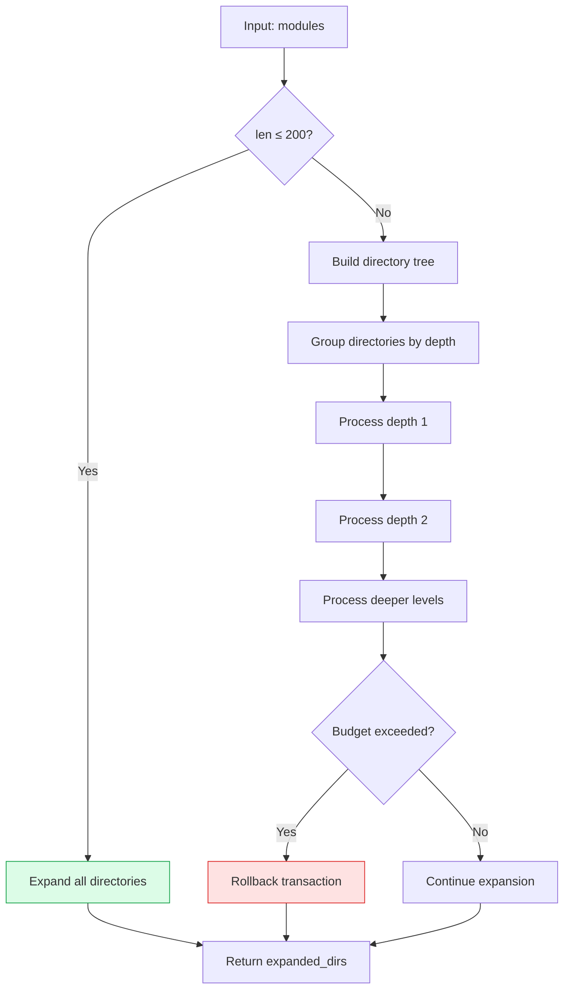
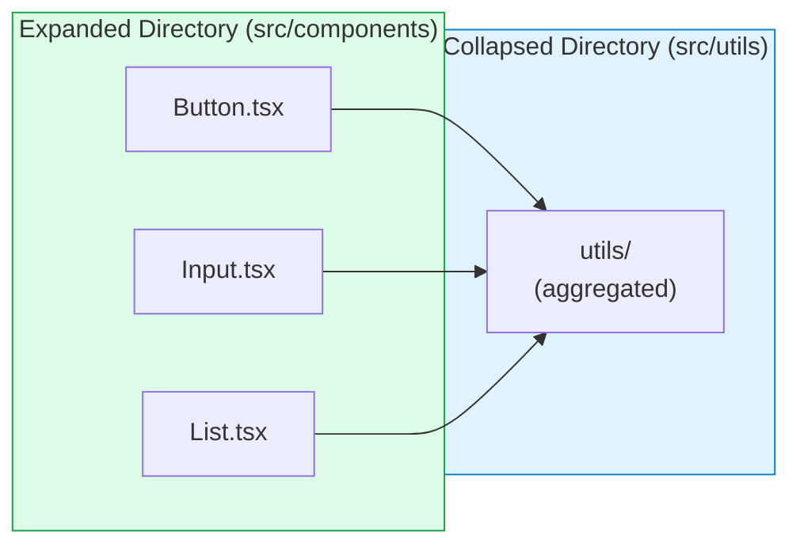
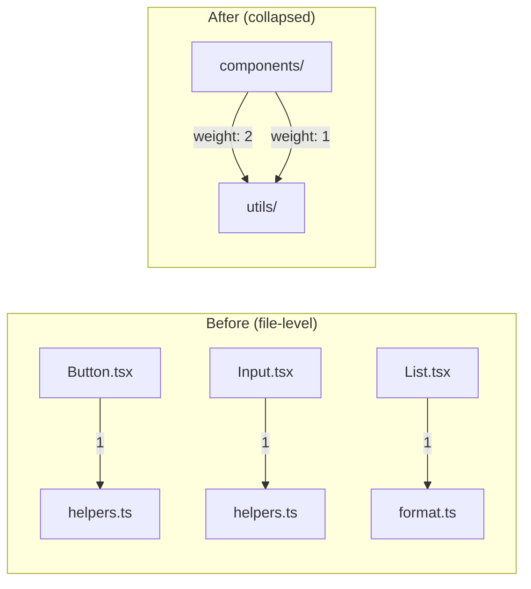
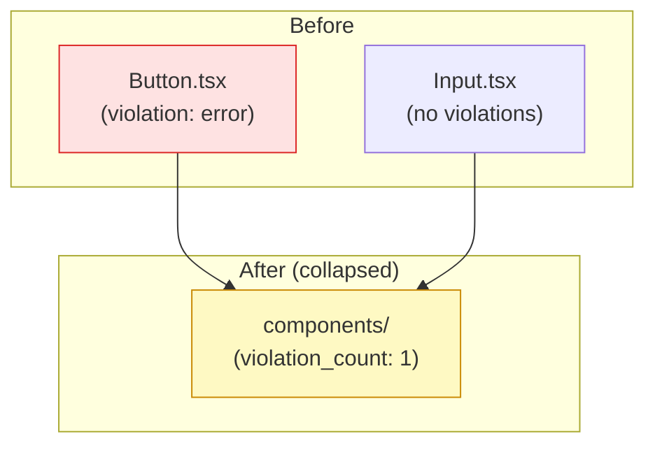
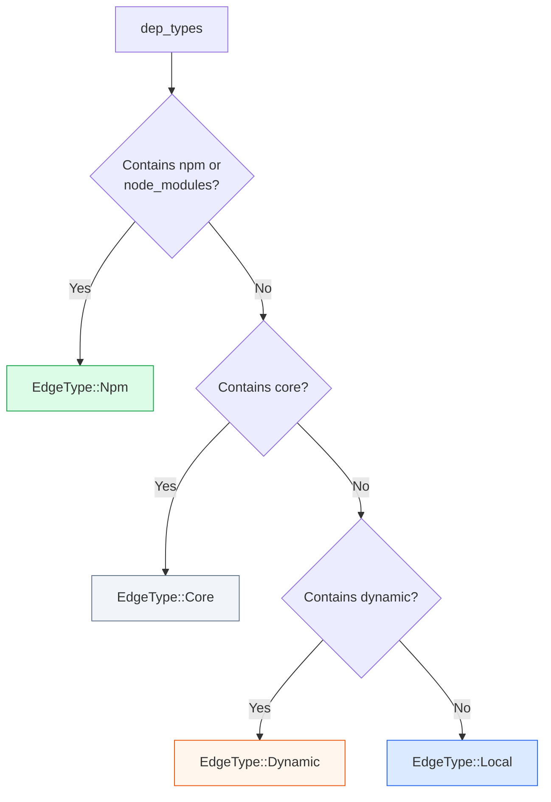
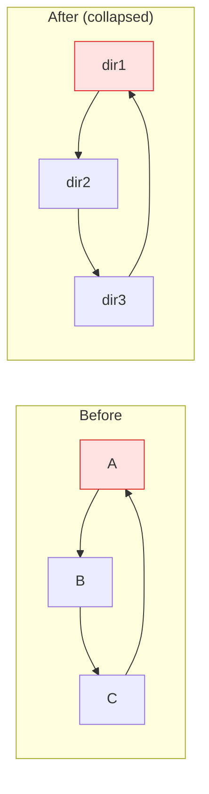

# Aggregation Strategy

## Overview

The Rust preprocessing engine uses hybrid aggregation: some directories show file-level nodes while others are collapsed to directory nodes. This is controlled by the `expanded_dirs` parameter, which can be explicitly provided or auto-computed.

## Auto-Expansion Algorithm

When `expanded_dirs` is not provided, the `compute_auto_expanded_dirs` function uses a budget algorithm:

```mermaid
flowchart TD
    Start[Input: modules] --> Check{len ≤ 200?}
    Check -->|Yes| All[Expand all directories]
    Check -->|No| Build[Build directory tree]
    Build --> Group[Group directories by depth]
    Group --> Level1[Process depth 1]
    Level1 --> Level2[Process depth 2]
    Level2 --> More[Process deeper levels]
    More --> Budget{Budget exceeded?}
    Budget -->|Yes| Rollback[Rollback transaction]
    Budget -->|No| Continue[Continue expansion]
    All --> Result[Return expanded_dirs]
    Rollback --> Result
    Continue --> Result

    style All fill:#dcfce7,stroke:#16a34a
    style Rollback fill:#fee2e2,stroke:#dc2626
```

### Key Parameters

| Parameter | Value | Purpose |
|-----------|-------|---------|
| `TARGET_NODE_BUDGET` | 200 | Target max nodes in output |
| `MAX_DIRECT_CHILDREN` | 50 | Max children before refusing expansion |

### Level-by-Level Processing

1. Directories processed by depth (depth 1 first, then depth 2, etc.)
2. Within each level, directories with more violations prioritized
3. Each level is a "transaction" — if budget exceeded, rollback the level
4. Directories with >50 direct children are skipped

## Hybrid Aggregation

The `build_hybrid_nodes` function creates a graph where:

- Directories in `expanded_dirs`: Show individual files as nodes
- Directories not in `expanded_dirs`: Show as single directory nodes

```mermaid
flowchart LR
    subgraph Expanded["Expanded Directory (src/components)"]
        F1[Button.tsx]
        F2[Input.tsx]
        F3[List.tsx]
    end

    subgraph Collapsed["Collapsed Directory (src/utils)"]
        Dir["utils/\n(aggregated)"]
    end

    F1 --> Dir
    F2 --> Dir
    F3 --> Dir

    style Expanded fill:#dcfce7,stroke:#16a34a
    style Collapsed fill:#e0f2fe,stroke:#0284c7
```

## Combo Generation

Combos (visual containers for G6) are generated with these rules:

1. **Combo ID format**: `combo:` prefix (e.g., `combo:src/components`)
2. **Single-child collapse**: A combo with only one child is collapsed — the child moves to the parent combo
3. **Hierarchy**: Combos can nest via the `combo` field

The aggregation level is derived from the expanded set:
- All modules expanded → `file` level
- Some directories expanded → `directory` level
- No directories expanded → `package` level

## Edge Aggregation

When files are collapsed into directories, edges are merged:

```mermaid
flowchart LR
    subgraph Before["Before (file-level)"]
        B1[Button.tsx] -->|1| H1[helpers.ts]
        I1[Input.tsx] -->|1| H2[helpers.ts]
        L1[List.tsx] -->|1| F1[format.ts]
    end

    subgraph After["After (collapsed)"]
        Comp[components/] -->|weight: 2| Utils[utils/]
        Comp -->|weight: 1| Utils
    end
```

**Edge properties:**
- `weight`: Count of merged edges
- `circular`: Set if any merged edge was circular
- `edge_type`: Majority vote from merged edges

## Performance Characteristics

| Nodes | Expanded Dirs | Output Size | Load Time |
|-------|--------------|-------------|-----------|
| 100 | all | ~100 nodes | <100ms |
| 5,000 | ~200 nodes worth | ~200 nodes | <500ms |
| 20,000 | top-level only | ~50 nodes | <1s |
| 100,000 | package-level | ~20 nodes | <3s |

## Violation Display

Violations are counted per module and aggregated:

```mermaid
flowchart TB
    subgraph Before["Before"]
        V1["Button.tsx\n(violation: error)"]
        V2["Input.tsx\n(no violations)"]
    end

    subgraph After["After (collapsed)"]
        Parent["components/\n(violation_count: 1)"]
    end

    V1 --> Parent
    V2 --> Parent

    style V1 fill:#fee2e2,stroke:#dc2626
    style Parent fill:#fef9c3,stroke:#ca8a04
```

The `violation_count` field accumulates from all child modules.

## Edge Type Detection

```mermaid
flowchart TD
    Start[dep_types] --> Npm{Contains npm or\nnode_modules?}
    Npm -->|Yes| NpmType[EdgeType::Npm]
    Npm -->|No| Core{Contains core?}
    Core -->|Yes| CoreType[EdgeType::Core]
    Core -->|No| Dynamic{Contains dynamic?}
    Dynamic -->|Yes| DynamicType[EdgeType::Dynamic]
    Dynamic -->|No| LocalType[EdgeType::Local]

    style NpmType fill:#dcfce7,stroke:#16a34a
    style CoreType fill:#f1f5f9,stroke:#64748b
    style DynamicType fill:#fff7ed,stroke:#ea580c
    style LocalType fill:#dbeafe,stroke:#2563eb
```

| Edge Type | Description | Color (UI) |
|-----------|-------------|------------|
| `local` | Project internal dependency | Blue |
| `npm` | External npm package | Green |
| `core` | Node.js built-in module | Gray |
| `dynamic` | Dynamic import (`import()`) | Orange |

## Circular Dependencies

Circular dependencies are marked with the `circular` field on edges:

```mermaid
flowchart LR
    subgraph Before["Before"]
        A --> B --> C --> A
    end

    subgraph After["After (collapsed)"]
        D1[dir1] --> D2[dir2] --> D3[dir3] --> D1
    end

    style A fill:#fee2e2,stroke:#dc2626
    style D1 fill:#fee2e2,stroke:#dc2626
```

The `circular: true` field is preserved when edges are aggregated.