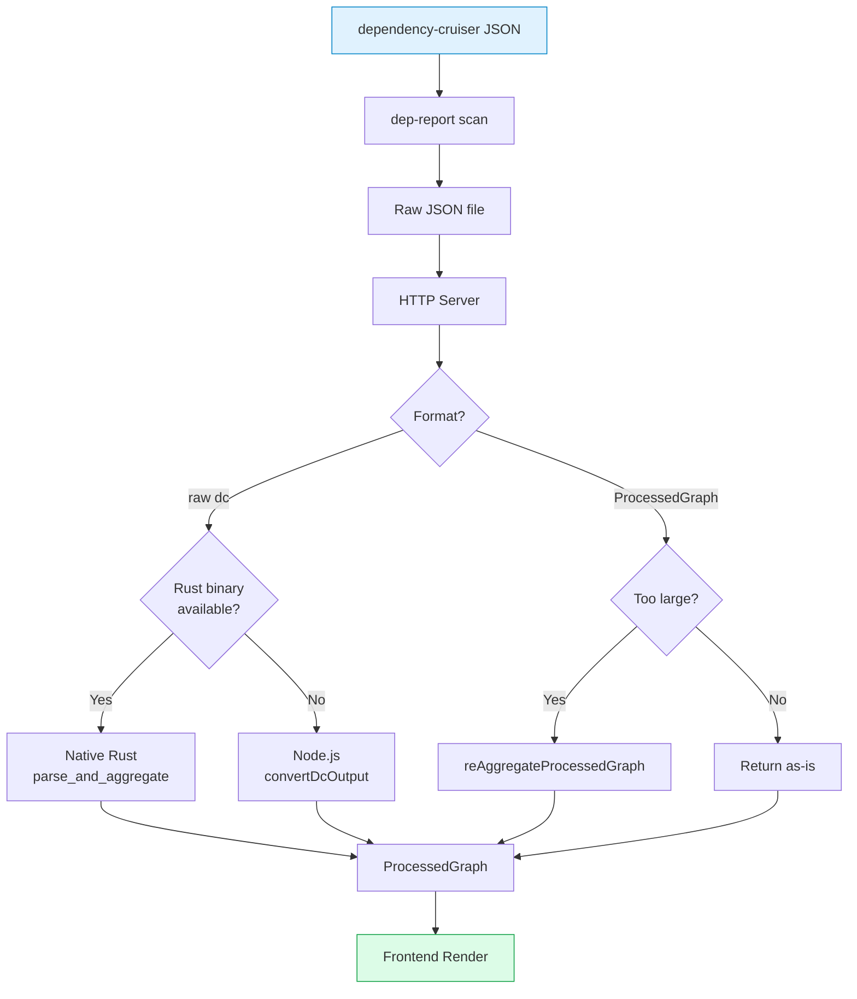
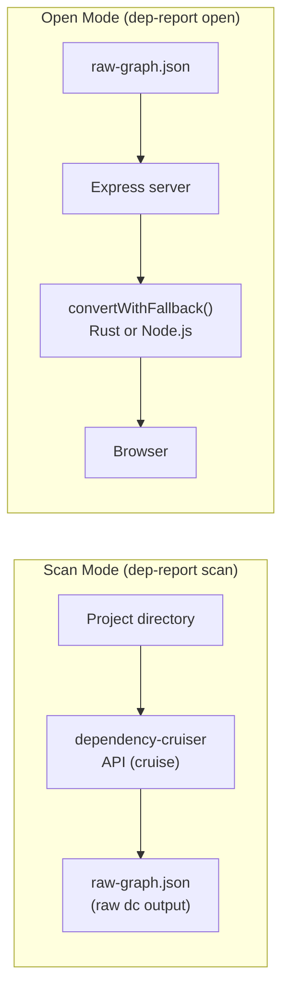
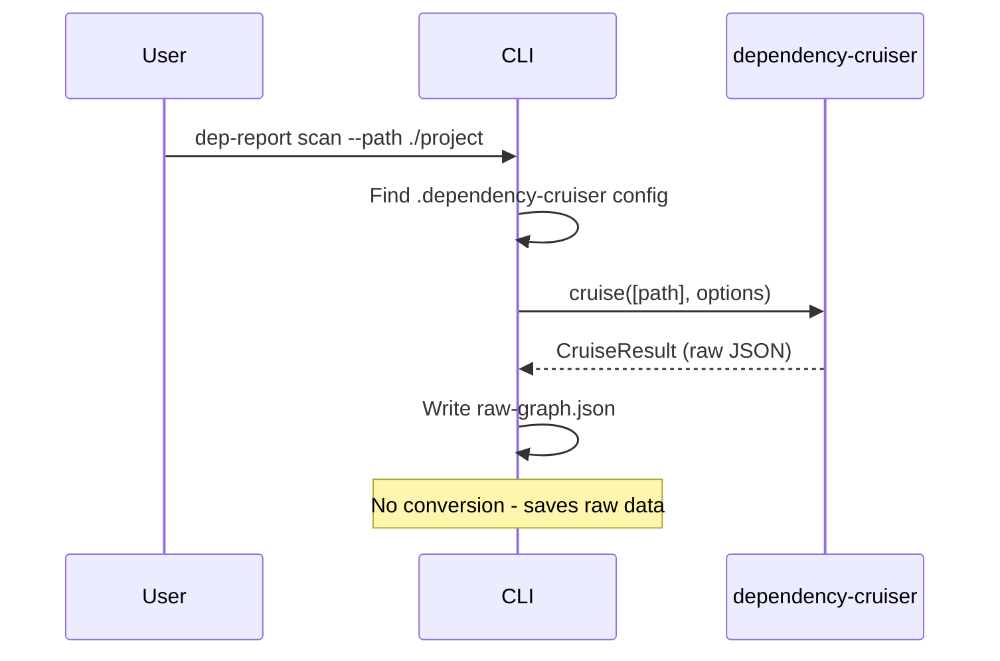
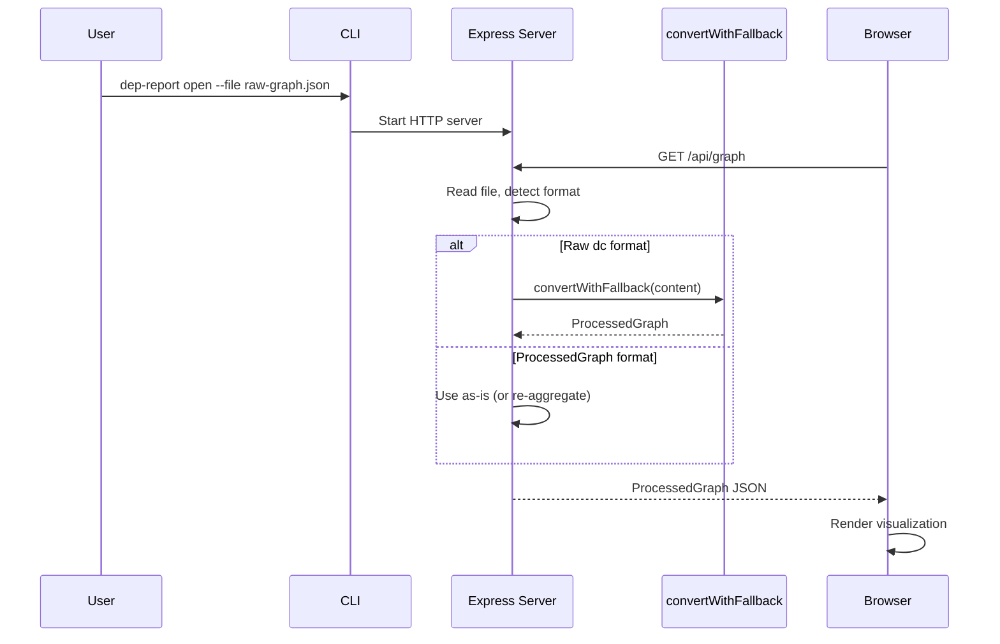
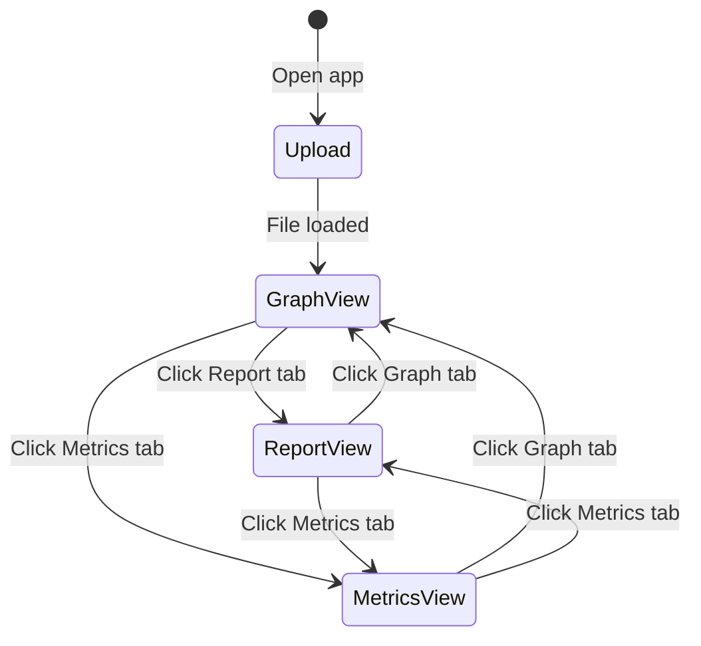

# Data Flow

## Processing Pipeline

## Processing Modes

## Key Change: Deferred Conversion

**Before:** `scan` command converted raw dependency-cruiser output to ProcessedGraph immediately, losing original data structure.

**After:** `scan` preserves raw dependency-cruiser JSON. Conversion happens on-demand when frontend requests `/api/graph`:
- Server detects file format (raw dc vs ProcessedGraph)
- Raw format: converts using `convertWithFallback` (Rust preferred, Node.js fallback)
- ProcessedGraph: re-aggregates if node count exceeds threshold

This enables future features like user-selectable aggregation levels.

## Input Format

dependency-cruiser outputs JSON. The CLI supports two input structures:

### Raw dependency-cruiser format (saved by `scan`)

Modules with nested dependencies array. Each module has `source`, `dependencies`, `valid`, optional `rules`.

> See [packages/cli/src/commands/convert.ts](../../packages/cli/src/commands/convert.ts) for full type definitions.

### ProcessedGraph format (already converted)

Nodes/edges/meta structure. Backward compatible - server handles both formats.

> See [packages/frontend/src/types.ts](../../packages/frontend/src/types.ts) for type definitions.

## Scan Mode Flow

## Open Mode Flow

## Frontend Interaction Flow

