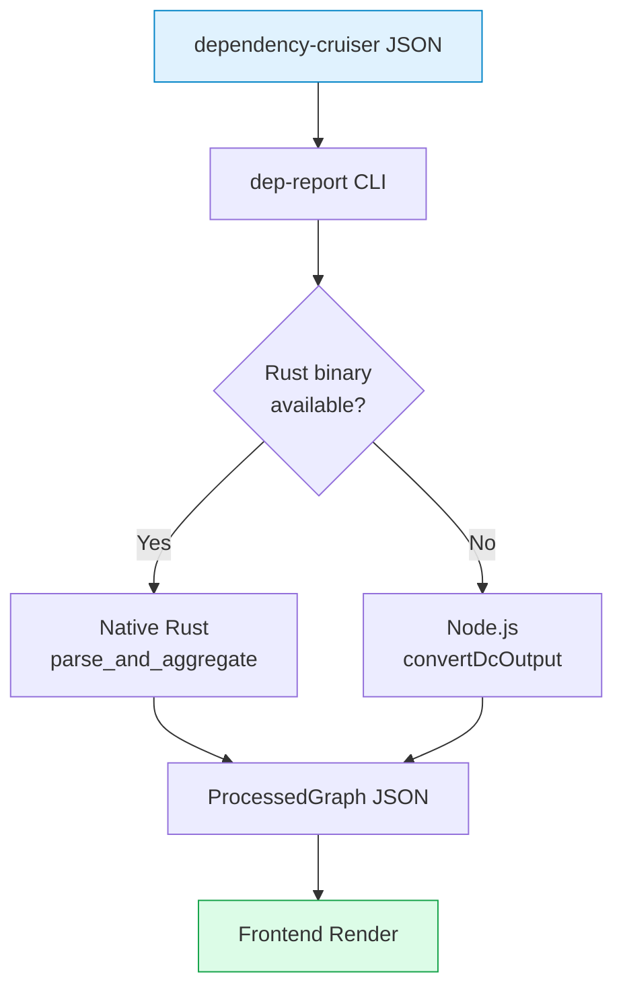
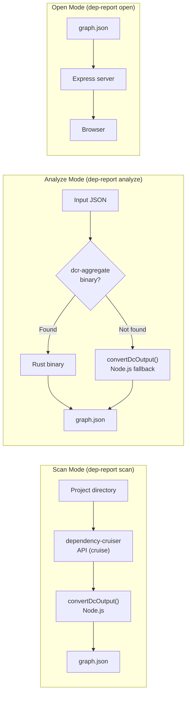
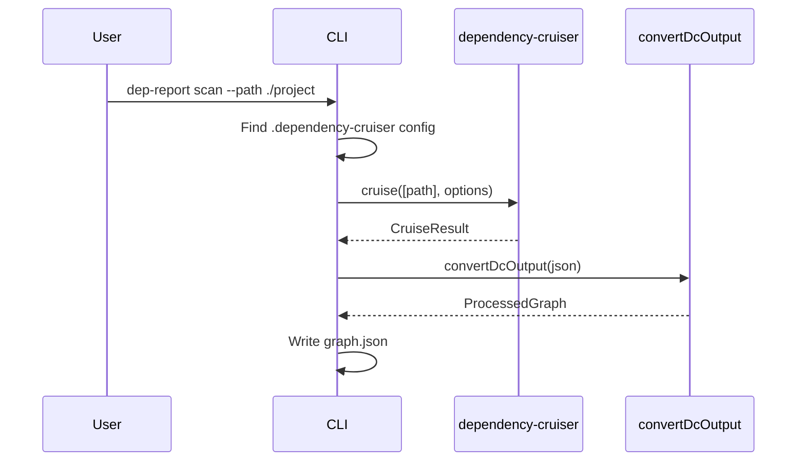
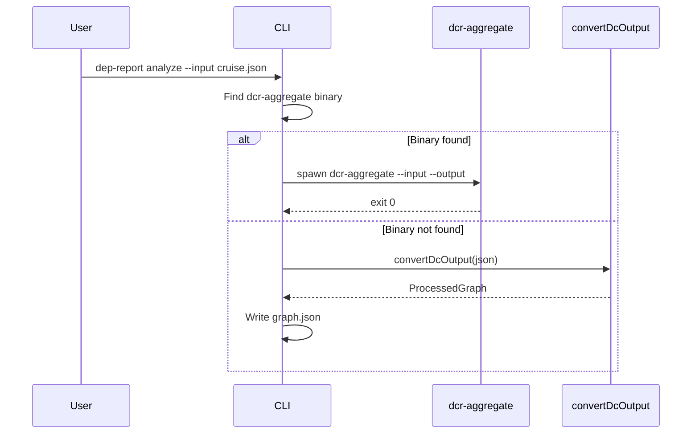
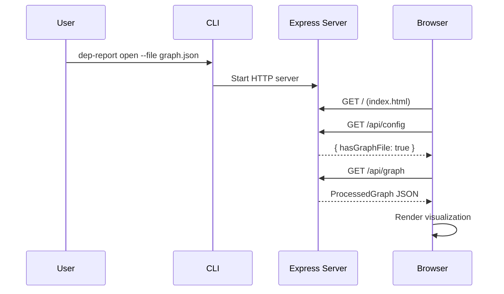
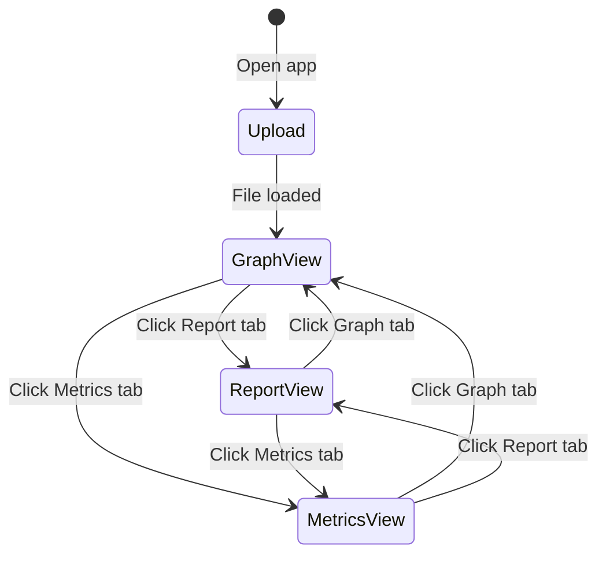

# Data Flow

## Processing Pipeline



## Processing Modes



## Input Format

dependency-cruiser outputs JSON. The CLI supports two input structures:

### Structure with nested dependencies (used by `scan` command)

The `scan` command uses the dependency-cruiser API, which returns modules with nested dependencies:

```typescript
interface DcOutput {
  modules: DcModule[];
  summary?: {
    violations: number;
    error: number;
    warn: number;
    info: number;
    totalCruised: number;
    totalDependenciesCruised: number;
  };
}

interface DcModule {
  source: string;
  dependencies: DcDependency[];
  valid: boolean;
}

interface DcDependency {
  resolved: string;
  moduleSystem: string;
  coreModule: boolean;
  couldNotResolve: boolean;
  dependencyTypes: string[];
  followable: boolean;
  rules?: { name: string; severity: string }[];
}
```

### Structure with top-level dependencies (used by Rust engine)

The Rust engine expects a flat structure with separate top-level arrays:

```rust
struct CruiseResult {
    modules: Option<Vec<Module>>,
    dependencies: Option<Vec<Dependency>>,
    violations: Option<Vec<RawViolation>>,
    summary: Option<Summary>,
}

struct Module {
    source: String,
    dependencies: Vec<String>,
    dependency_types: Option<Vec<String>>,
    size: Option<usize>,
}

struct Dependency {
    resolved: Option<String>,
    core_module: Option<String>,
    dependency_types: Vec<String>,
    from: Option<String>,
    to: Option<String>,
}
```

## Output Format

Both Rust and Node.js paths output the same `ProcessedGraph` JSON:

```typescript
interface ProcessedGraph {
  nodes: GraphNode[];
  edges: GraphEdge[];
  meta: GraphMeta;
  violations: ViolationInfo[];
}
```

See [Data Structures](../backend/data-structures.md) for full type definitions.

## Scan Mode Flow



## Analyze Mode Flow



## Open Mode Flow



## Frontend Interaction Flow


