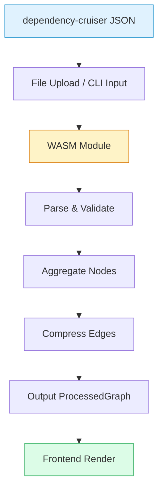
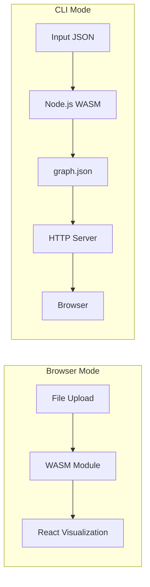
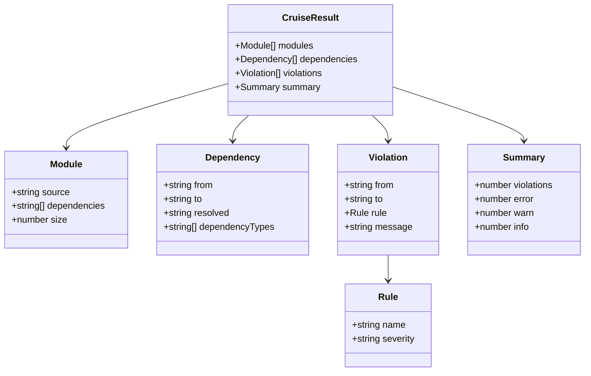
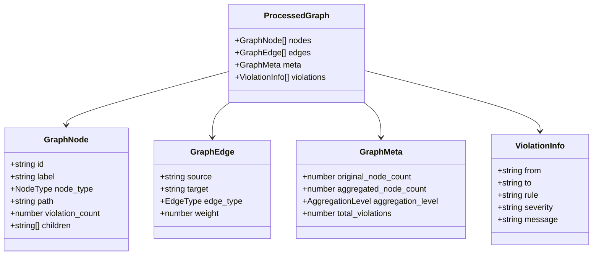
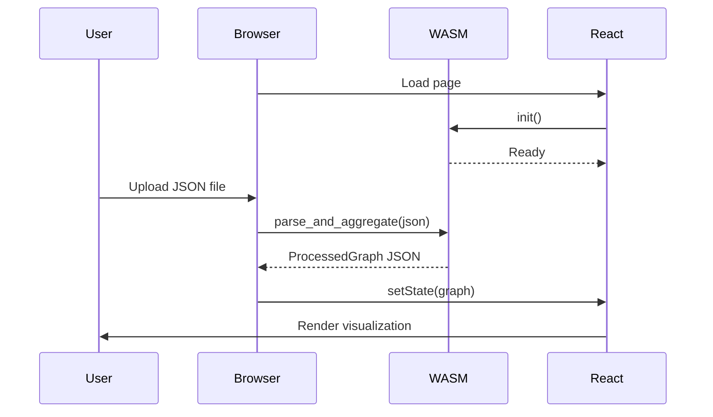
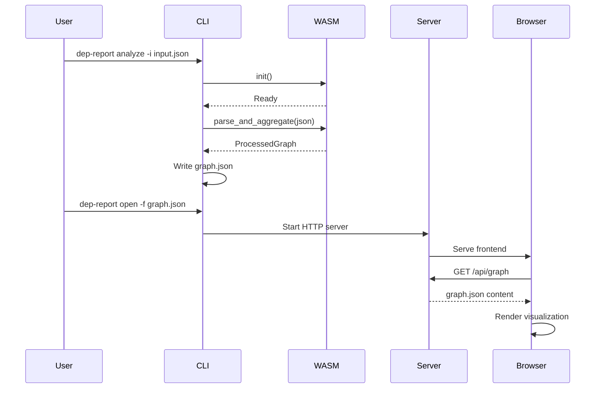
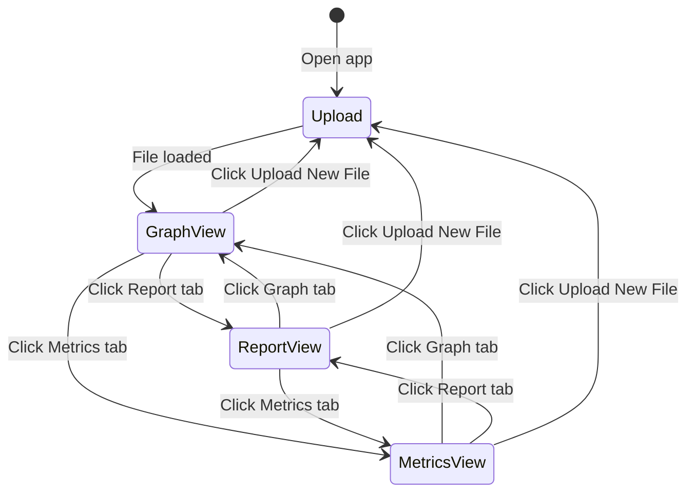
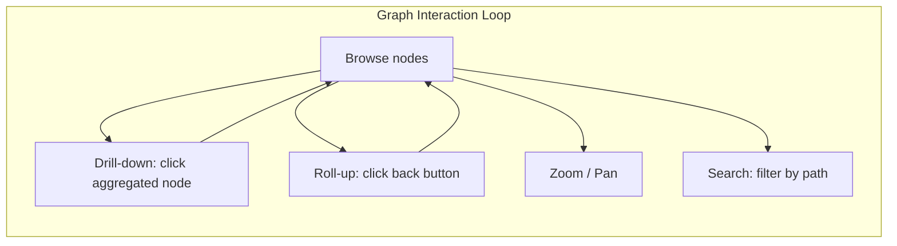

# Data Flow

## Processing Pipeline



## Processing Modes



## Input Format

dependency-cruiser outputs JSON with this structure:



Example:

```json
{
  "modules": [{ "source": "src/index.ts", "dependencies": ["src/app.ts"], "size": 42 }],
  "dependencies": [{ "from": "src/index.ts", "to": "src/app.ts", "resolved": "src/app.ts", "dependencyTypes": ["local"] }],
  "violations": [{ "from": "src/index.ts", "to": "src/app.ts", "rule": { "name": "no-circular", "severity": "error" }, "message": "Circular dependency detected" }],
  "summary": { "violations": 1, "error": 1, "warn": 0, "info": 0 }
}
```

## Output Format

Rust preprocessing outputs lightweight JSON:



Example:

```json
{
  "nodes": [{ "id": "src/components", "label": "components", "node_type": "directory", "path": "src/components", "violation_count": 0, "children": ["src/components/Button.tsx", "src/components/Input.tsx"] }],
  "edges": [{ "source": "src/components", "target": "src/utils", "edge_type": "local", "weight": 5 }],
  "meta": { "original_node_count": 150, "aggregated_node_count": 25, "aggregation_level": "directory", "total_violations": 3 },
  "violations": []
}
```

## Browser Mode Flow



## CLI Mode Flow



## Frontend Interaction Flow



### Interaction Details



| Action | Behavior |
|--------|----------|
| Click aggregated node | Expand to show children |
| Click "back" button | Return to parent level |
| Zoom/Pan | Navigate large graphs |
| Search | Filter nodes by path |