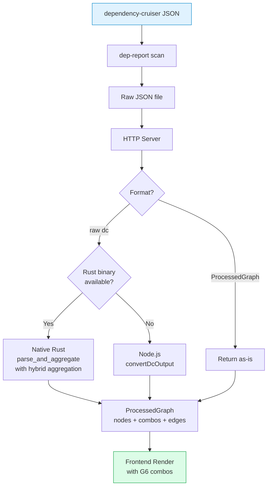
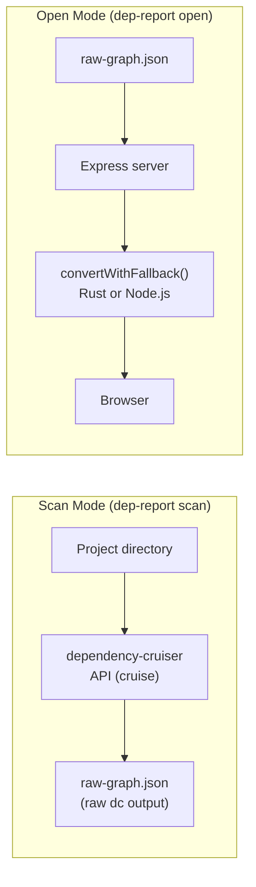
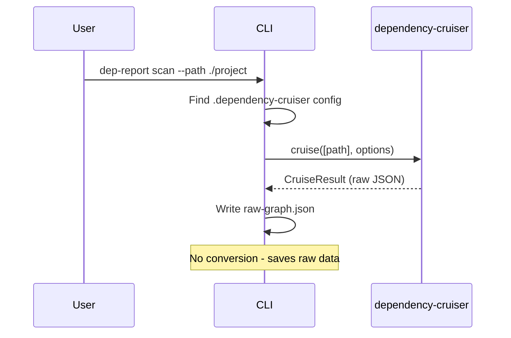
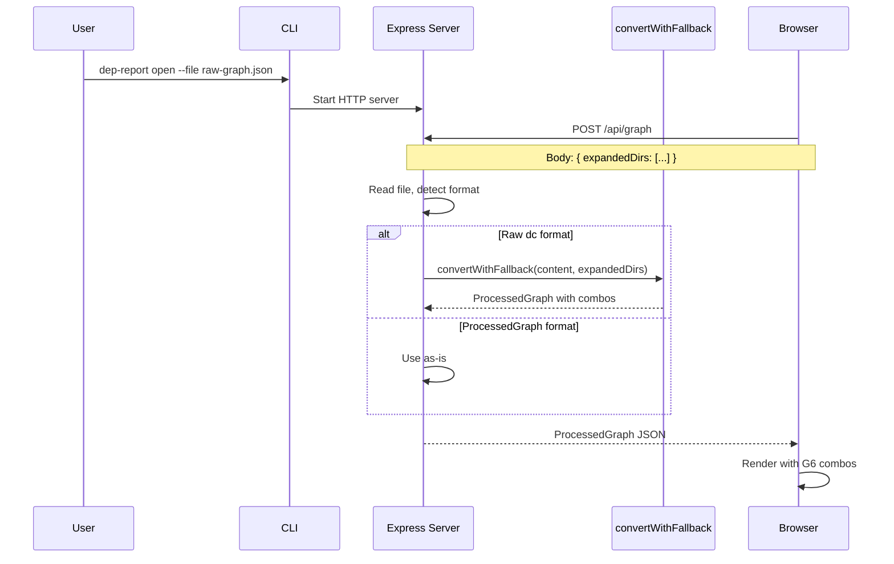
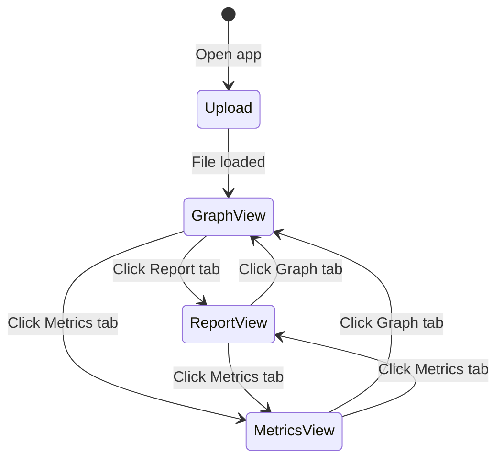

# Data Flow

## Processing Pipeline

```mermaid
flowchart TB
    Input[dependency-cruiser JSON] --> Scan[dep-report scan]
    Scan --> RawFile[Raw JSON file]
    RawFile --> Server[HTTP Server]
    Server --> Detect{Format?}
    Detect -->|raw dc| Rust{Rust binary\navailable?}
    Rust -->|Yes| Native[Native Rust\nparse_and_aggregate\nwith hybrid aggregation]
    Rust -->|No| Node[Node.js\nconvertDcOutput]
    Detect -->|ProcessedGraph| Direct[Return as-is]
    Native --> Output[ProcessedGraph\nnodes + combos + edges]
    Node --> Output
    Direct --> Output
    Output --> Render[Frontend Render\nwith G6 combos]

    style Input fill:#e0f2fe,stroke:#0284c7
    style Render fill:#dcfce7,stroke:#16a34a
```

## Processing Modes

```mermaid
flowchart LR
    subgraph Scan["Scan Mode (dep-report scan)"]
        Path["Project directory"] --> DC["dependency-cruiser\nAPI (cruise)"]
        DC --> RawFile1["raw-graph.json\n(raw dc output)"]
    end

    subgraph Open["Open Mode (dep-report open)"]
        File["raw-graph.json"] --> Server["Express server"]
        Server --> Convert["convertWithFallback()\nRust or Node.js"]
        Convert --> Browser["Browser"]
    end
```

## Key Change: Deferred Conversion + Hybrid Aggregation

**Before:** `scan` command converted raw dependency-cruiser output to ProcessedGraph immediately, losing original data structure. Fixed aggregation levels (file/directory/package/root).

**After:** `scan` preserves raw dependency-cruiser JSON. Conversion happens on-demand when frontend requests `/api/graph`:
- Server detects file format (raw dc vs ProcessedGraph)
- Raw format: converts using `convertWithFallback` (Rust preferred, Node.js fallback)
- ProcessedGraph: uses as-is

The Rust engine now uses **hybrid aggregation** controlled by `expanded_dirs`:
- Directories in `expanded_dirs` show file-level nodes
- Other directories are collapsed to single nodes
- Auto-computed when not provided (budget algorithm targeting ~200 nodes)

This enables interactive drill-down without rescanning.

## Input Format

dependency-cruiser outputs JSON. The CLI supports two input structures:

### Raw dependency-cruiser format (saved by `scan`)

Modules with nested dependencies array. Each module has `source`, `dependencies`, `valid`, optional `rules`.

> See [packages/cli/src/utils/convert.ts](../../packages/cli/src/utils/convert.ts) for full type definitions.

### ProcessedGraph format (already converted)

Nodes/edges/meta structure. Backward compatible - server handles both formats.

> See [packages/frontend/src/types.ts](../../packages/frontend/src/types.ts) for type definitions.

## Scan Mode Flow

```mermaid
sequenceDiagram
    participant User
    participant CLI
    participant DC as dependency-cruiser

    User->>CLI: dep-report scan --path ./project
    CLI->>CLI: Find .dependency-cruiser config
    CLI->>DC: cruise([path], options)
    DC-->>CLI: CruiseResult (raw JSON)
    CLI->>CLI: Write raw-graph.json
    Note over CLI: No conversion - saves raw data
```

## Open Mode Flow

```mermaid
sequenceDiagram
    participant User
    participant CLI
    participant Server as Express Server
    participant Convert as convertWithFallback
    participant Browser

    User->>CLI: dep-report open --file raw-graph.json
    CLI->>Server: Start HTTP server
    Browser->>Server: POST /api/graph
    Note over Browser,Server: Body: { expandedDirs: [...] }
    Server->>Server: Read file, detect format
    alt Raw dc format
        Server->>Convert: convertWithFallback(content, expandedDirs)
        Convert-->>Server: ProcessedGraph with combos
    else ProcessedGraph format
        Server->>Server: Use as-is
    end
    Server-->>Browser: ProcessedGraph JSON
    Browser->>Browser: Render with G6 combos
```

## Frontend Interaction Flow

```mermaid
stateDiagram-v2
    [*] --> Upload: Open app
    Upload --> GraphView: File loaded
    GraphView --> ReportView: Click Report tab
    GraphView --> MetricsView: Click Metrics tab
    ReportView --> GraphView: Click Graph tab
    ReportView --> MetricsView: Click Metrics tab
    MetricsView --> GraphView: Click Graph tab
    MetricsView --> ReportView: Click Metrics tab
```