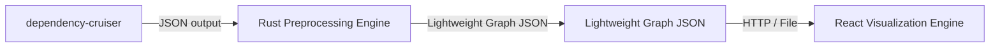
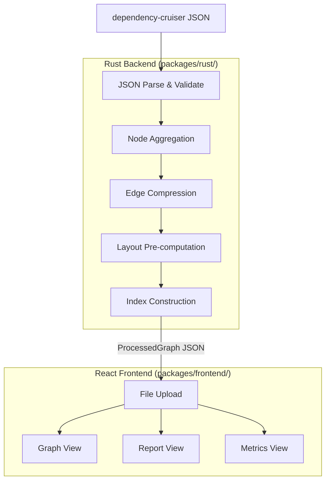
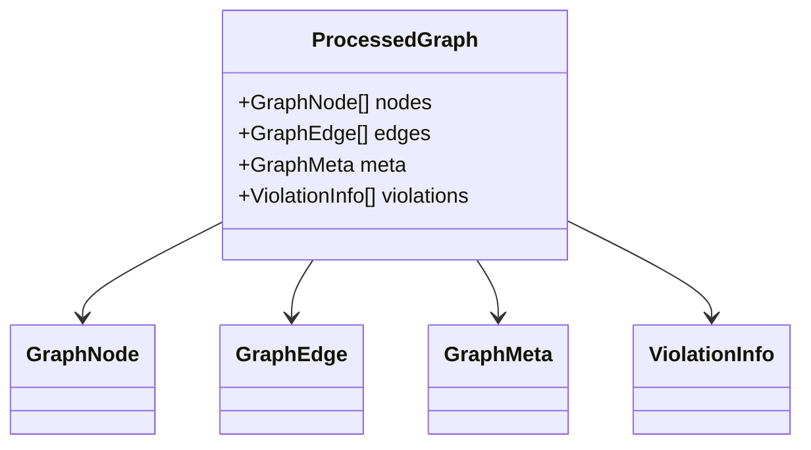

# Architecture Overview

## High-Level Architecture

## Component Breakdown

### Rust Backend (`packages/rust/`)

**Responsibilities:**

1. JSON parsing and validation
2. Node aggregation by directory/package level
3. Edge compression and deduplication
4. Layout coordinate pre-computation
5. Index construction for fast lookups

**Key Files:**

| File | Purpose |
|------|---------|
| `src/lib.rs` | Core library with data structures and processing logic |
| `src/main.rs` | CLI entry point |

### React Frontend (`packages/frontend/`)

**Responsibilities:**

1. Graph rendering with D3.js
2. User interaction handling
3. View switching (Graph/Report/Metrics)
4. File upload and parsing

**Key Files:**

| File | Purpose |
|------|---------|
| `src/App.tsx` | Main application component |
| `src/types.ts` | TypeScript type definitions |
| `src/main.tsx` | React entry point |

## Design Decisions

### Why Rust for Preprocessing?

- **Performance**: Handle 100k+ nodes without blocking
- **Memory efficiency**: Lower memory footprint than Node.js
- **Type safety**: Strong typing with serde JSON parsing

### Why React + D3.js?

- **Declarative UI**: React for component management
- **D3 ecosystem**: Rich graph visualization capabilities
- **Bundle size**: Lighter than alternatives (Cytoscape.js)

## Data Contract

TypeScript (`src/types.ts`) and Rust (`src/lib.rs`) share the same data structure:

See [Data Structures](../backend/data-structures.md) for detailed definitions.