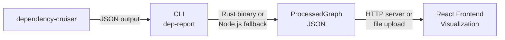
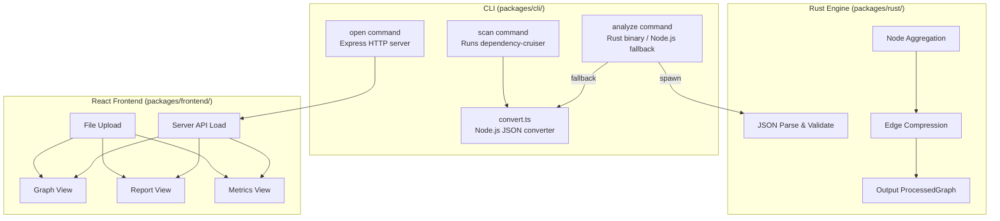
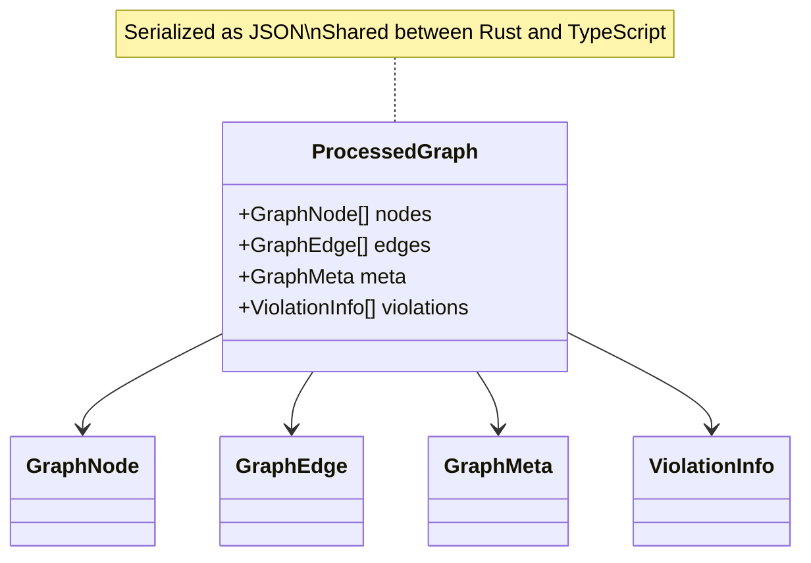

# Architecture Overview

## High-Level Architecture

**Key Design Decision**: Rust preprocessing engine runs as a **native binary** invoked by the CLI. When the binary is unavailable, a Node.js fallback converter handles processing. The frontend is a React SPA that loads data from the server API or accepts file uploads.

## Component Breakdown

### Rust Engine (`packages/rust/`)

**Responsibilities:**

1. JSON parsing and validation
2. Node aggregation by directory/package level
3. Edge compression and deduplication
4. Output `ProcessedGraph` JSON

**Key Files:**

| File | Purpose |
|------|---------|
| `src/lib.rs` | Core library: data structures, processing logic, tests |
| `src/main.rs` | CLI entry point (`dcr-aggregate` binary) |

### CLI (`packages/cli/`)

**Responsibilities:**

1. Run dependency-cruiser via API (`scan` command)
2. Process JSON with Rust binary or Node.js fallback (`analyze` command)
3. Serve frontend with Express (`open` command)
4. Export programmatic server API

**Key Files:**

| File | Purpose |
|------|---------|
| `bin/cli.js` | CLI entry point (commander program) |
| `src/commands/scan.ts` | Scan: runs dependency-cruiser on a project |
| `src/commands/analyze.ts` | Analyze: processes JSON with Rust binary |
| `src/commands/convert.ts` | Node.js fallback converter + `convertDcOutput` |
| `src/commands/open.ts` | Open: starts HTTP server |
| `src/server.ts` | Express server with API endpoints |

### React Frontend (`packages/frontend/`)

**Responsibilities:**

1. Load graph data from server API or file upload
2. Graph rendering with AntV G6
3. User interaction handling
4. View switching (Graph/Report/Metrics)

**Key Files:**

| File | Purpose |
|------|---------|
| `src/App.tsx` | Main application (all views inline) |
| `src/types.ts` | TypeScript type definitions |
| `src/main.tsx` | React entry point |

## Design Decisions

### Why Rust native binary instead of WASM?

| Aspect | Native Binary | WASM Approach |
|--------|---------------|---------------|
| Deployment | Bundled with CLI package | Ships with frontend bundle |
| User Experience | CLI-driven workflow | Browser-only workflow |
| Performance | Native speed | Near-native (WASM) |
| Complexity | Simple CLI spawn | Requires wasm-bindgen, wasm-pack, browser init |
| Fallback | Node.js converter available | No fallback |

### Why Node.js fallback?

- Rust binary may not be built on user's machine
- Provides graceful degradation
- Core logic (edge classification, aggregation level) is duplicated in `convert.ts`

### Why React + AntV G6?

- **Declarative UI**: React for component management
- **AntV G6**: Purpose-built graph visualization with built-in layout algorithms, combo support for aggregated nodes, and canvas/SVG rendering
- **Integration**: G6's data-driven API maps naturally to the ProcessedGraph structure

## Data Contract

TypeScript (`packages/frontend/src/types.ts`) and Rust (`packages/rust/src/lib.rs`) share the same data structure via JSON serialization.

See [Data Structures](../backend/data-structures.md) for detailed definitions.
