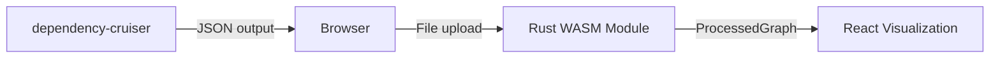
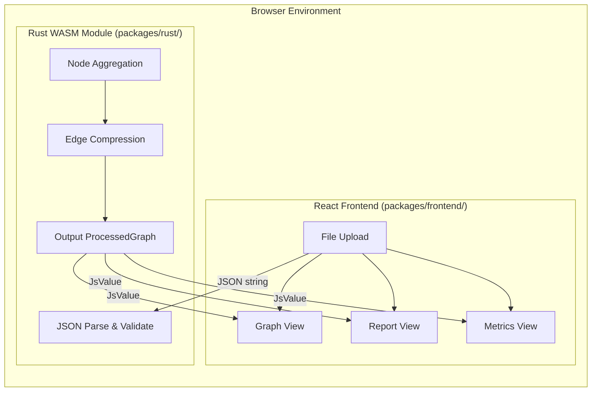
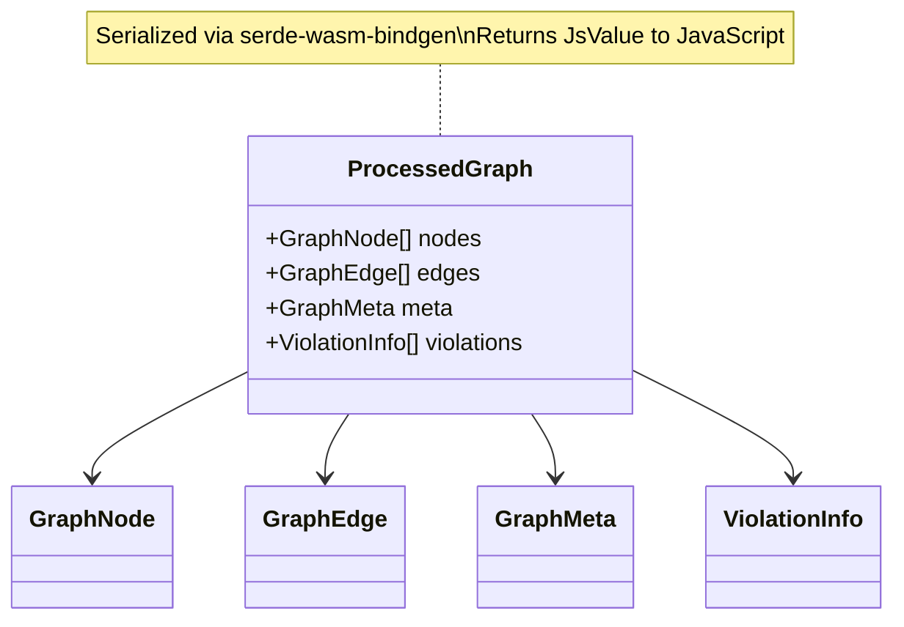

# Architecture Overview

## High-Level Architecture

**Key Design Decision**: Rust preprocessing engine runs as **WebAssembly directly in the browser**, eliminating the need for a separate CLI process.

## Component Breakdown

### Rust WASM Module (`packages/wasm/`)

**Responsibilities:**

1. JSON parsing and validation
2. Node aggregation by directory/package level
3. Edge compression and deduplication
4. Output to JavaScript-compatible types

**Key Files:**

| File | Purpose |
|------|---------|
| `src/lib.rs` | Core library with wasm-bindgen exports |
| `src/wasm.rs` | WASM-specific wrappers |

### React Frontend (`packages/frontend/`)

**Responsibilities:**

1. WASM module loading and initialization
2. Graph rendering with D3.js
3. User interaction handling
4. View switching (Graph/Report/Metrics)

**Key Files:**

| File | Purpose |
|------|---------|
| `src/App.tsx` | Main application component |
| `src/types.ts` | TypeScript type definitions |
| `src/hooks/useWasm.ts` | WASM loading hook |
| `src/main.tsx` | React entry point |

## Design Decisions

### Why WASM instead of CLI?

| Aspect | CLI Approach | WASM Approach |
|--------|--------------|---------------|
| Deployment | Requires binary installation | Ships with frontend bundle |
| User Experience | Two-step process | One-step, in-browser |
| Cross-platform | Platform-specific binaries | Universal browser support |
| Performance | Native speed | Near-native (WASM) |
| Distribution | npm + separate binary | Single npm package |

### Why React + D3.js?

- **Declarative UI**: React for component management
- **D3 ecosystem**: Rich graph visualization capabilities
- **Bundle size**: Lighter than alternatives (Cytoscape.js)

## Data Contract

TypeScript (`src/types.ts`) and Rust (`src/lib.rs`) share the same data structure via serde serialization.

See [Data Structures](../backend/data-structures.md) for detailed definitions.