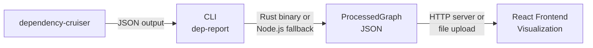
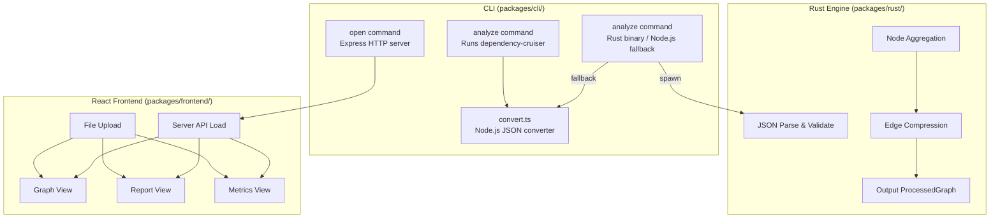
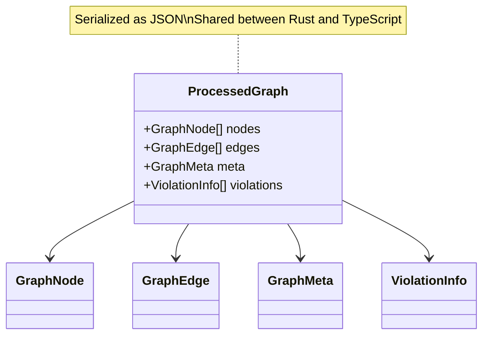

# Architecture Overview

## High-Level Architecture

```mermaid
flowchart LR
    DC[dependency-cruiser] -->|JSON output| CLI[CLI\ndep-report]
    CLI -->|Rust binary or\nNode.js fallback| JSON[ProcessedGraph\nJSON]
    JSON -->|HTTP server or\nfile upload| FE[React Frontend\nVisualization]
```

**Key Design Decision**: Rust preprocessing engine uses hybrid aggregation — directories can be expanded (show files) or collapsed (show as single nodes). The `expanded_dirs` parameter controls this, with auto-computation when not provided. When the Rust binary is unavailable, a Node.js fallback converter handles processing. The frontend is a React SPA that loads data from the server API or accepts file uploads.

## Component Breakdown

```mermaid
flowchart TB
    subgraph CLI["CLI (packages/cli/)"]
        Scan["analyze command\nRuns dependency-cruiser"]
        Analyze["analyze command\nRust binary / Node.js fallback"]
        Open["open command\nExpress HTTP server"]
        Convert["convert.ts\nNode.js JSON converter"]
    end

    subgraph Rust["Rust Engine (packages/rust/)"]
        Parse["JSON Parse & Validate"]
        Agg["Node Aggregation"]
        Edge["Edge Compression"]
        Output["Output ProcessedGraph"]
    end

    subgraph Frontend["React Frontend (packages/frontend/)"]
        Upload["File Upload"]
        ServerLoad["Server API Load"]
        Graph["Graph View"]
        Report["Report View"]
        Metrics["Metrics View"]
    end

    Scan --> Convert
    Analyze -->|spawn| Parse
    Analyze -->|fallback| Convert
    Agg --> Edge --> Output
    Open --> ServerLoad
    Upload --> Graph
    Upload --> Report
    Upload --> Metrics
    ServerLoad --> Graph
    ServerLoad --> Report
    ServerLoad --> Metrics
```

### Rust Engine (`packages/rust/`)

**Responsibilities:**

1. JSON parsing and validation
2. Hybrid node aggregation (expanded + collapsed directories)
3. Combo generation with single-child collapse
4. Edge aggregation and deduplication
5. Output `ProcessedGraph` JSON

**Key Files:**

| File | Purpose |
|------|---------|
| `src/lib.rs` | Library entry point, WASM exports |
| `src/types.rs` | Data structures (ProcessedGraph, GraphNode, etc.) with `#[derive(Tsify)]` |
| `src/aggregate/mod.rs` | Aggregation module exports |
| `src/aggregate/expand.rs` | Auto-expand algorithm (budget-based) |
| `src/aggregate/hybrid.rs` | Hybrid node building + combo generation |
| `src/aggregate/edges.rs` | Edge extraction, aggregation, type detection |

### CLI (`packages/cli/`)

**Responsibilities:**

1. Run dependency-cruiser via API (`analyze` command)
2. Serve frontend with Express (`open` command)
3. Process JSON with Rust binary or Node.js fallback on-demand
4. Export programmatic server API

**Key Files:**

| File | Purpose |
|------|---------|
| `src/bin/cli.ts` | CLI entry point (commander program) |
| `src/commands/analyze.ts` | Analyze: runs dependency-cruiser on a project |
| `src/commands/open.ts` | Open: starts HTTP server |
| `src/utils/convert.ts` | Node.js fallback converter + `convertDcOutput` |
| `src/utils/server.ts` | Express server with API endpoints |

### React Frontend (`packages/frontend/`)

**Responsibilities:**

1. Load graph data from server API or file upload
2. Graph rendering with AntV G6
3. User interaction handling
4. View switching (Graph/Report/Metrics)

**Key Files:**

| File | Purpose |
|------|---------|
| `src/App.tsx` | Main application (all views inline) |
| `src/types.ts` | TypeScript type definitions |
| `src/main.tsx` | React entry point |

## Design Decisions

### Why WASM with tsify?

| Aspect | Previous (CLI Binary) | Current (WASM + tsify) |
|--------|----------------------|----------------------|
| Deployment | CLI spawn of native binary | WASM module loaded via JS bindings |
| Type Safety | Manual type definitions in `convert.ts` | Auto-generated TypeScript types via `tsify` |
| Performance | Native speed | Near-native (WASM) |
| Consistency | Manual sync between Rust and TS types | Single source of truth from Rust structs |

### Why Node.js fallback?

- WASM module may fail to load in some environments
- Provides graceful degradation
- Core logic (edge classification, aggregation) is duplicated in `convert.ts`

### Why React + AntV G6?

- **Declarative UI**: React for component management
- **AntV G6**: Purpose-built graph visualization with built-in layout algorithms, combo support for aggregated nodes, and canvas/SVG rendering
- **Integration**: G6's data-driven API maps naturally to the ProcessedGraph structure

## Data Contract

```mermaid
classDiagram
    class ProcessedGraph {
        +GraphNode[] nodes
        +GraphEdge[] edges
        +GraphMeta meta
        +ViolationInfo[] violations
    }

    ProcessedGraph --> GraphNode
    ProcessedGraph --> GraphEdge
    ProcessedGraph --> GraphMeta
    ProcessedGraph --> ViolationInfo

    note for ProcessedGraph "Serialized as JSON\nShared between Rust and TypeScript"
```

TypeScript (`packages/frontend/src/types.ts`) and Rust (`packages/rust/src/types.rs`) share the same data structure via JSON serialization. TypeScript types are also auto-generated from Rust via `tsify`, allowing direct imports from `@dcr-reporter/wasm`.

See [Data Structures](../backend/data-structures.md) for detailed definitions.
