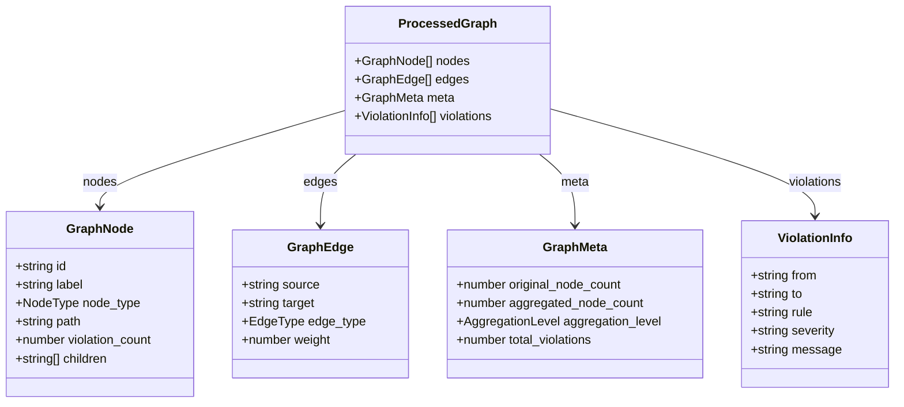
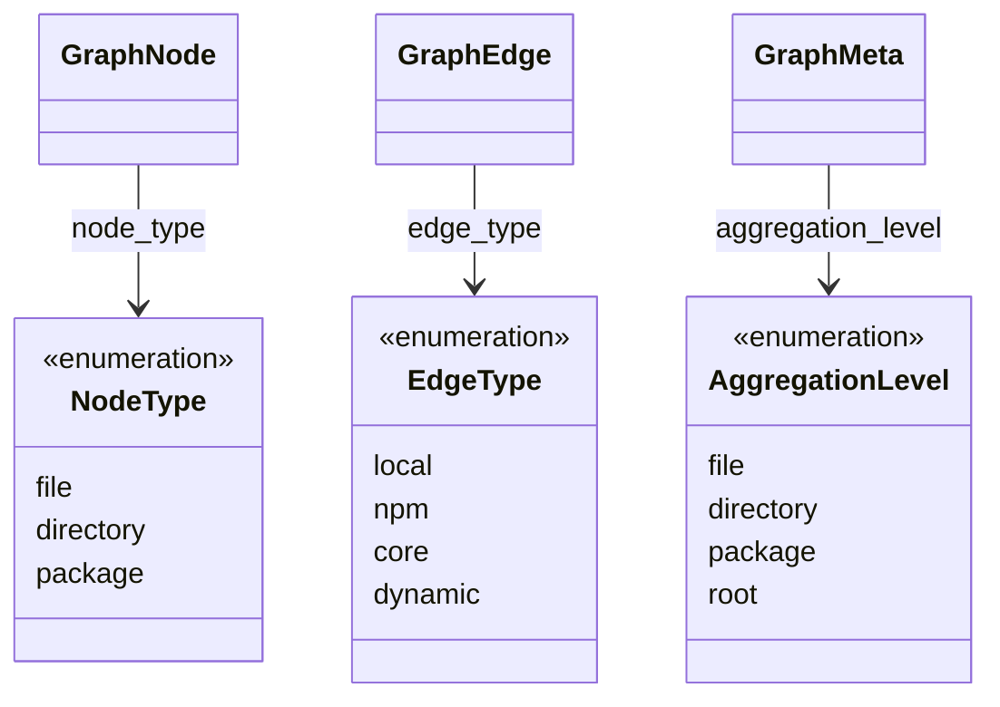

# Data Structures

Shared type contracts between Rust backend and TypeScript frontend.

## Core Types Overview



## Core Types

### ProcessedGraph (Root)

| Field | Type | Description |
|-------|------|-------------|
| `nodes` | `GraphNode[]` | All nodes in the graph |
| `edges` | `GraphEdge[]` | All edges (dependencies) in the graph |
| `meta` | `GraphMeta` | Aggregation metadata and statistics |
| `violations` | `ViolationInfo[]` | Dependency rule violations |

### GraphNode

| Field | Type | Description |
|-------|------|-------------|
| `id` | `string` | Unique identifier |
| `label` | `string` | Display name |
| `node_type` | `NodeType` | Determines rendering style and whether node can be expanded |
| `path` | `string?` | Original file path for drill-down navigation; omitted when node represents an aggregated group |
| `violation_count` | `number` | Number of violations involving this node |
| `children` | `string[]?` | IDs of child nodes; only present when node is aggregated (directory/package level) |

### GraphEdge

| Field | Type | Description |
|-------|------|-------------|
| `source` | `string` | Source node ID |
| `target` | `string` | Target node ID |
| `edge_type` | `EdgeType` | Determines edge color and styling |
| `weight` | `number` | Count of dependencies merged into this edge during aggregation |

### GraphMeta

| Field | Type | Description |
|-------|------|-------------|
| `original_node_count` | `number` | Nodes before aggregation |
| `aggregated_node_count` | `number` | Nodes after aggregation |
| `aggregation_level` | `AggregationLevel` | Controls the granularity of the entire graph |
| `total_violations` | `number` | Total violation count |

### ViolationInfo

| Field | Type | Description |
|-------|------|-------------|
| `from` | `string` | Source module path |
| `to` | `string` | Target module path |
| `rule` | `string` | Rule name that was violated |
| `severity` | `'error' \| 'warn' \| 'info'` | Violation severity level |
| `message` | `string?` | Optional violation message |

> TypeScript: [packages/frontend/src/types.ts](../../packages/frontend/src/types.ts) | Rust: [packages/rust/src/lib.rs](../../packages/rust/src/lib.rs)

## Enums



### NodeType

| Value | Description |
|-------|-------------|
| `file` | Individual source file |
| `directory` | Grouped directory |
| `package` | Grouped npm package |

### EdgeType

| Value | Description |
|-------|-------------|
| `local` | Project internal |
| `npm` | External npm package |
| `core` | Node.js built-in |
| `dynamic` | Dynamic import |

### AggregationLevel

| Value | Threshold |
|-------|-----------|
| `file` | <=1000 nodes |
| `directory` | 1001-5000 nodes |
| `package` | 5001-20000 nodes |
| `root` | >20000 nodes |

## Input Types

The CLI handles two input structures:

### TypeScript Input (used by `scan` command via dependency-cruiser API)

The `scan` command receives a nested structure: a `modules` array where each module has a `source` path and nested `dependencies` array. Each dependency includes `resolved` path, `coreModule` flag, `dependencyTypes`, and optional `rules` violations.

Edge classification in TypeScript (`classifyEdge`):

| Condition | Edge Type |
|-----------|-----------|
| `dep.coreModule === true` | `core` |
| `dep.couldNotResolve === true` | `dynamic` |
| `dep.dependencyTypes` includes `npm`/`npm-dev`/`npm-optional`/`npm-peer` | `npm` |
| Otherwise | `local` |

### Rust Input (used by `analyze` command)

The Rust engine expects a flat structure with separate top-level arrays for `modules`, `dependencies`, `violations`, and `summary`. Each dependency is a standalone object with `from`/`to` fields rather than being nested inside a module.

Edge detection in Rust (`detect_edge_type`):

| Condition | Edge Type |
|-----------|-----------|
| `dependencyTypes` contains `"npm"` or `"node_modules"` | `Npm` |
| `dependencyTypes` contains `"core"` | `Core` |
| `dependencyTypes` contains `"dynamic"` | `Dynamic` |
| Otherwise | `Local` |

> TypeScript input: [packages/cli/src/commands/convert.ts](../../packages/cli/src/commands/convert.ts) | Rust input: [packages/rust/src/lib.rs](../../packages/rust/src/lib.rs)

## Serialization Notes

The snake_case convention is critical because it defines the JSON contract between the Rust serializer and the TypeScript deserializer — both sides must agree on field names.

### Rust

```rust
#[serde(rename_all = "lowercase")]  // NodeType, EdgeType, AggregationLevel
#[serde(skip_serializing_if = "Option::is_none")]  // Optional fields
#[serde(default)]  // Missing fields use default values
```

### TypeScript

Use snake_case to match JSON output:

```typescript
node_type  // NOT nodeType
edge_type  // NOT edgeType
aggregation_level  // NOT aggregationLevel
```
