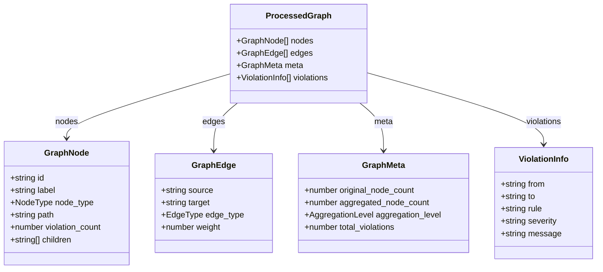
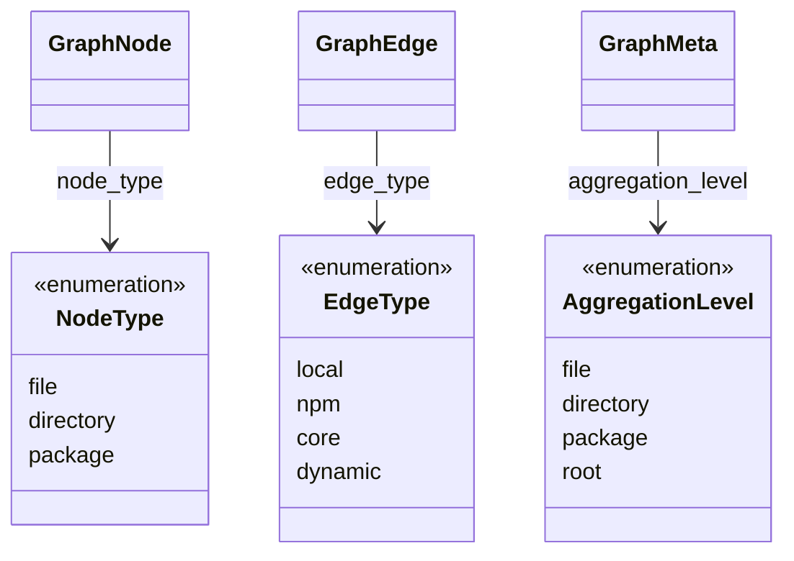

# Data Structures

Shared type contracts between Rust backend and TypeScript frontend.

## Core Types Overview



## Core Types

### ProcessedGraph (Root)

```typescript
// TypeScript (src/types.ts)
interface ProcessedGraph {
  nodes: GraphNode[];
  edges: GraphEdge[];
  meta: GraphMeta;
  violations: ViolationInfo[];
}
```

```rust
// Rust (src/lib.rs)
struct ProcessedGraph {
    nodes: Vec<GraphNode>,
    edges: Vec<GraphEdge>,
    meta: GraphMeta,
    violations: Vec<ViolationInfo>,
}
```

### GraphNode

```typescript
interface GraphNode {
  id: string;              // Unique identifier
  label: string;           // Display name
  node_type: NodeType;     // 'file' | 'directory' | 'package'
  path?: string;           // Original path (for drill-down)
  violation_count: number; // Number of violations
  children?: string[];     // Child node IDs (when aggregated)
}
```

```rust
struct GraphNode {
    id: String,
    label: String,
    node_type: NodeType,
    #[serde(skip_serializing_if = "Option::is_none")]
    path: Option<String>,
    violation_count: u32,
    #[serde(skip_serializing_if = "Option::is_none")]
    children: Option<Vec<String>>,
}
```

### GraphEdge

```typescript
interface GraphEdge {
  source: string;      // Source node ID
  target: string;      // Target node ID
  edge_type: EdgeType; // 'local' | 'npm' | 'core' | 'dynamic'
  weight: number;      // Aggregated edge weight
}
```

```rust
struct GraphEdge {
    source: String,
    target: String,
    edge_type: EdgeType,
    weight: u32,
}
```

### GraphMeta

```typescript
interface GraphMeta {
  original_node_count: number;      // Nodes before aggregation
  aggregated_node_count: number;    // Nodes after aggregation
  aggregation_level: AggregationLevel;
  total_violations: number;
}
```

```rust
struct GraphMeta {
    original_node_count: usize,
    aggregated_node_count: usize,
    aggregation_level: AggregationLevel,
    total_violations: usize,
}
```

### ViolationInfo

```typescript
interface ViolationInfo {
  from: string;       // Source module path
  to: string;         // Target module path
  rule: string;       // Rule name
  severity: 'error' | 'warn' | 'info';
  message?: string;   // Violation message
}
```

```rust
struct ViolationInfo {
    from: String,
    to: String,
    rule: String,
    severity: String,  // "error", "warn", or "info"
    message: Option<String>,
}
```

## Enums



### NodeType

| Value | Description |
|-------|-------------|
| `file` | Individual source file |
| `directory` | Grouped directory |
| `package` | Grouped npm package |

### EdgeType

| Value | Description |
|-------|-------------|
| `local` | Project internal |
| `npm` | External npm package |
| `core` | Node.js built-in |
| `dynamic` | Dynamic import |

### AggregationLevel

| Value | Threshold |
|-------|-----------|
| `file` | <=1000 nodes |
| `directory` | 1001-5000 nodes |
| `package` | 5001-20000 nodes |
| `root` | >20000 nodes |

## Input Types

The CLI handles two input structures:

### TypeScript Input (used by `scan` command via dependency-cruiser API)

```typescript
// From packages/cli/src/commands/convert.ts
interface DcModule {
  source: string;
  dependencies: DcDependency[];
  valid: boolean;
}

interface DcDependency {
  resolved: string;
  moduleSystem: string;
  coreModule: boolean;
  couldNotResolve: boolean;
  dependencyTypes: string[];
  followable: boolean;
  rules?: { name: string; severity: string }[];
}

interface DcOutput {
  modules: DcModule[];
  summary?: {
    violations: number;
    error: number;
    warn: number;
    info: number;
    totalCruised: number;
    totalDependenciesCruised: number;
  };
}
```

Edge classification in TypeScript (`classifyEdge`):

| Condition | Edge Type |
|-----------|-----------|
| `dep.coreModule === true` | `core` |
| `dep.couldNotResolve === true` | `dynamic` |
| `dep.dependencyTypes` includes `npm`/`npm-dev`/`npm-optional`/`npm-peer` | `npm` |
| Otherwise | `local` |

### Rust Input (used by `analyze` command)

```rust
// From packages/rust/src/lib.rs
struct CruiseResult {
    modules: Option<Vec<Module>>,
    dependencies: Option<Vec<Dependency>>,
    violations: Option<Vec<RawViolation>>,
    summary: Option<Summary>,
}

struct Module {
    source: String,
    #[serde(default)]
    dependencies: Vec<String>,
    #[serde(default)]
    dependency_types: Option<Vec<String>>,
    #[serde(default)]
    size: Option<usize>,
}

struct Dependency {
    #[serde(rename = "resolved")]
    resolved: Option<String>,
    #[serde(rename = "coreModule")]
    core_module: Option<String>,
    #[serde(rename = "dependencyTypes", default)]
    dependency_types: Vec<String>,
    #[serde(rename = "from", default)]
    from: Option<String>,
    #[serde(rename = "to", default)]
    to: Option<String>,
}

struct RawViolation {
    #[serde(rename = "from", default)]
    from: Option<String>,
    #[serde(rename = "to", default)]
    to: Option<String>,
    #[serde(rename = "rule", default)]
    rule: Option<Rule>,
    #[serde(rename = "message", default)]
    message: Option<String>,
}

struct Rule {
    #[serde(rename = "severity", default)]
    severity: Option<String>,
    #[serde(rename = "name", default)]
    name: Option<String>,
}

struct Summary {
    #[serde(rename = "violations", default)]
    violations: Option<usize>,
    #[serde(rename = "error", default)]
    error: Option<usize>,
    #[serde(rename = "warn", default)]
    warn: Option<usize>,
    #[serde(rename = "info", default)]
    info: Option<usize>,
}
```

Edge detection in Rust (`detect_edge_type`):

| Condition | Edge Type |
|-----------|-----------|
| `dependencyTypes` contains `"npm"` or `"node_modules"` | `Npm` |
| `dependencyTypes` contains `"core"` | `Core` |
| `dependencyTypes` contains `"dynamic"` | `Dynamic` |
| Otherwise | `Local` |

## Serialization Notes

### Rust

```rust
#[serde(rename_all = "lowercase")]  // NodeType, EdgeType, AggregationLevel
#[serde(skip_serializing_if = "Option::is_none")]  // Optional fields
#[serde(default)]  // Missing fields use default values
```

### TypeScript

Use snake_case to match JSON output:

```typescript
node_type  // NOT nodeType
edge_type  // NOT edgeType
aggregation_level  // NOT aggregationLevel
```
