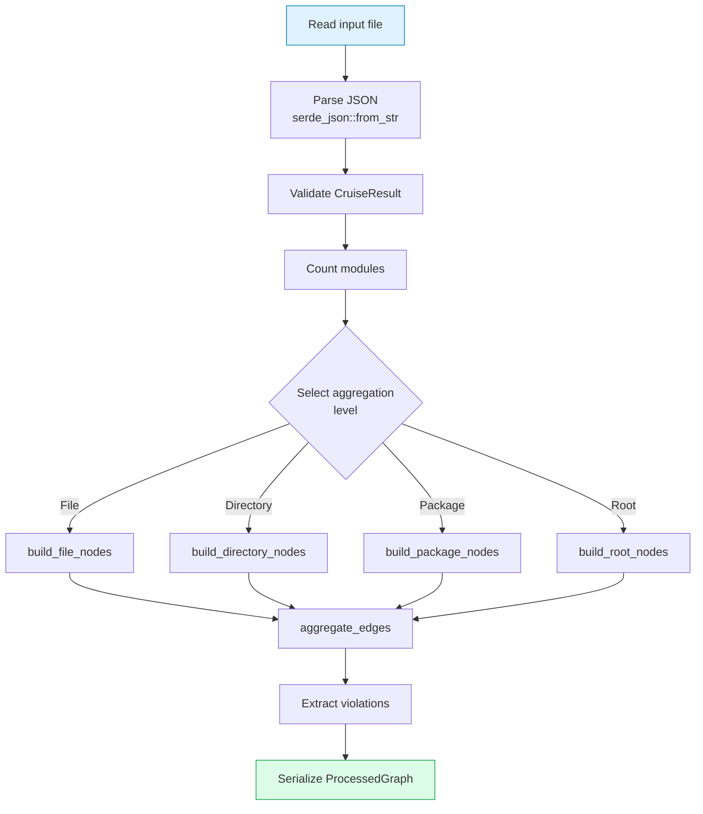
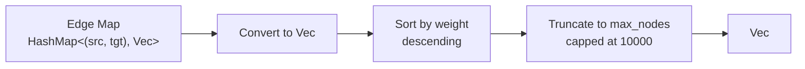

# Rust Engine Design

## Overview

The Rust preprocessing engine is the core of dependency-cruiser-reporter, responsible for parsing, aggregating, and transforming dependency-cruiser JSON output. It compiles to a native binary (`dcr-aggregate`) invoked by the CLI.

## Dependencies

| Crate | Purpose |
|-------|---------|
| `serde` + `serde_json` | JSON serialization/deserialization |
| `thiserror` | Error handling |
| `clap` | CLI argument parsing (binary only) |

## Module Structure

```
packages/rust/
├── Cargo.toml
├── src/
│   ├── lib.rs      # Core library (data structures + processing + tests)
│   └── main.rs     # CLI entry point (dcr-aggregate binary)
```

All data structures, processing logic, and tests are in `lib.rs`. The binary in `main.rs` is a thin CLI wrapper.

## Processing Flow



## Entry Point

### Library API (`lib.rs`)

```rust
pub fn parse_and_aggregate(
    input: &Path,
    max_nodes: usize,
    level: Option<AggregationLevel>,
    _layout: bool,
) -> Result<ProcessedGraph, DcrError>
```

Reads the input file, parses the JSON, determines aggregation level, builds nodes and edges, and returns the processed graph.

### CLI (`main.rs`)

```bash
dcr-aggregate --input <path> --output <path> [options]
```

Uses clap derive API. Parses arguments, calls `parse_and_aggregate`, and writes the output JSON.

## Error Handling

> Error handling is defined in the [Rust package docs](../packages/rust.md#error-handling).

## Core Functions

### Aggregation Builders

| Function | Level | Behavior |
|----------|-------|----------|
| `build_file_nodes` | File | No transformation, pass-through |
| `build_directory_nodes` | Directory | Group by parent directory |
| `build_package_nodes` | Package | Group by npm package name |
| `build_root_nodes` | Root | Single node with all modules |

### Edge Processing



1. Convert edge map to vector
2. Sort by weight (descending)
3. Truncate to `max_nodes` (capped at 10000)

### Helper Functions

| Function | Purpose |
|----------|---------|
| `select_aggregation_level` | Determine level from node count thresholds |
| `detect_edge_type` | Classify edge from `dependencyTypes` |
| `get_parent_directory` | Extract parent directory from path |
| `extract_package_name` | Extract npm package name from `node_modules/` path |

## Testing

Tests are inline in `lib.rs` under `#[cfg(test)] mod tests`:

```bash
cargo test        # Run unit tests
cargo clippy      # Lint
cargo fmt         # Format
```

### Test Coverage

| Test | Purpose |
|------|---------|
| `test_aggregation_level_selection` | Verify threshold logic |
| `test_edge_type_detection` | Verify edge type classification |
| `test_package_name_extraction` | Verify npm package parsing |

## Build Profiles

Release builds are optimized for:
- Maximum optimization level (`opt-level = 3`)
- Link-time optimization (`lto = true`)
- Single codegen unit for better optimization
