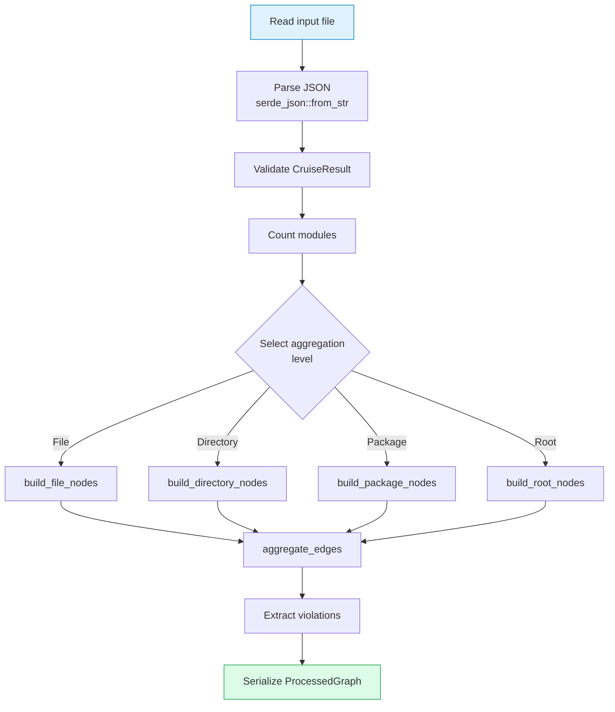
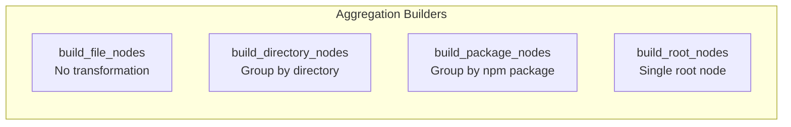

# Rust Engine Design

## Overview

The Rust preprocessing engine is the core of dependency-cruiser-reporter, responsible for parsing, aggregating, and transforming dependency-cruiser JSON output.

## Dependencies

```toml
[dependencies]
serde = { version = "1.0", features = ["derive"] }
serde_json = "1.0"
thiserror = "1.0"
clap = { version = "4.5", features = ["derive"] }
```

| Crate | Purpose |
|-------|---------|
| `serde` + `serde_json` | JSON serialization/deserialization |
| `thiserror` | Error handling |
| `clap` | CLI argument parsing |

## Module Structure

```
packages/rust/
├── Cargo.toml
├── src/
│   ├── lib.rs      # Core library (data structures + processing)
│   └── main.rs     # CLI entry point
```

## Processing Flow



## Entry Point

### Library API (`lib.rs`)

```rust
pub fn parse_and_aggregate(
    input: &Path,
    max_nodes: usize,
    level: Option<AggregationLevel>,
    layout: bool,
) -> Result<ProcessedGraph, DcrError>
```

### CLI (`main.rs`)

```bash
dcr-aggregate --input <path> --output <path> [options]
```

## Error Handling

```rust
#[derive(Error, Debug)]
pub enum DcrError {
    #[error("Failed to read file: {0}")]
    IoError(#[from] std::io::Error),

    #[error("Failed to parse JSON: {0}")]
    JsonError(#[from] serde_json::Error),

    #[error("Invalid input: {0}")]
    InvalidInput(String),
}
```

## Core Functions

### Aggregation Builders



| Function | Level | Behavior |
|----------|-------|----------|
| `build_file_nodes` | File | No transformation, pass-through |
| `build_directory_nodes` | Directory | Group by parent directory |
| `build_package_nodes` | Package | Group by npm package name |
| `build_root_nodes` | Root | Single node with all modules |

### Edge Processing

```mermaid
flowchart LR
    EdgeMap[Edge Map\nHashMap&lt;(src, tgt), Vec&lt;String&gt;&gt;] --> Convert[Convert to Vec]
    Convert --> Sort[Sort by weight\ndescending]
    Sort --> Truncate[Truncate to max_nodes\ncapped at 10000]
    Truncate --> Result[Vec&lt;GraphEdge&gt;]
```

1. Convert edge map to vector
2. Sort by weight (descending)
3. Truncate to `max_nodes` (capped at 10000)

## Testing

```bash
cargo test        # Run unit tests
cargo clippy      # Lint
cargo fmt         # Format
```

### Test Coverage

| Test | Purpose |
|------|---------|
| `test_aggregation_level_selection` | Verify threshold logic |
| `test_edge_type_detection` | Verify edge type classification |
| `test_package_name_extraction` | Verify npm package parsing |

## Build Profiles

```toml
[profile.release]
opt-level = 3
lto = true
codegen-units = 1
```

Release builds are optimized for:
- Maximum optimization level (`opt-level = 3`)
- Link-time optimization (`lto = true`)
- Single codegen unit for better optimization