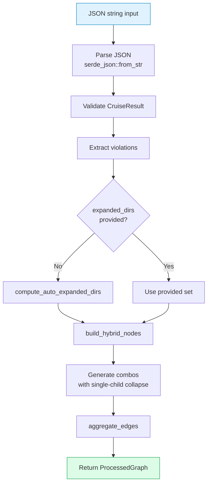

# Rust Engine Design

## Overview

The Rust preprocessing engine is the core of dependency-cruiser-reporter, responsible for parsing, aggregating, and transforming dependency-cruiser JSON output. It compiles to a WebAssembly module invoked by the CLI via JavaScript bindings.

## Dependencies

| Crate | Purpose |
|-------|---------|
| `serde` + `serde_json` | JSON serialization/deserialization |
| `thiserror` | Error handling |
| `wasm-bindgen` | JavaScript/WASM interop |
| `serde-wasm-bindgen` | Serde integration for WASM |
| `js-sys` | JavaScript standard library bindings |

## Module Structure

```
packages/rust/
├── Cargo.toml
├── src/
│   ├── lib.rs           # Library entry point, WASM exports
│   ├── lib_test.rs      # Unit tests
│   ├── types.rs         # Data structures (ProcessedGraph, GraphNode, etc.)
│   └── aggregate/       # Aggregation logic
│       ├── mod.rs       # Module exports
│       ├── edges.rs     # Edge extraction, aggregation, type detection
│       ├── expand.rs    # Auto-compute expanded directories algorithm
│       └── hybrid.rs    # Hybrid node building with combo generation
│       └── violations.rs # Violation parsing and edge association
```

The codebase is organized into modules:
- `types.rs`: All data structures and error types
- `aggregate/`: Processing logic for node aggregation and edge handling
- `violations.rs`: Violation parsing and counting
- `lib_test.rs`: Comprehensive unit tests

## Processing Flow


```mermaid
flowchart TB
    Input[JSON string input] --> Parse[Parse JSON\nserde_json::from_str]
    Parse --> Validate[Validate CruiseResult]
    Validate --> Violations[Extract violations]
    Violations --> ComputeExpanded{expanded_dirs\nprovided?}
    ComputeExpanded -->|No| AutoExpand[compute_auto_expanded_dirs]
    ComputeExpanded -->|Yes| UseProvided[Use provided set]
    AutoExpand --> BuildHybrid[build_hybrid_nodes]
    UseProvided --> BuildHybrid

    BuildHybrid --> Combos[Generate combos\nwith single-child collapse]
    Combos --> EdgeProc[aggregate_edges]
    EdgeProc --> Output[Return ProcessedGraph]

    style Input fill:#e0f2fe,stroke:#0284c7
    style Output fill:#dcfce7,stroke:#16a34a
```

The hybrid aggregation approach allows mixing expanded (file-level) and collapsed (directory-level) nodes in the same graph.

## Entry Points

### WASM API (`lib.rs`)

```rust
#[wasm_bindgen(js_name = aggregate)]
pub fn wasm_aggregate(
    content: &str,
    max_nodes: usize,
    expanded_dirs: Option<Array>,
) -> Result<JsValue, JsValue>
```

WASM entry point called from JavaScript. Parses dependency-cruiser JSON string and returns the aggregated graph as a JavaScript object.

**Parameters:**

| Param | Type | Description |
|-------|------|-------------|
| `content` | `&str` | dependency-cruiser JSON string |
| `max_nodes` | `usize` | Maximum edges in output |
| `expanded_dirs` | `Option<Array>` | JS array of directory paths to expand |

### Core Logic (`lib.rs`)

```rust
pub fn aggregate_from_str(
    content: &str,
    max_nodes: usize,
    expanded_dirs: Option<Vec<String>>,
) -> Result<ProcessedGraph, DcrError>
```

Core aggregation logic used by both WASM and test targets. Parses JSON string and produces the aggregated graph.

**Parameters:**

| Param | Type | Description |
|-------|------|-------------|
| `content` | `&str` | dependency-cruiser JSON string |
| `max_nodes` | `usize` | Maximum edges in output |
| `expanded_dirs` | `Option<Vec<String>>` | Directories to expand; `None` triggers auto-computation |

When `expanded_dirs` is `None`, the `compute_auto_expanded_dirs` function determines which directories to expand based on a budget algorithm. Directories in this set show file-level nodes; others are collapsed to directory nodes.

## Error Handling

`DcrError` has three variants:
- **IoError** — file I/O failures (for compatibility, though not used in WASM mode)
- **JsonError** — JSON parse failures (auto-converted from `serde_json::Error`)
- **InvalidInput** — malformed input data (with descriptive message)

## Core Functions

### Aggregation Builders

| Function | Module | Purpose |
|----------|--------|---------|
| `build_hybrid_nodes` | `aggregate/hybrid.rs` | Build nodes and combos based on expanded_dirs set |
| `compute_auto_expanded_dirs` | `aggregate/expand.rs` | Auto-compute expanded directories using budget algorithm |
| `aggregate_edges` | `aggregate/edges.rs` | Aggregate and sort edges by weight |
| `extract_edges` | `aggregate/edges.rs` | Extract raw edges from modules |
| `compute_violation_counts` | `aggregate/edges.rs` | Count violations per module |

### Edge Processing


```mermaid
flowchart LR
    EdgeMap["Edge Map\nHashMap<(src, tgt), Vec<String>>"] --> Convert[Convert to Vec]
    Convert --> Sort["Sort by weight\ndescending"]
    Sort --> Truncate["Truncate to max_nodes\ncapped at 10000"]
    Truncate --> Result["Vec<GraphEdge>"]
```

1. Convert edge map to vector
2. Sort by weight (descending)
3. Truncate to `max_nodes` (capped at 10000)

### Helper Functions

| Function | Module | Purpose |
|----------|--------|---------|
| `detect_edge_type` | `aggregate/edges.rs` | Classify edge from `dependencyTypes` |
| `is_path_expanded` | `aggregate/hybrid.rs` | Check if path should show files |
| `find_closest_unexpanded_ancestor` | `aggregate/hybrid.rs` | Find collapsed ancestor for a path |

## Testing

Tests are in `lib_test.rs`:

```bash
cargo test        # Run unit tests (native)
cargo clippy      # Lint
cargo fmt         # Format
```

WASM-specific tests use `wasm-bindgen-test` and run via `wasm-pack test --node`:

```bash
wasm-pack test --node  # Run WASM tests in Node.js
```

### Test Coverage

| Test | Purpose |
|------|---------|
| `test_aggregate_from_str_*` | Verify JSON parsing and aggregation |
| `test_wasm_aggregate_*` | Verify WASM bindings (wasm32 target only) |
| `test_edge_type_detection` | Verify edge type classification |
| `test_smart_expansion_*` | Verify auto-expand budget algorithm |

## Build Profiles

Release builds are optimized for:
- Maximum optimization level (`opt-level = 3`)
- Link-time optimization (`lto = true`)
- Single codegen unit for better optimization

## Build Commands

```bash
# Build WASM module (via wasm-pack)
pnpm build:rust

# Debug build
cargo build

# Run tests
cargo test

# Lint
cargo clippy

# Format check
cargo fmt --check
```