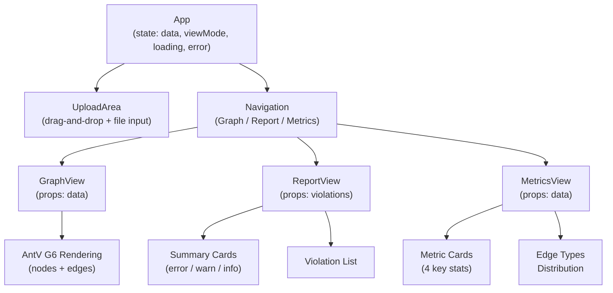
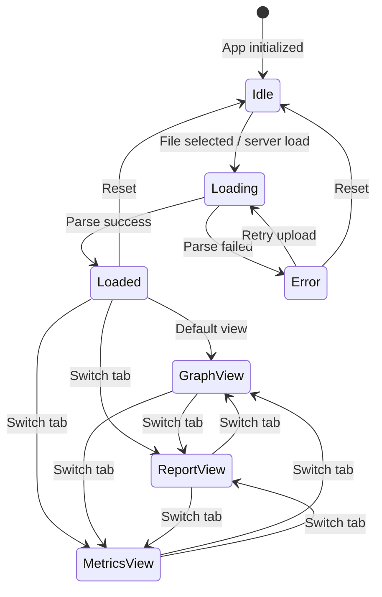

# Frontend Components

## Technology Stack

| Technology | Purpose |
|------------|---------|
| React 18 | UI framework |
| AntV G6 5 | Graph visualization |
| Vite 5 | Build tool |
| TypeScript 5 | Type safety |
| Biome | Linting/formatting |

## Project Structure

```
packages/frontend/
├── src/
│   ├── App.tsx        # Main application (all views inline)
│   ├── main.tsx       # React entry point
│   └── types.ts       # Type definitions
├── index.html         # HTML template
├── vite.config.ts     # Vite configuration
├── tsconfig.json      # TypeScript config
├── biome.json         # Biome config
└── package.json
```

## Component Architecture



All view components (GraphView, ReportView, MetricsView) are defined inline in `App.tsx`, not in separate files.

### App (Root)

Main application component managing:

- Server-side data loading (via `/api/config` + `/api/graph`)
- File upload state
- View mode switching
- Data loading

On mount, the App fetches graph data from the Express server via `/api/config` and `/api/graph` endpoints. If no server data is available, it falls back to file upload.

### UploadArea

File upload with drag-and-drop. When a file is selected, it is read as text and parsed with `JSON.parse`.

### GraphView

Dependency graph visualization using the `DependencyGraph` component (AntV G6 comboCombined layout). See [views.md](./views.md#graph-view) for details.

### ReportView

Groups violations by severity (error/warn/info) and renders summary cards with counts.

### MetricsView

Displays summary statistics: original node count, aggregated node count, dependency count, and edge type distribution.

## State Management



Current implementation uses React `useState`. No external state management library.

| State | Type | Owner |
|-------|------|-------|
| `data` | `ProcessedGraph \| null` | App |
| `viewMode` | `'graph' \| 'report' \| 'metrics'` | App |
| `loading` | `boolean` | App |
| `error` | `string \| null` | App |

## Styling

Inline styles defined in `styles` object within `App.tsx`. Color palette:

| Token | Hex | Usage |
|-------|-----|-------|
| Primary | `#4a90d9` | Nodes, links |
| Error | `#ef4444` | Errors |
| Warning | `#f59e0b` | Warnings |
| Info | `#3b82f6` | Info |
| Background | `#f8fafc` | Page background |

## Commands

```bash
pnpm dev           # Start dev server (http://localhost:5173)
pnpm build         # Production build
pnpm lint          # Biome linting
```
