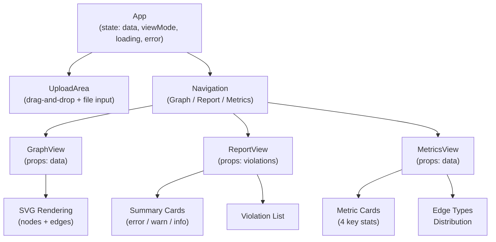
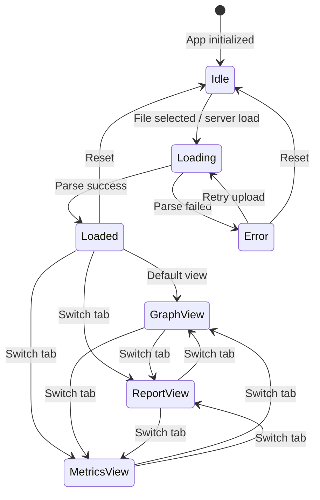

# Frontend Components

## Technology Stack

| Technology | Purpose |
|------------|---------|
| React 18 | UI framework |
| D3.js 7 | Graph visualization |
| Vite 5 | Build tool |
| TypeScript 5 | Type safety |
| Biome | Linting/formatting |

## Project Structure

```
packages/frontend/
├── src/
│   ├── App.tsx        # Main application (all views inline)
│   ├── main.tsx       # React entry point
│   └── types.ts       # Type definitions
├── index.html         # HTML template
├── vite.config.ts     # Vite configuration
├── tsconfig.json      # TypeScript config
├── biome.json         # Biome config
└── package.json
```

## Component Architecture



All view components (GraphView, ReportView, MetricsView) are defined inline in `App.tsx`, not in separate files.

### App (Root)

Main application component managing:

- Server-side data loading (via `/api/config` + `/api/graph`)
- File upload state
- View mode switching
- Data loading

```tsx
function App() {
  const [data, setData] = useState<ProcessedGraph | null>(null);
  const [viewMode, setViewMode] = useState<ViewMode>('graph');
  const [loading, setLoading] = useState(false);
  const [error, setError] = useState<string | null>(null);
  // ...
}
```

On mount, the App checks if a graph file is available from the server:

```tsx
useEffect(() => {
  const loadGraphFromServer = async () => {
    const configRes = await fetch('/api/config');
    const config = await configRes.json();
    if (config.hasGraphFile) {
      const graphRes = await fetch('/api/graph');
      // ...
    }
  };
  loadGraphFromServer();
}, []);
```

### UploadArea

File upload with drag-and-drop:

```tsx
<div onDrop={handleDrop} onDragOver={handleDragOver}>
  <input type="file" accept=".json" />
</div>
```

When a file is selected, it is read as text and parsed with `JSON.parse` (no WASM processing).

### GraphView

Dependency graph visualization:

```tsx
function GraphView({ data }: { data: ProcessedGraph }) {
  // SVG-based node/edge rendering
  // 5-column grid layout
  // Max 20 edges displayed
}
```

### ReportView

Violation list with severity grouping:

```tsx
function ReportView({ violations }: { violations: ViolationInfo[] }) {
  const errors = violations.filter(v => v.severity === 'error');
  const warnings = violations.filter(v => v.severity === 'warn');
  // ...
}
```

### MetricsView

Summary statistics dashboard:

```tsx
function MetricsView({ data }: { data: ProcessedGraph }) {
  // Display counts, edge type distribution
}
```

## State Management



Current implementation uses React `useState`. No external state management library.

| State | Type | Owner |
|-------|------|-------|
| `data` | `ProcessedGraph \| null` | App |
| `viewMode` | `'graph' \| 'report' \| 'metrics'` | App |
| `loading` | `boolean` | App |
| `error` | `string \| null` | App |

## Styling

Inline styles defined in `styles` object within `App.tsx`:

```tsx
const styles: Record<string, React.CSSProperties> = {
  container: { minHeight: '100vh', ... },
  header: { background: '#fff', ... },
  // ...
};
```

Color palette:

| Token | Hex | Usage |
|-------|-----|-------|
| Primary | `#4a90d9` | Nodes, links |
| Error | `#ef4444` | Errors |
| Warning | `#f59e0b` | Warnings |
| Info | `#3b82f6` | Info |
| Background | `#f8fafc` | Page background |

## Commands

```bash
pnpm dev           # Start dev server (http://localhost:5173)
pnpm build         # Production build
pnpm lint          # Biome linting
```
