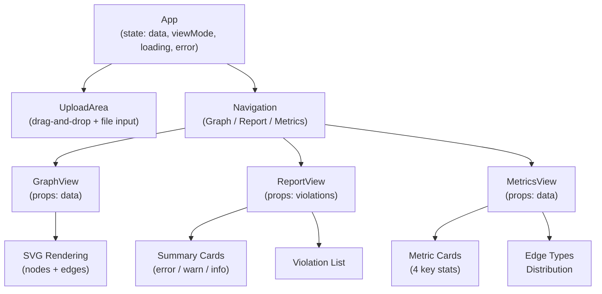
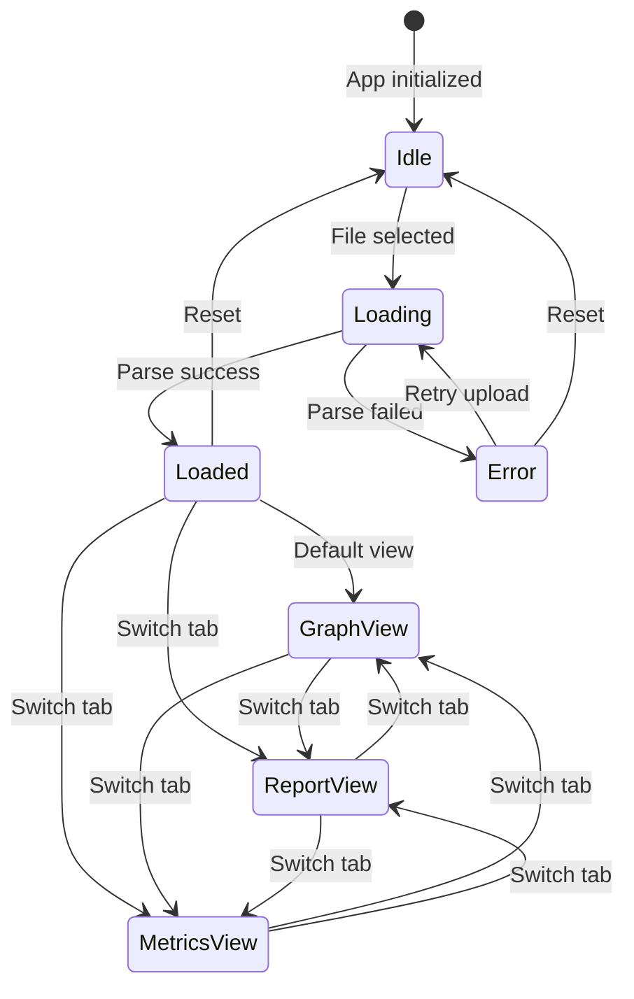

# Frontend Components

## Technology Stack

| Technology | Purpose |
|------------|---------|
| React 18 | UI framework |
| D3.js 7 | Graph visualization |
| Vite 5 | Build tool |
| TypeScript 5 | Type safety |
| Biome | Linting/formatting |
| Playwright | E2E testing |

## Project Structure

```
packages/frontend/
├── src/
│   ├── App.tsx        # Main application
│   ├── main.tsx       # React entry point
│   └── types.ts       # Type definitions
├── e2e/
│   └── app.spec.ts    # E2E tests
├── index.html         # HTML template
├── vite.config.ts     # Vite configuration
├── tsconfig.json      # TypeScript config
├── biome.json         # Biome config
└── playwright.config.ts # Playwright config
```

## Component Architecture



### App (Root)

Main application component managing:

- File upload state
- View mode switching
- Data loading

```tsx
function App() {
  const [data, setData] = useState<ProcessedGraph | null>(null);
  const [viewMode, setViewMode] = useState<ViewMode>('graph');
  // ...
}
```

### UploadArea

File upload with drag-and-drop:

```tsx
<div
  onDrop={handleDrop}
  onDragOver={handleDragOver}
>
  <input type="file" accept=".json" />
</div>
```

### GraphView

Dependency graph visualization:

```tsx
function GraphView({ data }: { data: ProcessedGraph }) {
  // SVG-based node/edge rendering
}
```

### ReportView

Violation list with severity grouping:

```tsx
function ReportView({ violations }: { violations: ViolationInfo[] }) {
  const errors = violations.filter(v => v.severity === 'error');
  const warnings = violations.filter(v => v.severity === 'warn');
  // ...
}
```

### MetricsView

Summary statistics dashboard:

```tsx
function MetricsView({ data }: { data: ProcessedGraph }) {
  // Display counts, edge type distribution
}
```

## State Management



Current implementation uses React `useState`. No external state management library.

| State | Type | Owner |
|-------|------|-------|
| `data` | `ProcessedGraph \| null` | App |
| `viewMode` | `'graph' \| 'report' \| 'metrics'` | App |
| `loading` | `boolean` | App |
| `error` | `string \| null` | App |

## Styling

Inline styles defined in `styles` object:

```tsx
const styles: Record<string, React.CSSProperties> = {
  container: { minHeight: '100vh', ... },
  header: { background: '#fff', ... },
  // ...
};
```

Color palette:

| Token | Hex | Usage |
|-------|-----|-------|
| Primary | `#4a90d9` | Nodes, links |
| Error | `#ef4444` | Errors |
| Warning | `#f59e0b` | Warnings |
| Info | `#3b82f6` | Info |
| Background | `#f8fafc` | Page background |

## Commands

```bash
pnpm dev           # Start dev server
pnpm build         # Production build
pnpm typecheck     # TypeScript check
pnpm lint          # Biome linting
pnpm test:e2e      # Playwright tests
```