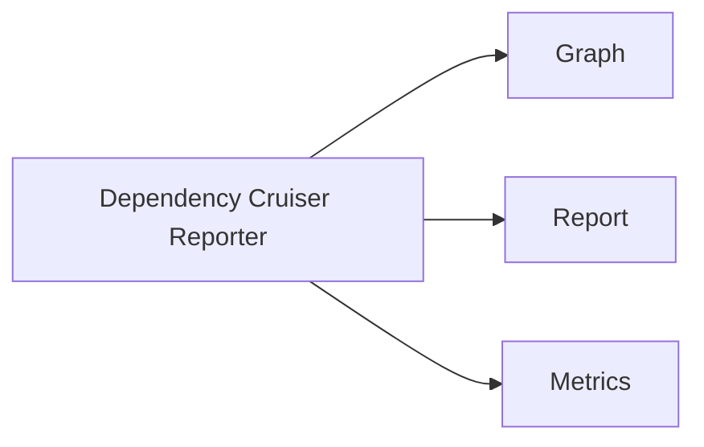
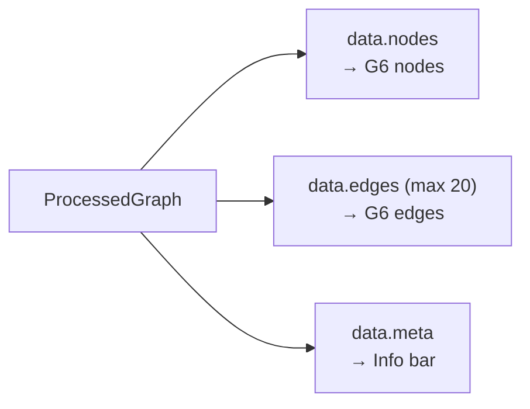
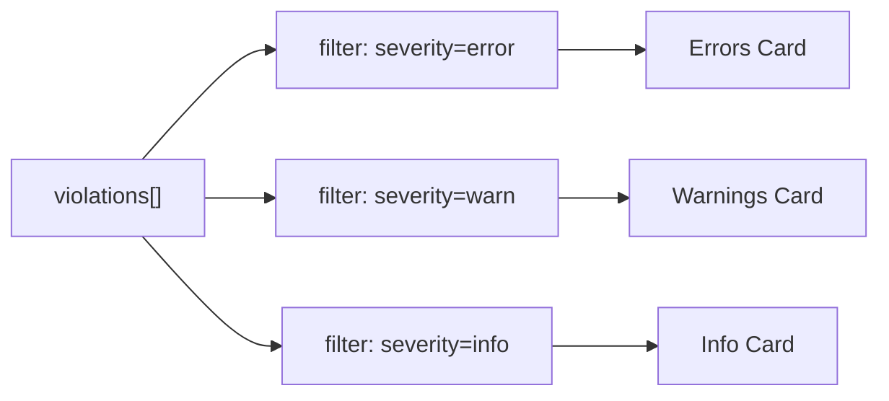
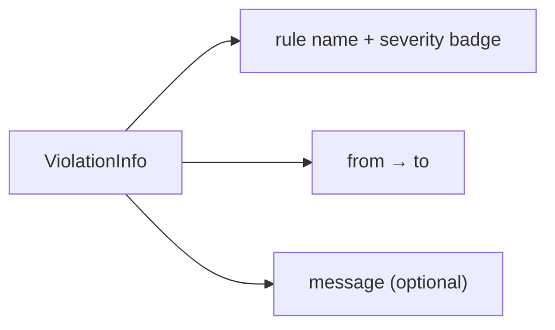
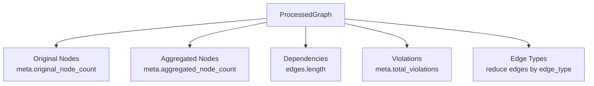
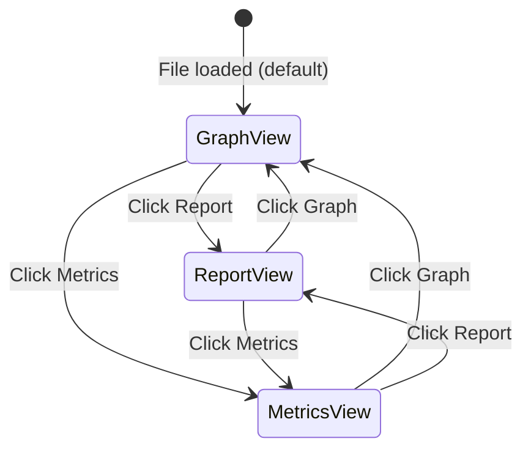

# Views

Three main views in the application.

## View Navigation

## Graph View

Interactive dependency graph visualization.

### Features

- AntV G6 canvas/SVG rendering
- comboCombined layout with automatic node positioning
- Edge rendering with weight-based stroke width (max 3px)
- Node/edge counts display
- Max 20 edges displayed

### Layout Algorithm

Layout uses AntV G6's `comboCombined` layout algorithm, which automatically positions nodes in a force-directed arrangement with combo (group) support for aggregated nodes.

### Data Rendering

### Data Displayed

| Element | Source |
|---------|--------|
| Nodes | `data.nodes` |
| Edges | `data.edges` (max 20 shown) |
| Counts | `data.meta` |

---

## Report View

Violation list grouped by severity.

### Summary Cards

### Violation Items

Each violation item displays:

### Severity Colors

| Severity | Border Color |
|----------|--------------|
| `error` | `#ef4444` (red) |
| `warn` | `#f59e0b` (amber) |
| `info` | `#3b82f6` (blue) |

### Filtering

Current: No filtering

---

## Metrics View

Summary statistics dashboard.

### Key Metrics

### Edge Type Distribution

| Type | Source |
|------|--------|
| `local` | `edges.filter(e => e.edge_type === 'local').length` |
| `npm` | `edges.filter(e => e.edge_type === 'npm').length` |
| `core` | `edges.filter(e => e.edge_type === 'core').length` |
| `dynamic` | `edges.filter(e => e.edge_type === 'dynamic').length` |

### Data Sources

| Metric | Source |
|--------|--------|
| Original Nodes | `meta.original_node_count` |
| Aggregated Nodes | `meta.aggregated_node_count` |
| Dependencies | `edges.length` |
| Violations | `meta.total_violations` |
| Edge Types | `edges[].edge_type` aggregation |

---

## View Mode Switching

View switching uses React `useState` with a `ViewMode` union type (`'graph' | 'report' | 'metrics'`). The active view is rendered conditionally based on the current state.
