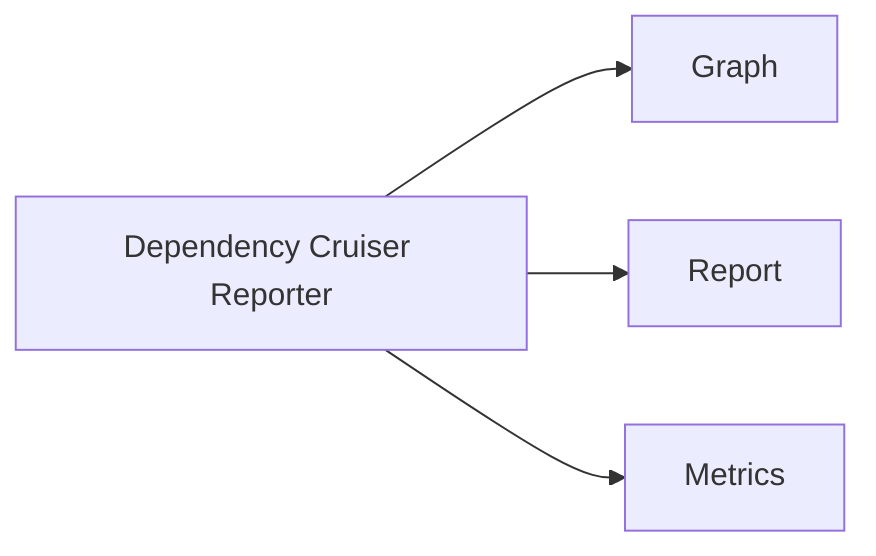
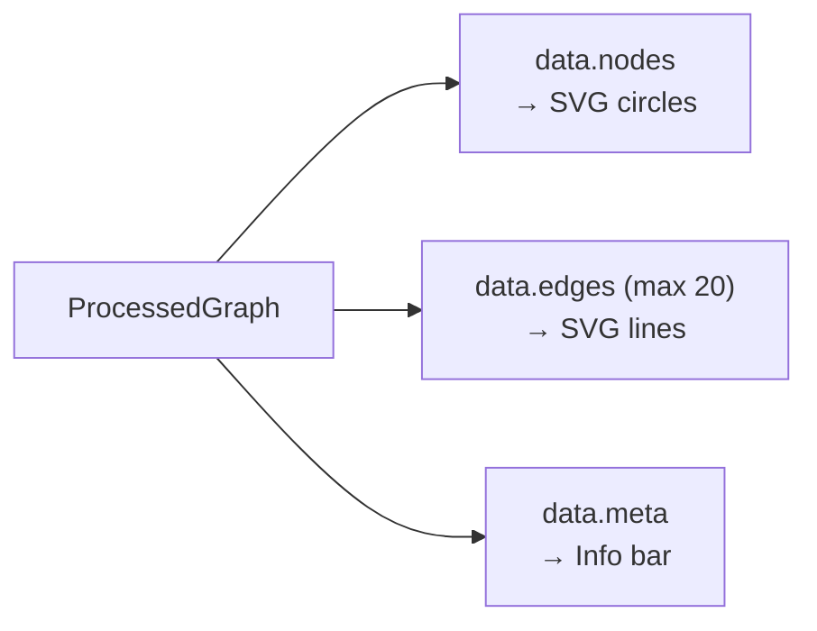
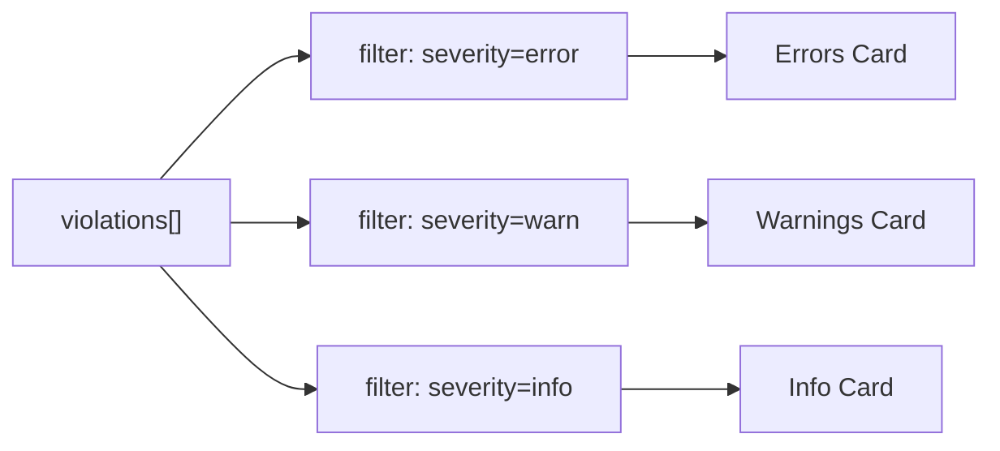
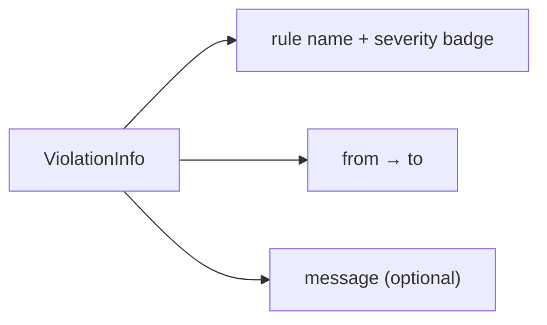
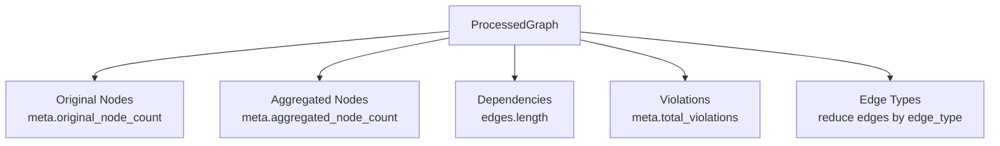
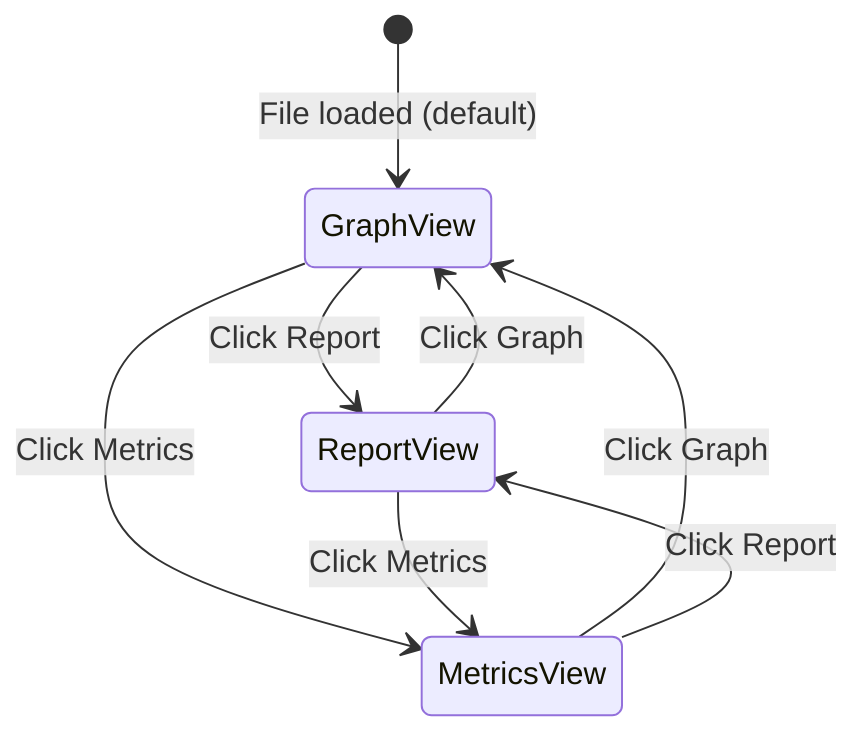

# Views

Three main views in the application.

## View Navigation



## Graph View

Interactive dependency graph visualization.

### Features

- SVG-based rendering
- Node grid layout (5 columns)
- Edge rendering with weight-based stroke width (max 3px)
- Node/edge counts display
- Max 20 edges displayed

### Layout Algorithm

```tsx
const x = 100 + (i % 5) * 150;  // 5-column grid
const y = 100 + Math.floor(i / 5) * 100;
```

### Data Rendering



### Data Displayed

| Element | Source |
|---------|--------|
| Nodes | `data.nodes` |
| Edges | `data.edges` (max 20 shown) |
| Counts | `data.meta` |

---

## Report View

Violation list grouped by severity.

### Summary Cards



### Violation Items

Each violation item displays:



### Severity Colors

| Severity | Border Color |
|----------|--------------|
| `error` | `#ef4444` (red) |
| `warn` | `#f59e0b` (amber) |
| `info` | `#3b82f6` (blue) |

### Filtering

Current: No filtering

---

## Metrics View

Summary statistics dashboard.

### Key Metrics



### Edge Type Distribution

| Type | Source |
|------|--------|
| `local` | `edges.filter(e => e.edge_type === 'local').length` |
| `npm` | `edges.filter(e => e.edge_type === 'npm').length` |
| `core` | `edges.filter(e => e.edge_type === 'core').length` |
| `dynamic` | `edges.filter(e => e.edge_type === 'dynamic').length` |

### Data Sources

| Metric | Source |
|--------|--------|
| Original Nodes | `meta.original_node_count` |
| Aggregated Nodes | `meta.aggregated_node_count` |
| Dependencies | `edges.length` |
| Violations | `meta.total_violations` |
| Edge Types | `edges[].edge_type` aggregation |

---

## View Mode Switching



```tsx
const [viewMode, setViewMode] = useState<ViewMode>('graph');

// Navigation buttons
<button onClick={() => setViewMode('graph')}>Graph</button>
<button onClick={() => setViewMode('report')}>Report</button>
<button onClick={() => setViewMode('metrics')}>Metrics</button>

// Conditional rendering
{viewMode === 'graph' && <GraphView data={data} />}
{viewMode === 'report' && <ReportView violations={data.violations} />}
{viewMode === 'metrics' && <MetricsView data={data} />}
```
