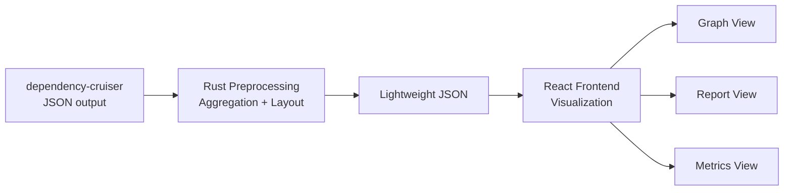
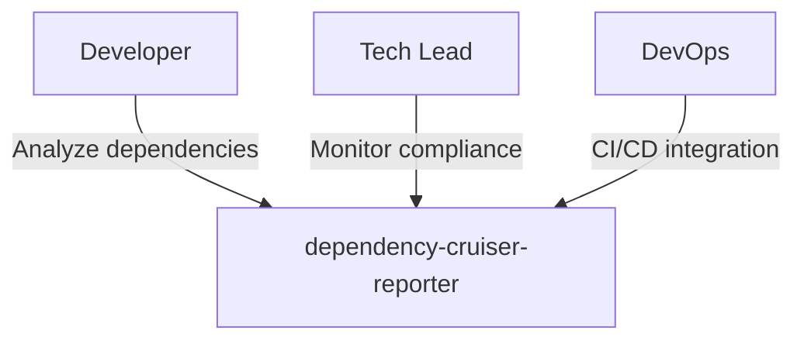

# Project Overview

dependency-cruiser-reporter is a visualization tool for [dependency-cruiser](https://github.com/sverrejo/nmc-dependency-cruiser) scan results.

## Problem Statement

[dependency-cruiser](https://github.com/sverrejo/nmc-dependency-cruiser) is a JavaScript/TypeScript static analysis tool that detects dependency issues:

- Circular dependencies
- Unused dependencies
- Rule violations (e.g., architecture constraints)

It outputs JSON format with detailed reports, but its native HTML report capabilities are limited.

## Solution

**dependency-cruiser-reporter** transforms dependency-cruiser JSON output into interactive visualizations:

### Core Features

1. **Dependency Graph** — Interactive graph with zoom, drag, and node expansion
2. **Error Report** — Violations grouped by severity (error/warn/info)
3. **Metrics Dashboard** — Summary statistics and trends

## Core Features

### 1. Dependency Graph Visualization

- Parse module dependencies from dependency-cruiser JSON
- Generate interactive dependency graph
- Distinguish edge types:
  - **resolvable** — Regular dependencies
  - **dynamic** — Dynamic imports
  - **unresolvable** — Invalid dependencies
  - **circular** — Circular dependencies
- Support filtering by rule, path, or package name

### 2. Error Report

- Extract all violations and errors
- Group by severity: `error` / `warn` / `info`
- Group by rule type
- Support search and filtering

### 3. Metrics Dashboard

- Summary statistics:
  - Total modules
  - Total dependency edges
  - Violation counts by type
  - Circular dependency count
  - Internal vs external dependency ratio
- Multi-scan comparison (future)
- Export capability: JSON/CSV/PDF (future)

## Target Users

| Role | Use Case |
|------|----------|
| Developer | Analyze project dependencies during development |
| Tech Lead | Monitor architecture compliance during code review |
| DevOps | Integrate into CI/CD pipeline for automated checks |

## Feature Roadmap

```mermaid
flowchart LR
    subgraph P0["P0 - Must Have"]
        P0A[Rust Preprocessing]
        P0B[Auto Aggregation]
        P0C[Layout Pre-compute]
        P0D[Graph Display]
        P0E[Violation Report]
        P0F[Basic Metrics]
    end

    subgraph P1["P1 - Should Have"]
        P1A[Drill-down/Roll-up]
        P1B[Filters]
        P1C[Search]
        P1D[Multi-scan Compare]
        P1E[Export JSON/CSV]
    end

    subgraph P2["P2 - Nice to Have"]
        P2A[Dark Theme]
        P2B[Mobile Responsive]
        P2C[Source Explorer]
        P2D[Pre-commit Hook]
    end

    P0 --> P1 --> P2
```

## Non-Goals

- Real-time dependency monitoring
- IDE integration (out of scope for P0)
- Custom rule definition (use dependency-cruiser directly)