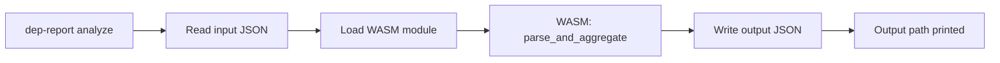
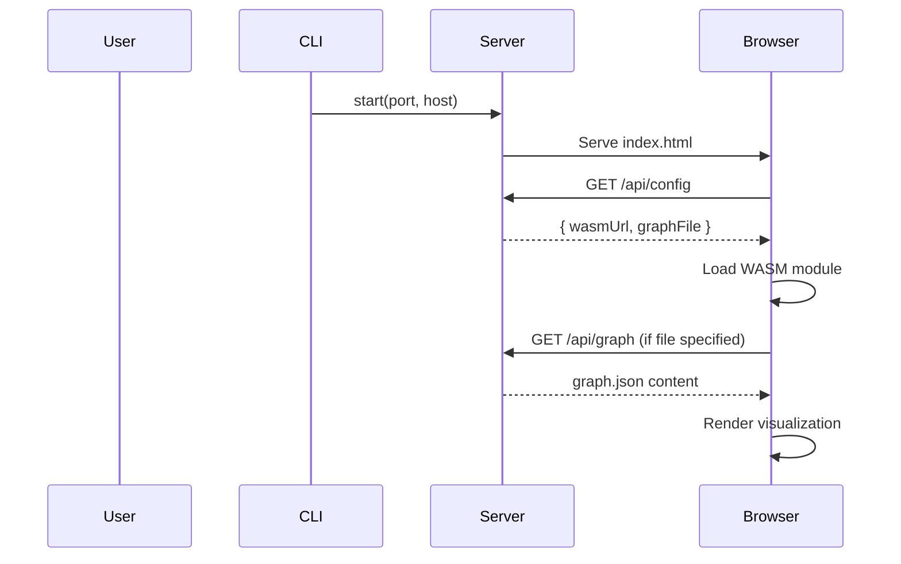

# CLI Package

## Overview

The `packages/cli` package provides the command-line interface for dependency-cruiser-reporter. It handles:

1. **`analyze`** — Process dependency-cruiser JSON output
2. **`open`** — Start HTTP server to view results

## Package Structure

```
packages/cli/
├── bin/
│   └── cli.js           # CLI entry point
├── src/
│   ├── commands/
│   │   ├── analyze.ts   # Analyze command implementation
│   │   └── open.ts      # Open command implementation
│   ├── server.ts        # HTTP server for 'open' command
│   └── index.ts         # Main exports
├── package.json
└── tsconfig.json
```

## Commands

### `dep-report analyze`

Process dependency-cruiser JSON and generate aggregated graph.



**Usage:**

```bash
dep-report analyze --input <path> [options]
```

**Options:**

| Flag | Default | Description |
|------|---------|-------------|
| `-i, --input <path>` | (required) | Input dependency-cruiser JSON file |
| `-o, --output <path>` | `graph.json` | Output graph JSON file |
| `-l, --level <level>` | auto | Aggregation level: `file` \| `directory` \| `package` \| `root` |
| `-m, --max-nodes <n>` | `5000` | Maximum nodes in output |

**Example:**

```bash
# Basic usage
dep-report analyze --input cruise.json

# Specify output and level
dep-report analyze -i cruise.json -o output/graph.json -l directory
```

---

### `dep-report open`

Start HTTP server to view processed graph.

```mermaid
flowchart TB
    CLI[dep-report open] --> Server[Start HTTP server]
    Server --> Static[Serve static files]
    Server --> API[/api/graph endpoint]
    Static --> Index[index.html]
    Index --> WASM[Initialize WASM]
    WASM --> Render[Render visualization]
```

**Usage:**

```bash
dep-report open [options]
```

**Options:**

| Flag | Default | Description |
|------|---------|-------------|
| `-f, --file <path>` | - | Pre-processed graph JSON to load |
| `-p, --port <port>` | `3000` | Server port |
| `--host <host>` | `localhost` | Server host |

**Example:**

```bash
# Open with pre-processed file
dep-report open --file graph.json

# Custom port
dep-report open -f graph.json -p 8080
```

## HTTP Server

The `open` command starts a simple HTTP server:



### API Endpoints

| Endpoint | Method | Description |
|----------|--------|-------------|
| `/` | GET | Serve frontend index.html |
| `/assets/*` | GET | Static assets (JS, CSS) |
| `/api/config` | GET | Return WASM config |
| `/api/graph` | GET | Return graph JSON (if `--file` specified) |

## npm Package Configuration

```json
{
  "name": "dependency-cruiser-reporter",
  "version": "0.1.0",
  "bin": {
    "dep-report": "./bin/cli.js"
  },
  "files": [
    "bin/",
    "dist/"
  ],
  "dependencies": {
    "@dcr-reporter/wasm": "workspace:*",
    "@dcr-reporter/frontend": "workspace:*"
  }
}
```

## Integration with WASM

The CLI loads the WASM module via dynamic import:

```typescript
import init, { parse_and_aggregate } from '@dcr-reporter/wasm';

async function analyze(input: string, options: AnalyzeOptions) {
  await init(); // Initialize WASM
  const graphJson = await readFile(input, 'utf-8');
  const result = parse_and_aggregate(graphJson, options.maxNodes, options.level);
  await writeFile(options.output, JSON.stringify(result, null, 2));
}
```

## Build Process

```bash
# Build WASM module
cd packages/wasm && wasm-pack build

# Build frontend
cd packages/frontend && pnpm build

# Build CLI
cd packages/cli && pnpm build

# Package for npm
pnpm pack
```

## Exit Codes

| Code | Meaning |
|------|---------|
| 0 | Success |
| 1 | Input file not found |
| 2 | Invalid JSON format |
| 3 | Server port already in use |
| 4 | Unknown command |