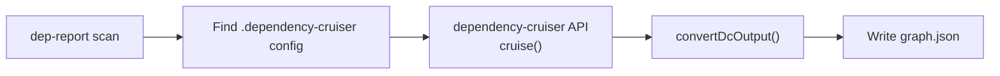
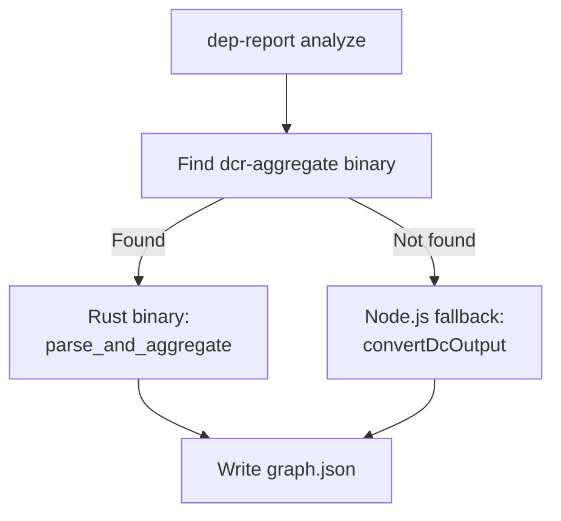
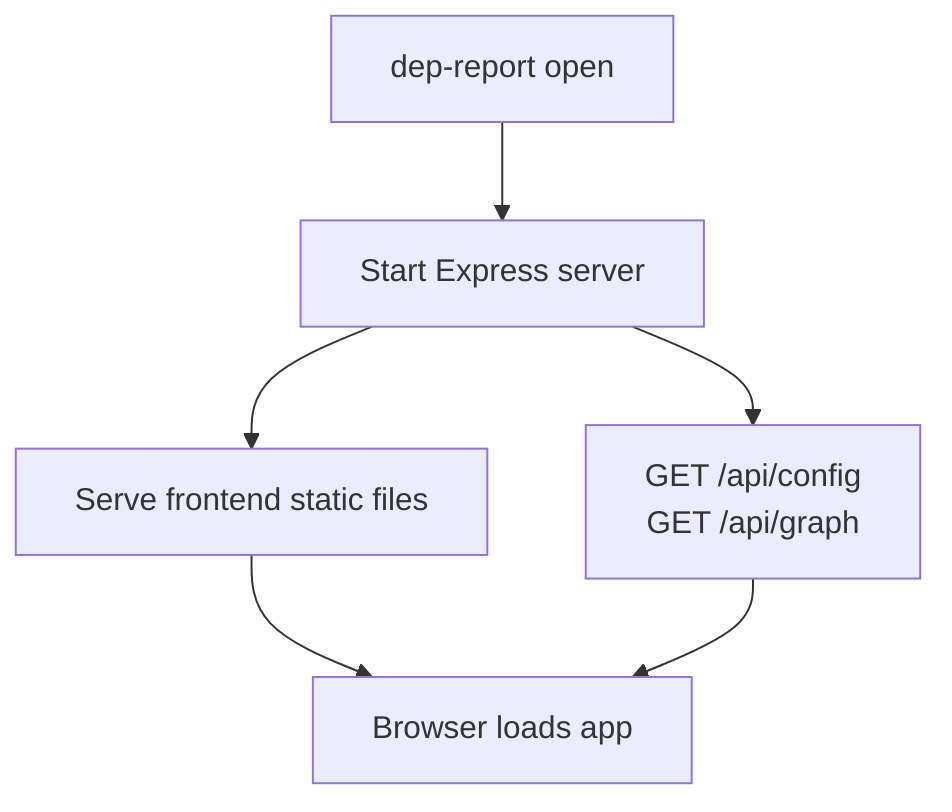
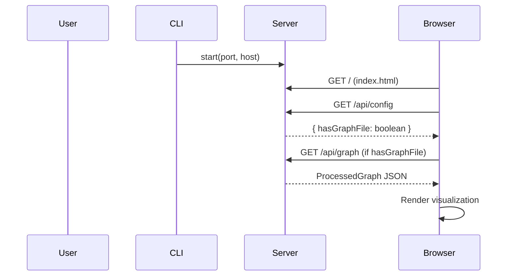

# CLI Package

## Overview

The `packages/cli` package provides the command-line interface for dependency-cruiser-reporter. It handles:

1. **`scan`** — Run dependency-cruiser on a project directory and generate graph
2. **`analyze`** — Process dependency-cruiser JSON output into aggregated graph
3. **`open`** — Start HTTP server to view results

Also exports a programmatic Express server via `createServer`.

## Package Structure

```
packages/cli/
├── bin/
│   └── cli.js           # CLI entry point (commander program)
├── src/
│   ├── commands/
│   │   ├── analyze.ts   # Analyze command (Rust binary + Node.js fallback)
│   │   ├── convert.ts   # Node.js dependency-cruiser JSON converter
│   │   ├── scan.ts      # Scan command (runs dependency-cruiser API)
│   │   └── open.ts      # Open command (starts HTTP server)
│   ├── server.ts        # Express HTTP server
│   └── index.ts         # Main exports
├── package.json
└── tsconfig.json
```

## Commands

### `dep-report scan`

Run dependency-cruiser on a project and generate a visualization-ready graph.



**Usage:**

```bash
dep-report scan --path <dir> [options]
```

**Options:**

| Flag | Default | Description |
|------|---------|-------------|
| `-p, --path <dir>` | (required) | Project directory to scan |
| `-o, --output <path>` | `<dirname>-graph.json` | Output graph JSON file |
| `-c, --config <path>` | auto-detect | dependency-cruiser config file |

The `scan` command auto-detects `.dependency-cruiser.json` or `.dependency-cruiser.js` in the scan directory or current working directory. It also detects `tsconfig.json` for TypeScript support.

**Example:**

```bash
# Scan current project
dep-report scan --path ./my-project

# Specify output and config
dep-report scan -p ./my-project -o output/graph.json -c .dependency-cruiser.json
```

---

### `dep-report analyze`

Process dependency-cruiser JSON and generate aggregated graph.



**Usage:**

```bash
dep-report analyze --input <path> [options]
```

**Options:**

| Flag | Default | Description |
|------|---------|-------------|
| `-i, --input <path>` | (required) | Input dependency-cruiser JSON file |
| `-o, --output <path>` | `graph.json` | Output graph JSON file |
| `-l, --level <level>` | auto | Aggregation level: `file` \| `directory` \| `package` \| `root` |
| `-m, --max-nodes <n>` | `5000` | Maximum nodes in output |

**Example:**

```bash
# Basic usage
dep-report analyze --input cruise.json

# Specify output and level
dep-report analyze -i cruise.json -o output/graph.json -l directory
```

---

### `dep-report open`

Start HTTP server to view processed graph.



**Usage:**

```bash
dep-report open [options]
```

**Options:**

| Flag | Default | Description |
|------|---------|-------------|
| `-f, --file <path>` | - | Pre-processed graph JSON to load |
| `-p, --port <port>` | `3000` | Server port |
| `--host <host>` | `localhost` | Server host |

**Example:**

```bash
# Open with pre-processed file
dep-report open --file graph.json

# Custom port
dep-report open -f graph.json -p 8080
```

## Node.js Converter (`convert.ts`)

When the Rust binary is unavailable, `convertDcOutput` provides a pure Node.js fallback:

```typescript
export function convertDcOutput(dcJson: string): ProcessedGraph
```

It parses dependency-cruiser JSON (with `DcModule`, `DcDependency` types), classifies edges (`local` | `npm` | `core` | `dynamic`), extracts violations, and determines the aggregation level based on node count thresholds.

Edge classification logic:

| Condition | Edge Type |
|-----------|-----------|
| `dep.coreModule === true` | `core` |
| `dep.couldNotResolve === true` | `dynamic` |
| `dep.dependencyTypes` includes `npm`/`npm-dev`/`npm-optional`/`npm-peer` | `npm` |
| Otherwise | `local` |

The `analyzeWithFallback` function (also in `convert.ts`) provides the same analyze flow as `analyze.ts` but with an alternative binary search path. Both `analyze.ts` and `convert.ts` contain `findDcrAggregateBinary()`.

## HTTP Server

The `open` command starts an Express server (`server.ts`) with these routes:



### API Endpoints

| Endpoint | Method | Description |
|----------|--------|-------------|
| `/` | GET | Serve frontend index.html (SPA) |
| `/api/config` | GET | Return `{ hasGraphFile: boolean }` |
| `/api/graph` | GET | Return graph JSON (if `--file` specified) |
| `/assets/*` | GET | Static assets (JS, CSS) |

### Programmatic API

```typescript
import { createServer } from '@dcr-reporter/cli';

const server = createServer({ port: 3000, host: 'localhost', graphFile: 'graph.json' });
await server.start();
server.stop();
```

## npm Package Configuration

```json
{
  "name": "@dcr-reporter/cli",
  "version": "0.1.0",
  "type": "module",
  "bin": {
    "dep-report": "./bin/cli.js"
  },
  "main": "dist/index.js",
  "types": "dist/index.d.ts",
  "dependencies": {
    "commander": "^12.0.0",
    "express": "^4.18.2",
    "dependency-cruiser": "^17.3.0",
    "@dcr-reporter/frontend": "workspace:*"
  },
  "engines": {
    "node": ">=18"
  }
}
```

## Integration with Rust Binary

The `analyze` command locates the `dcr-aggregate` binary by checking:

1. `packages/rust/target/release/dcr-aggregate[.exe]`
2. `packages/rust/target/debug/dcr-aggregate[.exe]`

Paths are resolved relative to the CLI dist directory. If the binary exists, it is spawned with the appropriate arguments. On failure, it falls back to the Node.js converter.

## Build Process

```bash
# Build Rust binary
cd packages/rust && cargo build --release

# Build frontend (served by open command)
cd packages/frontend && pnpm build

# Build CLI TypeScript
cd packages/cli && pnpm build
```
