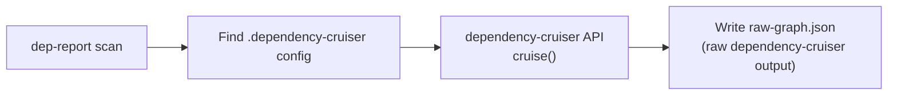
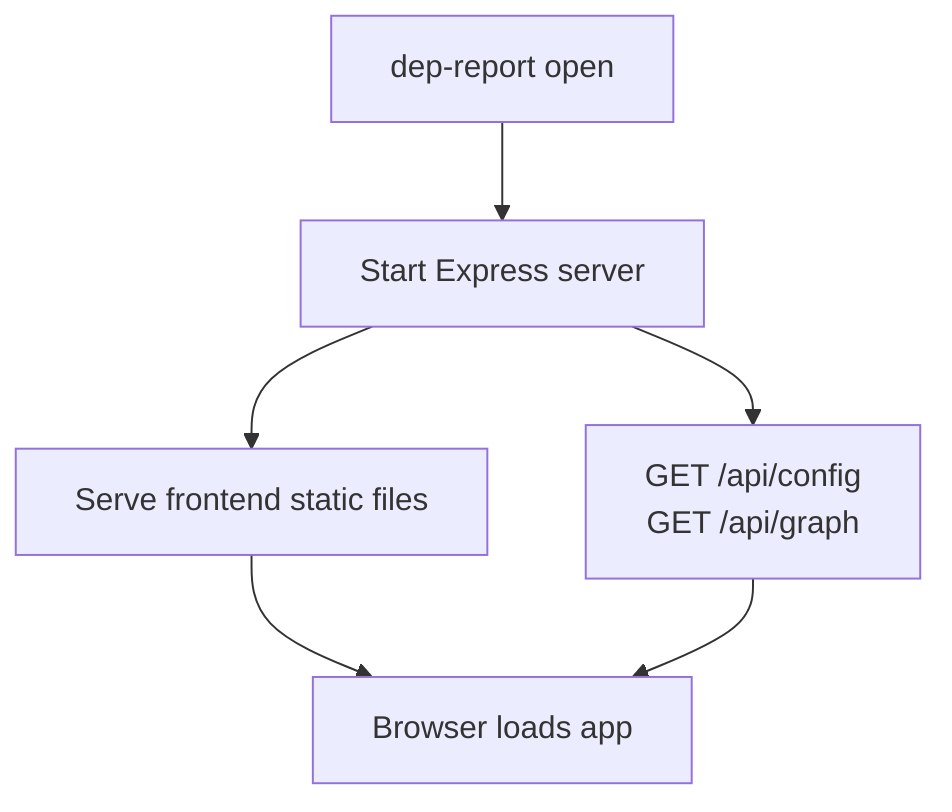
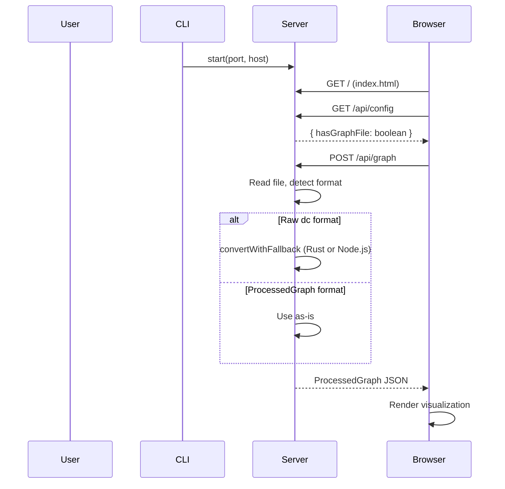

# CLI Package

## Overview

The `packages/cli` package provides the command-line interface for dependency-cruiser-reporter. It handles:

1. **`scan`** — Run dependency-cruiser on a project directory and save raw output
2. **`open`** — Start HTTP server to view results (aggregation happens on-demand)

Also exports a programmatic Express server via `createServer`.

## Package Structure

```
packages/cli/
├── scripts/
│   └── postbuild.js     # Post-build script for CLI
├── src/
│   ├── bin/
│   │   └── cli.ts       # CLI entry point (commander program)
│   ├── commands/
│   │   ├── index.ts     # Command exports
│   │   ├── scan.ts      # Scan command (runs dependency-cruiser API)
│   │   └── open.ts      # Open command (starts HTTP server)
│   ├── utils/
│   │   ├── convert.ts   # Node.js dependency-cruiser JSON converter
│   │   └── server.ts    # Express HTTP server
│   └── index.ts         # Main exports
├── package.json
└── tsconfig.json
```

## Commands

### `dep-report scan`

Run dependency-cruiser on a project and save raw output.


```mermaid
flowchart LR
    CLI["dep-report scan"] --> Find["Find .dependency-cruiser config"]
    Find --> DC["dependency-cruiser API\ncruise()"]
    DC --> Write["Write raw-graph.json\n(raw dependency-cruiser output)"]
```

**Usage:**

```bash
dep-report scan --path <dir> [options]
```

**Options:**

| Flag | Default | Description |
|------|---------|-------------|
| `-p, --path <dir>` | (required) | Project directory to scan |
| `-o, --output <path>` | `<dirname>-graph.json` | Output JSON file |
| `-c, --config <path>` | auto-detect | dependency-cruiser config file |

The `scan` command auto-detects `.dependency-cruiser.json` or `.dependency-cruiser.js` in the scan directory or current working directory. It also detects `tsconfig.json` for TypeScript support.

**Example:**

```bash
# Scan current project
dep-report scan --path ./my-project

# Specify output and config
dep-report scan -p ./my-project -o output/raw-graph.json -c .dependency-cruiser.json
```

> **Note:** The `scan` command saves raw dependency-cruiser output. Aggregation happens on-demand when the frontend requests `/api/graph`.

---

### `dep-report open`

Start HTTP server to view processed graph.


```mermaid
flowchart TB
    CLI["dep-report open"] --> Server["Start Express server"]
    Server --> Static["Serve frontend static files"]
    Server --> API["GET /api/config\nGET /api/graph"]
    Static --> Browser["Browser loads app"]
    API --> Browser
```

**Usage:**

```bash
dep-report open [options]
```

**Options:**

| Flag | Default | Description |
|------|---------|-------------|
| `-f, --file <path>` | - | Pre-processed graph JSON to load |
| `-p, --port <port>` | `3000` | Server port |
| `--host <host>` | `localhost` | Server host |

**Example:**

```bash
# Open with pre-processed file
dep-report open --file graph.json

# Custom port
dep-report open -f graph.json -p 8080
```

## Node.js Converter (`convert.ts`)

When the Rust binary is unavailable, `convertDcOutput` provides a pure Node.js fallback:

```typescript
export function convertDcOutput(dcJson: string): ProcessedGraph
```

It parses dependency-cruiser JSON (with `DcModule`, `DcDependency` types), classifies edges (`local` | `npm` | `core` | `dynamic`), extracts violations, and determines the aggregation level based on node count thresholds.

Edge classification logic:

| Condition | Edge Type |
|-----------|-----------|
| `dep.coreModule === true` | `core` |
| `dep.couldNotResolve === true` | `dynamic` |
| `dep.dependencyTypes` includes `npm`/`npm-dev`/`npm-optional`/`npm-peer` | `npm` |
| Otherwise | `local` |

The `analyzeWithFallback` function in `convert.ts` provides the flow used by `/api/graph`: find the Rust binary, spawn it, or fall back to Node.js processing.

## HTTP Server

The `open` command starts an Express server (`server.ts`) with these routes:


```mermaid
sequenceDiagram
    participant User
    participant CLI
    participant Server
    participant Browser

    CLI->>Server: start(port, host)
    Browser->>Server: GET / (index.html)
    Browser->>Server: GET /api/config
    Server-->>Browser: { hasGraphFile: boolean }
    Browser->>Server: POST /api/graph
    Server->>Server: Read file, detect format
    alt Raw dc format
        Server->>Server: convertWithFallback (Rust or Node.js)
    else ProcessedGraph format
        Server->>Server: Use as-is
    end
    Server-->>Browser: ProcessedGraph JSON
    Browser->>Browser: Render visualization
```

### API Endpoints

| Endpoint | Method | Description |
|----------|--------|-------------|
| `/` | GET | Serve frontend index.html (SPA) |
| `/api/config` | GET | Return `{ hasGraphFile: boolean }` |
| `/api/graph` | POST | Return graph JSON (supports `expanded_dirs` body) |
| `/assets/*` | GET | Static assets (JS, CSS) |

### `/api/graph` Endpoint

The graph endpoint accepts an optional JSON body:

```json
{
  "expandedDirs": ["src/components", "src/utils"]
}
```

This allows the frontend to request different expansion configurations without rescanning.

### Programmatic API

```typescript
import { createServer } from '@dcr-reporter/cli';

const server = createServer({ port: 3000, host: 'localhost', graphFile: 'graph.json' });
await server.start();
server.stop();
```

## npm Package Configuration

> See [packages/cli/package.json](../../packages/cli/package.json) for current package configuration.

## Integration with Rust Binary

The server's `/api/graph` endpoint uses `convertWithFallback`:

1. Search for `dcr-aggregate` binary in `packages/rust/target/release/` or `target/debug/`
2. If found, spawn the binary with appropriate arguments
3. If binary fails or is not found, fall back to `convertDcOutput` in Node.js

The Node.js fallback maintains feature parity for basic aggregation.

## Build Process

```bash
# Build Rust binary
cd packages/rust && cargo build --release

# Build frontend (served by open command)
cd packages/frontend && pnpm build

# Build CLI TypeScript
cd packages/cli && pnpm build
```
