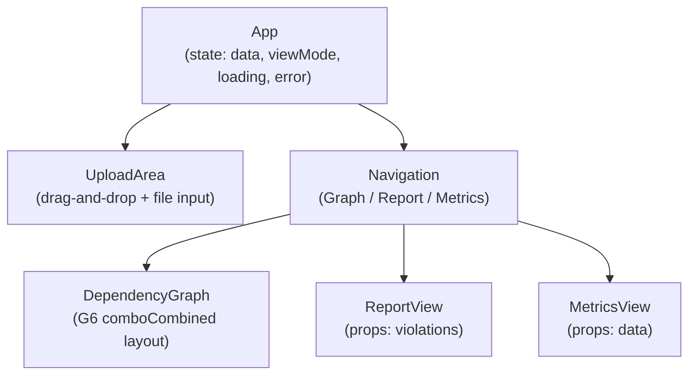
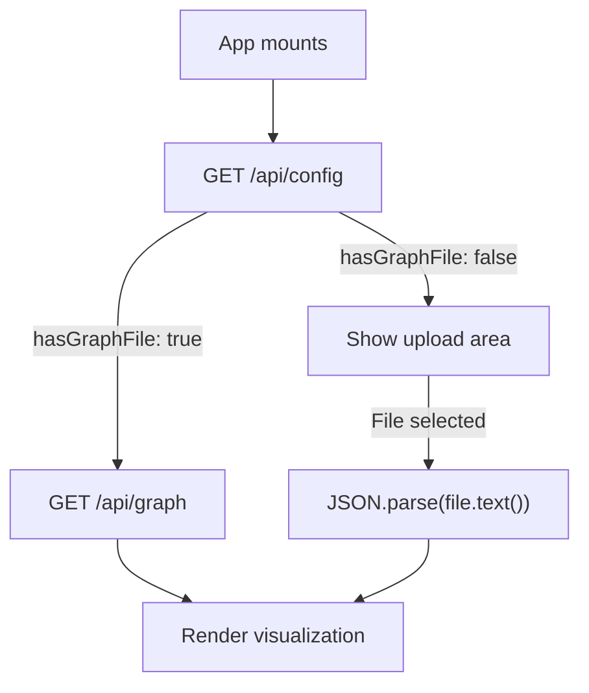
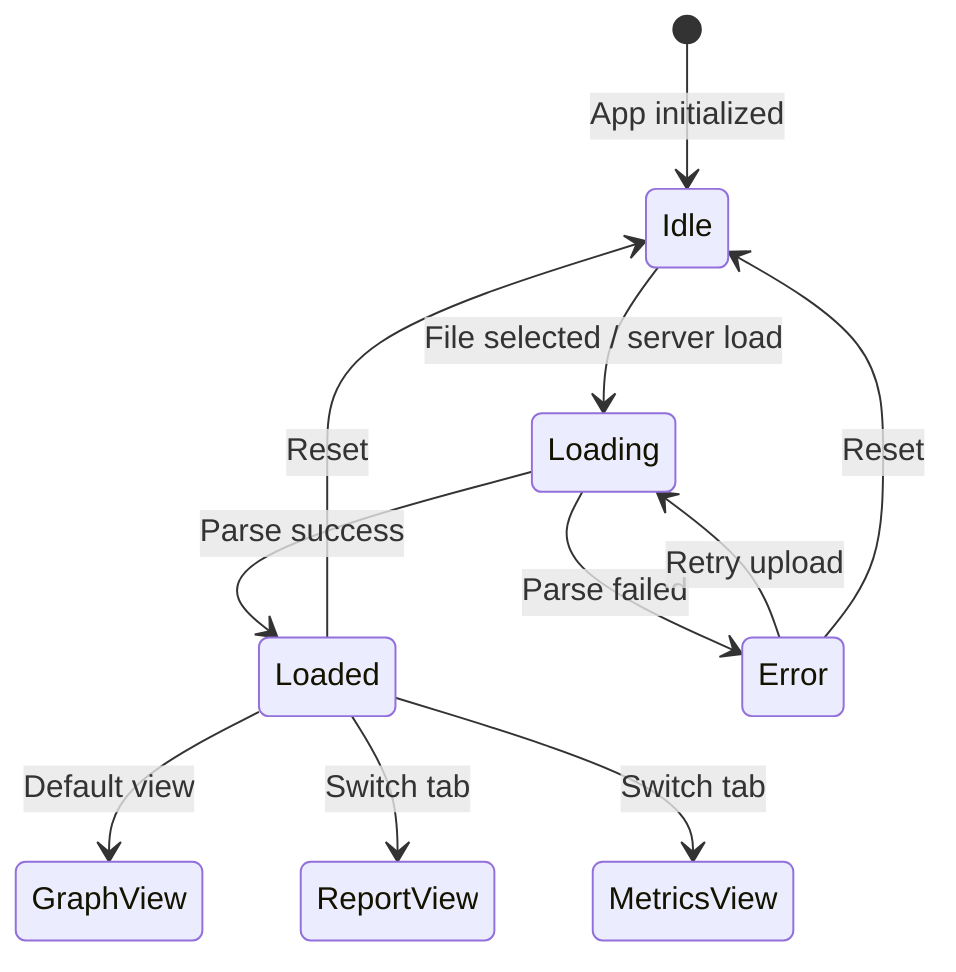

# Frontend Package

## Overview

The `packages/frontend` package provides the React-based visualization interface. It loads graph data from the server API or accepts uploaded JSON files.

## Package Structure

```
packages/frontend/
├── src/
│   ├── App.tsx           # Main application (upload + view switching)
│   ├── main.tsx          # React entry point
│   ├── types.ts          # TypeScript type definitions
│   └── components/
│       └── DependencyGraph.tsx  # G6 graph visualization component
├── index.html            # HTML template
├── vite.config.ts        # Vite configuration
├── tsconfig.json         # TypeScript config
├── biome.json            # Biome linting config
└── package.json
```

## Technology Stack

| Technology | Purpose |
|------------|---------|
| React 18 | UI framework |
| AntV G6 5 | Graph visualization (combo tree + force layout) |
| Vite 5 | Build tool |
| TypeScript 5 | Type safety |
| Biome | Linting/formatting |

## Component Architecture



The GraphView is now implemented as `DependencyGraph` component using AntV G6 v5 with `comboCombined` layout (directory nesting + force layout).

## Data Loading

The frontend supports two data loading paths:

1. **Server mode**: On mount, fetches `/api/config` to check if a graph file is available, then loads it via `/api/graph`
2. **File upload**: User drops or selects a `.json` file, which is parsed directly with `JSON.parse`



## State Management



Current implementation uses React `useState`. No external state management library.

| State | Type | Owner |
|-------|------|-------|
| `data` | `ProcessedGraph \| null` | App |
| `viewMode` | `'graph' \| 'report' \| 'metrics'` | App |
| `loading` | `boolean` | App |
| `error` | `string \| null` | App |

## Styling

Inline styles defined in `styles` object within `App.tsx`:

```tsx
const styles: Record<string, React.CSSProperties> = {
  container: { minHeight: '100vh', ... },
  header: { background: '#fff', ... },
  // ...
};
```

Color palette:

| Token | Hex | Usage |
|-------|-----|-------|
| Primary | `#4a90d9` | Nodes, links |
| Error | `#ef4444` | Errors |
| Warning | `#f59e0b` | Warnings |
| Info | `#3b82f6` | Info |
| Background | `#f8fafc` | Page background |

## npm Package Configuration

```json
{
  "name": "@dcr-reporter/frontend",
  "version": "0.1.0",
  "type": "module",
  "dependencies": {
    "@antv/g6": "^5.0.0",
    "react": "^18.3.1",
    "react-dom": "^18.3.1"
  },
  "devDependencies": {
    "@biomejs/biome": "^1.9.0",
    "@playwright/test": "^1.45.0",
    "@types/react": "^18.3.3",
    "@types/react-dom": "^18.3.0",
    "@vitejs/plugin-react": "^4.3.1",
    "dependency-cruiser": "^17.3.0",
    "typescript": "^5.5.0",
    "vite": "^5.4.0"
  },
  "engines": {
    "node": ">=18"
  }
}
```

## Commands

```bash
pnpm dev           # Start dev server (http://localhost:5173)
pnpm build         # Production build
pnpm lint          # Biome linting
```
