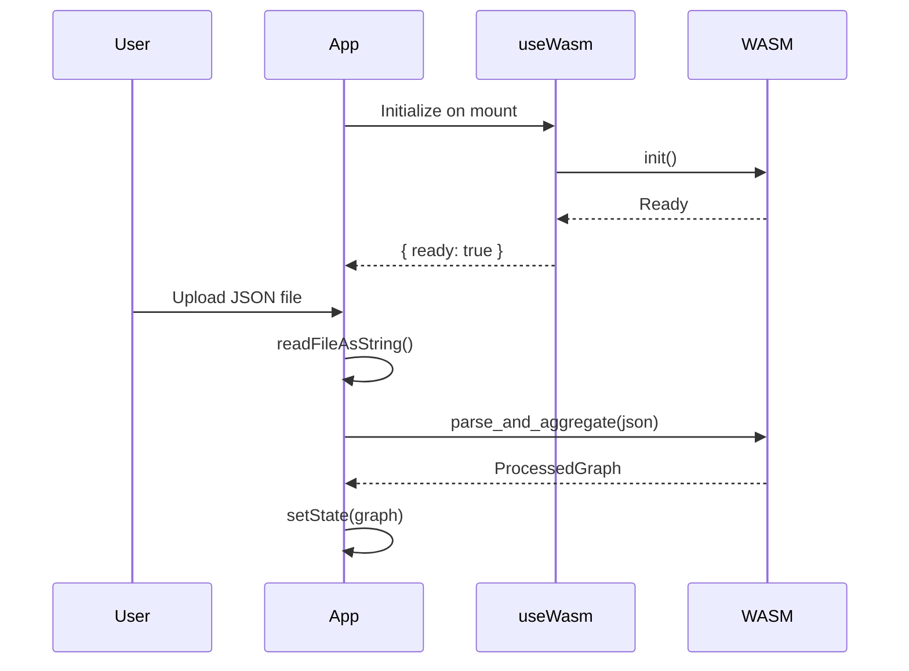
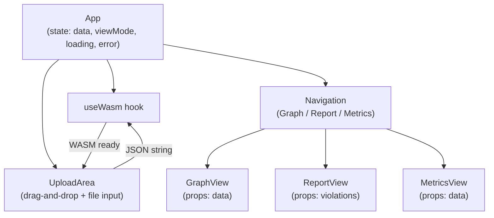

# Frontend Package

## Overview

The `packages/frontend` package provides the React-based visualization interface. It consumes the WASM module for browser-side processing.

## Package Structure

```
packages/frontend/
├── src/
│   ├── App.tsx           # Main application
│   ├── main.tsx          # React entry point
│   ├── types.ts          # TypeScript type definitions
│   ├── hooks/
│   │   └── useWasm.ts    # WASM initialization hook
│   └── components/
│       ├── GraphView.tsx
│       ├── ReportView.tsx
│       └── MetricsView.tsx
├── public/
│   └── wasm/             # WASM module (copied from packages/wasm)
├── e2e/
│   └── app.spec.ts       # Playwright tests
├── index.html
├── vite.config.ts
├── tsconfig.json
└── package.json
```

## Technology Stack

| Technology | Purpose |
|------------|---------|
| React 18 | UI framework |
| D3.js 7 | Graph visualization |
| Vite 5 | Build tool |
| TypeScript 5 | Type safety |
| wasm-pack | WASM integration |
| Biome | Linting/formatting |
| Playwright | E2E testing |

## WASM Integration

### Loading WASM

```typescript
// src/hooks/useWasm.ts
import { useState, useEffect } from 'react';
import init, { parse_and_aggregate } from '@dcr-reporter/wasm';

interface UseWasmResult {
  ready: boolean;
  error: Error | null;
  parse_and_aggregate: typeof parse_and_aggregate | null;
}

export function useWasm(): UseWasmResult {
  const [state, setState] = useState<UseWasmResult>({
    ready: false,
    error: null,
    parse_and_aggregate: null,
  });

  useEffect(() => {
    init()
      .then(() => {
        setState({ ready: true, error: null, parse_and_aggregate });
      })
      .catch((err) => {
        setState({ ready: false, error: err, parse_and_aggregate: null });
      });
  }, []);

  return state;
}
```

### File Upload Flow



## Component Architecture



## Vite Configuration

```typescript
// vite.config.ts
import { defineConfig } from 'vite';
import react from '@vitejs/plugin-react';

export default defineConfig({
  plugins: [react()],
  build: {
    target: 'esnext', // Required for top-level await in WASM
  },
  optimizeDeps: {
    exclude: ['@dcr-reporter/wasm'], // Exclude WASM from optimization
  },
});
```

## npm Package Configuration

```json
{
  "name": "@dcr-reporter/frontend",
  "version": "0.1.0",
  "main": "dist/index.js",
  "types": "dist/index.d.ts",
  "files": ["dist/", "public/wasm/"],
  "dependencies": {
    "@dcr-reporter/wasm": "workspace:*",
    "react": "^18.3.1",
    "react-dom": "^18.3.1",
    "d3": "^7.9.0"
  },
  "devDependencies": {
    "@vitejs/plugin-react": "^4.3.1",
    "typescript": "^5.5.0",
    "vite": "^5.4.0",
    "@playwright/test": "^1.45.0",
    "@biomejs/biome": "^1.9.0"
  }
}
```

## Commands

```bash
pnpm dev           # Start dev server
pnpm build         # Production build
pnpm typecheck     # TypeScript check
pnpm lint          # Biome linting
pnpm test:e2e      # Playwright tests
```

## Build Output

```
dist/
├── index.html
├── assets/
│   ├── index-[hash].js
│   └── index-[hash].css
└── wasm/
    ├── dcr_reporter.js
    ├── dcr_reporter.d.ts
    └── dcr_reporter_bg.wasm
```