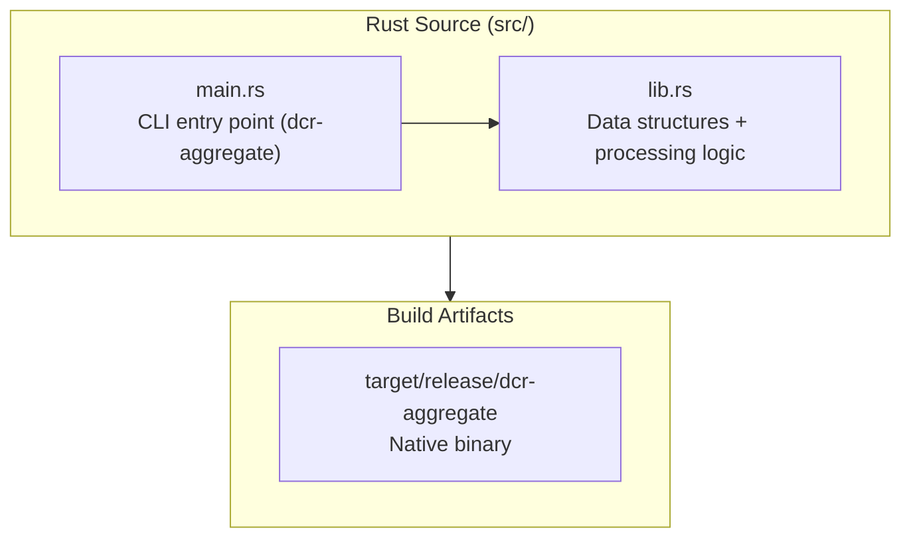
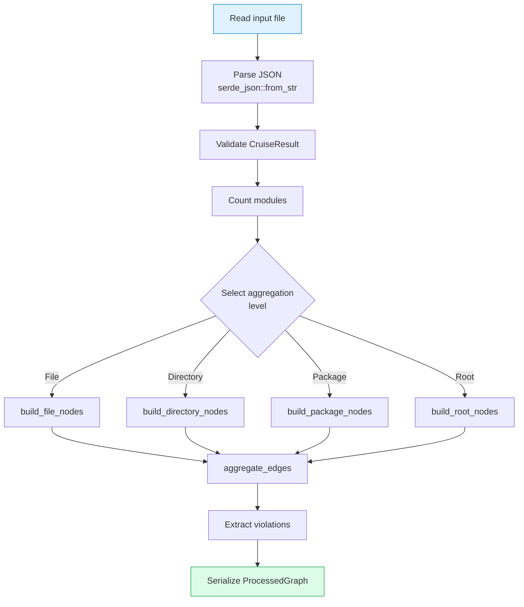

# Rust Package

## Overview

The `packages/rust` package provides the native Rust preprocessing engine. It compiles to a CLI binary (`dcr-aggregate`) called by the `dep-report analyze` command for high-performance JSON processing. When the Rust binary is unavailable, the CLI falls back to a Node.js converter.

## Package Structure

```
packages/rust/
├── Cargo.toml          # Rust configuration
├── src/
│   ├── lib.rs          # Core library (data structures + processing)
│   └── main.rs         # CLI entry point (dcr-aggregate binary)
```

## Architecture



## Library API (`lib.rs`)

### `parse_and_aggregate`

Main function that parses dependency-cruiser JSON and produces an aggregated graph:

```rust
pub fn parse_and_aggregate(
    input: &Path,
    max_nodes: usize,
    level: Option<AggregationLevel>,
    _layout: bool,
) -> Result<ProcessedGraph, DcrError>
```

**Parameters:**

| Param | Type | Description |
|-------|------|-------------|
| `input` | `&Path` | Path to dependency-cruiser JSON file |
| `max_nodes` | `usize` | Maximum nodes in output (default: 5000) |
| `level` | `Option<AggregationLevel>` | Aggregation level override |
| `_layout` | `bool` | Layout coordinate computation (reserved) |

**Returns:** `Result<ProcessedGraph, DcrError>`

### Error Handling

```rust
#[derive(Error, Debug)]
pub enum DcrError {
    #[error("Failed to read file: {0}")]
    IoError(#[from] std::io::Error),
    #[error("Failed to parse JSON: {0}")]
    JsonError(#[from] serde_json::Error),
    #[error("Invalid input: {0}")]
    InvalidInput(String),
}
```

## CLI Binary (`main.rs`)

### `dcr-aggregate`

```bash
dcr-aggregate --input <path> --output <path> [options]
```

**Options:**

| Flag | Default | Description |
|------|---------|-------------|
| `-i, --input <path>` | (required) | Input dependency-cruiser JSON file |
| `-o, --output <path>` | `graph.json` | Output graph JSON file |
| `-m, --max-nodes <n>` | `5000` | Maximum nodes in output |
| `-l, --level <level>` | auto | Aggregation level: `file` \| `directory` \| `package` \| `root` |
| `-L, --layout` | false | Calculate layout coordinates |

Built with [clap](https://docs.rs/clap) derive API.

## Cargo Configuration

```toml
[package]
name = "dcr-reporter"
version = "0.1.0"
edition = "2021"

[lib]
name = "dcr_reporter"
path = "src/lib.rs"

[[bin]]
name = "dcr-aggregate"
path = "src/main.rs"

[dependencies]
serde = { version = "1.0", features = ["derive"] }
serde_json = "1.0"
thiserror = "1.0"
clap = { version = "4.5", features = ["derive"] }

[profile.release]
opt-level = 3
lto = true
codegen-units = 1
```

| Crate | Purpose |
|-------|---------|
| `serde` + `serde_json` | JSON serialization/deserialization |
| `thiserror` | Error handling |
| `clap` | CLI argument parsing |

## Processing Flow



## Integration with CLI

The `dep-report analyze` command locates and invokes the `dcr-aggregate` binary:

1. Search `target/release/dcr-aggregate` then `target/debug/dcr-aggregate` relative to CLI dist
2. If found, spawn the binary with `--input`, `--output`, `--max-nodes`, `--level` arguments
3. If binary fails or is not found, fall back to Node.js `convertDcOutput` in `packages/cli/src/commands/convert.ts`

See [CLI Package](./cli.md) for details.

## Build Commands

```bash
# Debug build
cargo build

# Release build (optimized)
cargo build --release

# Run tests
cargo test

# Lint
cargo clippy

# Format check
cargo fmt --check
```

## Test Coverage

| Test | Purpose |
|------|---------|
| `test_aggregation_level_selection` | Verify threshold logic |
| `test_edge_type_detection` | Verify edge type classification |
| `test_package_name_extraction` | Verify npm package parsing |

Tests are defined inline in `lib.rs` under `#[cfg(test)] mod tests`.
