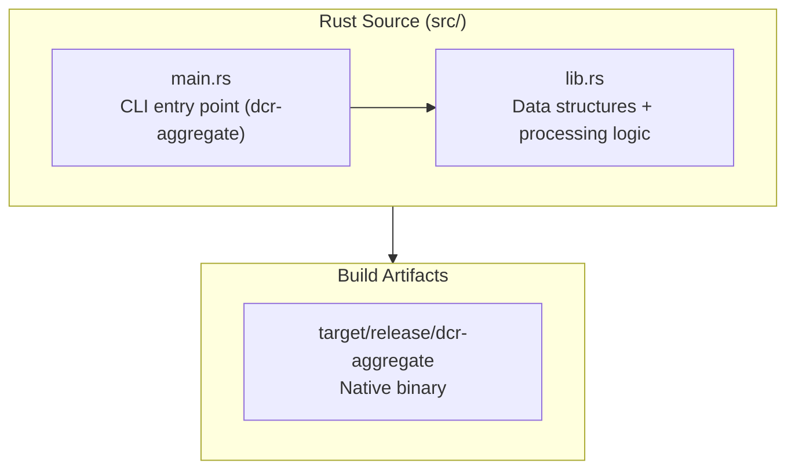
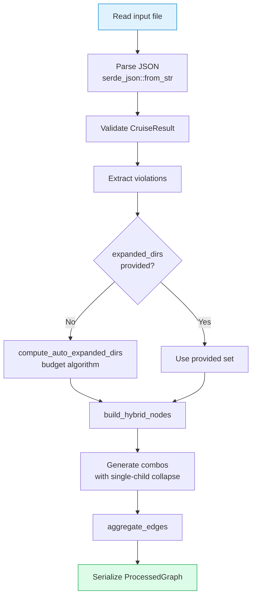

# Rust Package

## Overview

The `packages/rust` package provides the native Rust preprocessing engine. It compiles to a CLI binary (`dcr-aggregate`) called by the `dep-report analyze` command for high-performance JSON processing. When the Rust binary is unavailable, the CLI falls back to a Node.js converter.

## Package Structure

```
packages/rust/
├── Cargo.toml          # Rust configuration
├── src/
│   ├── lib.rs          # Library entry point
│   ├── lib_test.rs     # Unit tests
│   ├── types.rs        # Data structures
│   ├── main.rs         # CLI entry point (dcr-aggregate binary)
│   └── aggregate/      # Aggregation logic
│       ├── mod.rs      # Module exports
│       ├── edges.rs    # Edge processing
│       ├── expand.rs   # Auto-expand algorithm
│       └── hybrid.rs   # Hybrid node building
```

## Architecture


```mermaid
flowchart TB
    subgraph Rust["Rust Source (src/)"]
        Lib["lib.rs\nData structures + processing logic"]
        Main["main.rs\nCLI entry point (dcr-aggregate)"]

        Main --> Lib
    end

    subgraph Output["Build Artifacts"]
        Binary["target/release/dcr-aggregate\nNative binary"]
    end

    Rust --> Output
```

## Library API (`lib.rs`)

### `parse_and_aggregate`

Main function that parses dependency-cruiser JSON and produces an aggregated graph:

```rust
pub fn parse_and_aggregate(
    input: &Path,
    max_nodes: usize,
    expanded_dirs: Option<Vec<String>>,
) -> Result<ProcessedGraph, DcrError>
```

**Parameters:**

| Param | Type | Description |
|-------|------|-------------|
| `input` | `&Path` | Path to dependency-cruiser JSON file |
| `max_nodes` | `usize` | Maximum edges in output (default: 5000) |
| `expanded_dirs` | `Option<Vec<String>>` | Directories to expand; `None` triggers auto-computation |

**Returns:** `Result<ProcessedGraph, DcrError>`

When `expanded_dirs` is `None`, the function calls `compute_auto_expanded_dirs` to determine which directories should show file-level nodes versus collapsed directory nodes. This uses a budget algorithm targeting ~200 nodes.

### Error Handling

`DcrError` has three variants:
- **IoError** — file I/O failures (auto-converted from `std::io::Error`)
- **JsonError** — JSON parse failures (auto-converted from `serde_json::Error`)
- **InvalidInput** — malformed input data (with descriptive message)

## CLI Binary (`main.rs`)

### `dcr-aggregate`

```bash
dcr-aggregate --input <path> --output <path> [options]
```

**Options:**

| Flag | Default | Description |
|------|---------|-------------|
| `-i, --input <path>` | (required) | Input dependency-cruiser JSON file |
| `-o, --output <path>` | `graph.json` | Output graph JSON file |
| `-m, --max-nodes <n>` | `5000` | Maximum edges in output |

Built with [clap](https://docs.rs/clap) derive API.

## Cargo Configuration

> See [packages/rust/Cargo.toml](../../packages/rust/Cargo.toml) for current crate configuration.

| Crate | Purpose |
|-------|---------|
| `serde` + `serde_json` | JSON serialization/deserialization |
| `thiserror` | Error handling |
| `clap` | CLI argument parsing |

## Processing Flow


```mermaid
flowchart TB
    Input[Read input file] --> Parse[Parse JSON\nserde_json::from_str]
    Parse --> Validate[Validate CruiseResult]
    Validate --> Violations[Extract violations]
    Violations --> ComputeExpanded{expanded_dirs\nprovided?}
    ComputeExpanded -->|No| AutoExpand[compute_auto_expanded_dirs\nbudget algorithm]
    ComputeExpanded -->|Yes| UseProvided[Use provided set]
    AutoExpand --> BuildHybrid[build_hybrid_nodes]
    UseProvided --> BuildHybrid

    BuildHybrid --> Combos[Generate combos\nwith single-child collapse]
    Combos --> EdgeProc[aggregate_edges]
    EdgeProc --> Output[Serialize ProcessedGraph]

    style Input fill:#e0f2fe,stroke:#0284c7
    style Output fill:#dcfce7,stroke:#16a34a
```

The hybrid aggregation approach supports mixing expanded directories (showing files) and collapsed directories (showing as single nodes) in the same graph.

## Integration with CLI

The `dep-report analyze` command invokes the Rust binary for aggregation:

1. The server's `/api/graph` endpoint calls `convertWithFallback`
2. If Rust binary available, spawn with `--input`, `--output`, `--max-nodes`
3. If binary unavailable or fails, fall back to Node.js `convertDcOutput`

See [CLI Package](./cli.md) for details.

## Build Commands

```bash
# Debug build
cargo build

# Release build (optimized)
cargo build --release

# Run tests
cargo test

# Lint
cargo clippy

# Format check
cargo fmt --check
```

## Test Coverage

| Test | Purpose |
|------|---------|
| `test_aggregation_level_selection` | Verify level determination from expanded_set |
| `test_edge_type_detection` | Verify edge type classification |
| `test_violation_counts` | Verify violation counting |
| `test_edge_aggregation` | Verify edge weight aggregation |

Tests are defined in `lib_test.rs`.
