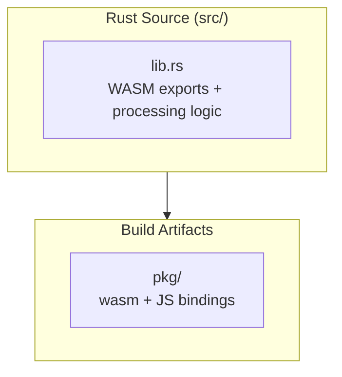
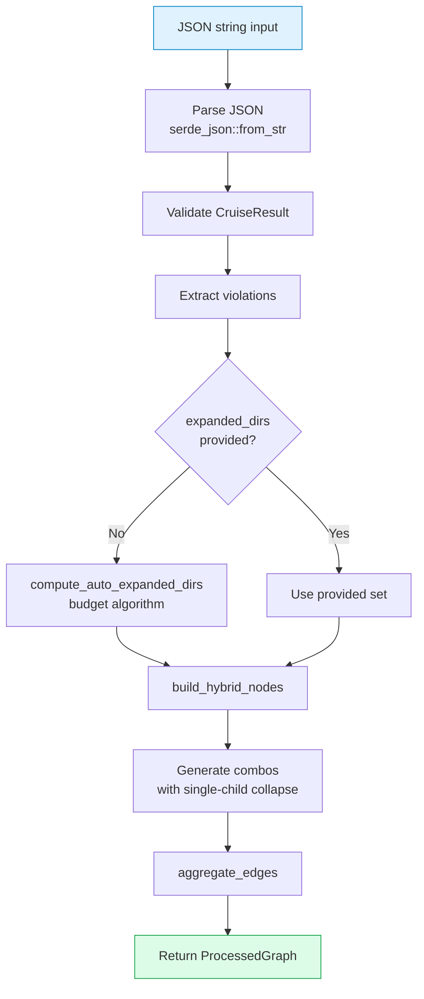

# Rust Package

## Overview

The `packages/rust` package provides the WASM preprocessing engine. It compiles to a WebAssembly module loaded by the CLI for high-performance JSON processing. When the WASM module is unavailable, the CLI falls back to a Node.js converter.

## Package Structure

```
packages/rust/
├── Cargo.toml          # Rust configuration
├── src/
│   ├── lib.rs          # Library entry point, WASM exports
│   ├── lib_test.rs     # Unit tests
│   ├── types.rs        # Data structures
│   └── aggregate/      # Aggregation logic
│       ├── mod.rs      # Module exports
│       ├── edges.rs    # Edge processing
│       ├── expand.rs   # Auto-expand algorithm
│       └── hybrid.rs   # Hybrid node building
│       └── violations.rs # Violation parsing
└── pkg/                # Built WASM output (via wasm-pack)
```

## Architecture


```mermaid
flowchart TB
    subgraph Rust["Rust Source (src/)"]
        Lib["lib.rs\nWASM exports + processing logic"]
    end

    subgraph Output["Build Artifacts"]
        WASM["pkg/\nwasm + JS bindings"]
    end

    Rust --> Output
```

## Library API (`lib.rs`)

### `wasm_aggregate`

WASM entry point called from JavaScript:

```rust
#[wasm_bindgen(js_name = aggregate)]
pub fn wasm_aggregate(
    content: &str,
    max_nodes: usize,
    expanded_dirs: Option<Array>,
) -> Result<JsValue, JsValue>
```

**Parameters:**

| Param | Type | Description |
|-------|------|-------------|
| `content` | `&str` | dependency-cruiser JSON string |
| `max_nodes` | `usize` | Maximum edges in output |
| `expanded_dirs` | `Option<Array>` | JS array of directory paths to expand |

**Returns:** `Result<JsValue, JsValue>` — ProcessedGraph as a JS object, or error string

### `aggregate_from_str`

Core aggregation logic (public, for testing and reuse):

```rust
pub fn aggregate_from_str(
    content: &str,
    max_nodes: usize,
    expanded_dirs: Option<Vec<String>>,
) -> Result<ProcessedGraph, DcrError>
```

**Parameters:**

| Param | Type | Description |
|-------|------|-------------|
| `content` | `&str` | dependency-cruiser JSON string |
| `max_nodes` | `usize` | Maximum edges in output |
| `expanded_dirs` | `Option<Vec<String>>` | Directories to expand; `None` triggers auto-computation |

**Returns:** `Result<ProcessedGraph, DcrError>`

When `expanded_dirs` is `None`, the function calls `compute_auto_expanded_dirs` to determine which directories should show file-level nodes versus collapsed directory nodes. This uses a budget algorithm targeting ~200 nodes.

### Error Handling

`DcrError` has three variants:
- **IoError** — file I/O failures (for compatibility)
- **JsonError** — JSON parse failures (auto-converted from `serde_json::Error`)
- **InvalidInput** — malformed input data (with descriptive message)

## Cargo Configuration

> See [packages/rust/Cargo.toml](../../packages/rust/Cargo.toml) for current crate configuration.

| Crate | Purpose |
|-------|---------|
| `serde` + `serde_json` | JSON serialization/deserialization |
| `thiserror` | Error handling |
| `wasm-bindgen` | JavaScript/WASM interop |
| `serde-wasm-bindgen` | Serde integration for WASM |
| `js-sys` | JavaScript standard library bindings |
| `wasm-bindgen-test` | WASM test framework (optional, `wasm-test` feature) |

**Features:**

| Feature | Description |
|---------|-------------|
| `wasm-test` | Enable WASM-specific tests (`wasm-bindgen-test`) |

## Processing Flow


```mermaid
flowchart TB
    Input[JSON string input] --> Parse[Parse JSON\nserde_json::from_str]
    Parse --> Validate[Validate CruiseResult]
    Validate --> Violations[Extract violations]
    Violations --> ComputeExpanded{expanded_dirs\nprovided?}
    ComputeExpanded -->|No| AutoExpand[compute_auto_expanded_dirs\nbudget algorithm]
    ComputeExpanded -->|Yes| UseProvided[Use provided set]
    AutoExpand --> BuildHybrid[build_hybrid_nodes]
    UseProvided --> BuildHybrid

    BuildHybrid --> Combos[Generate combos\nwith single-child collapse]
    Combos --> EdgeProc[aggregate_edges]
    EdgeProc --> Output[Return ProcessedGraph]

    style Input fill:#e0f2fe,stroke:#0284c7
    style Output fill:#dcfce7,stroke:#16a34a
```

The hybrid aggregation approach supports mixing expanded directories (showing files) and collapsed directories (showing as single nodes) in the same graph.

## Integration with CLI

The `dep-report open` command uses the WASM module for aggregation:

1. The server's `/api/graph` endpoint calls `convertWithFallback`
2. If WASM module available, calls `wasm_aggregate` via JS bindings
3. If WASM unavailable or fails, falls back to Node.js `convertDcOutput`

See [CLI Package](./cli.md) for details.

## Build Commands

```bash
# Build WASM module (via wasm-pack)
pnpm build:rust

# Debug build
cargo build

# Run tests (native)
cargo test

# Run WASM tests
wasm-pack test --node

# Lint
cargo clippy

# Format check
cargo fmt --check
```

## Test Coverage

| Test | Purpose |
|------|---------|
| `test_aggregate_from_str_*` | Verify JSON parsing and aggregation |
| `test_wasm_aggregate_*` | Verify WASM bindings (wasm32 target only) |
| `test_edge_type_detection` | Verify edge type classification |
| `test_smart_expansion_*` | Verify auto-expand budget algorithm |
| `test_is_path_expanded` | Verify path expansion checks |
| `test_real_world_scale` | Verify budget with 3000+ modules |
| `test_relative_path_with_single_top_level_dir` | Verify relative path handling |

Tests are defined in `lib_test.rs`.