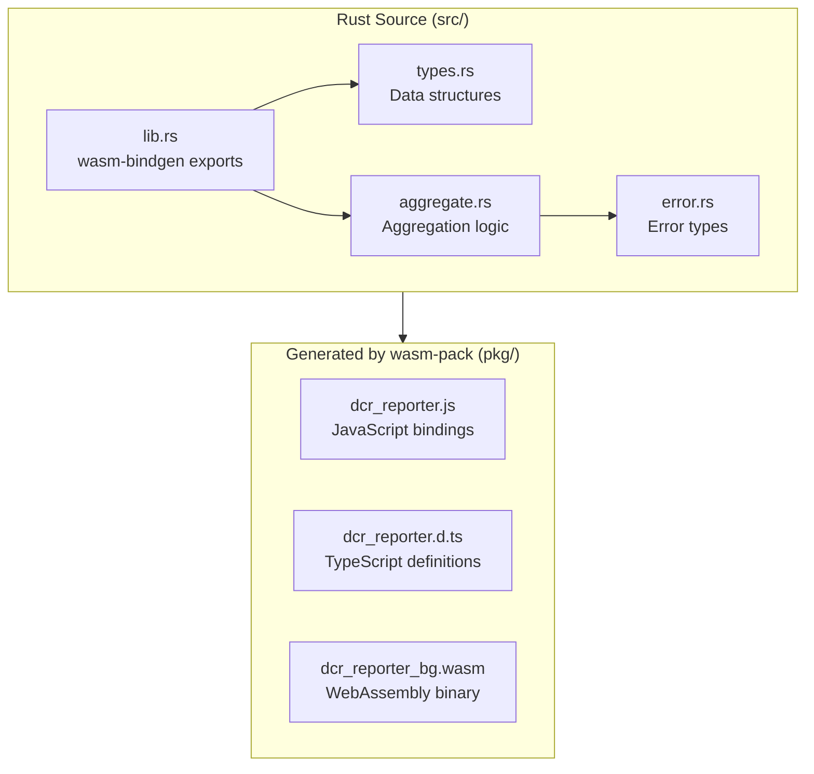

# WASM Package

## Overview

The `packages/wasm` package contains the Rust preprocessing engine compiled to WebAssembly. It runs directly in the browser or Node.js, providing high-performance JSON processing without a separate binary.

## Package Structure

```
packages/wasm/
├── Cargo.toml          # Rust configuration
├── src/
│   ├── lib.rs          # Core library with wasm-bindgen exports
│   ├── types.rs        # Data structures
│   ├── aggregate.rs    # Aggregation logic
│   └── error.rs        # Error handling
├── pkg/                # Generated by wasm-pack
│   ├── dcr_reporter.js
│   ├── dcr_reporter.d.ts
│   └── dcr_reporter_bg.wasm
└── tests/
    └── web.rs          # WASM tests
```

## Architecture



## WASM Exports

### `parse_and_aggregate`

Main function exposed to JavaScript:

```rust
#[wasm_bindgen]
pub fn parse_and_aggregate(
    json_input: String,
    max_nodes: usize,
    level: Option<String>,
) -> Result<JsValue, JsValue>
```

**Parameters:**

| Param | Type | Description |
|-------|------|-------------|
| `json_input` | `String` | dependency-cruiser JSON content |
| `max_nodes` | `usize` | Maximum nodes in output (default: 5000) |
| `level` | `Option<String>` | Aggregation level override |

**Returns:** `JsValue` containing serialized `ProcessedGraph`

### Usage in JavaScript

```typescript
import init, { parse_and_aggregate } from '@dcr-reporter/wasm';

// Initialize WASM module
await init();

// Process dependency-cruiser JSON
const cruiseJson = await readFile('cruise.json', 'utf-8');
const result = parse_and_aggregate(cruiseJson, 5000, null);

// Result is ProcessedGraph
const graph: ProcessedGraph = JSON.parse(result);
```

## Cargo Configuration

```toml
[package]
name = "dcr-reporter"
version = "0.1.0"
edition = "2021"

[lib]
crate-type = ["cdylib", "rlib"]  # cdylib for WASM, rlib for tests

[dependencies]
wasm-bindgen = "0.2"
serde = { version = "1.0", features = ["derive"] }
serde_json = "1.0"
serde-wasm-bindgen = "0.6"
thiserror = "1.0"

[dev-dependencies]
wasm-bindgen-test = "0.3"

[profile.release]
opt-level = 3
lto = true
```

## Conditional Compilation

The library supports both native and WASM targets:

```rust
// Native (CLI) - reads from file
#[cfg(not(target_arch = "wasm32"))]
pub fn parse_and_aggregate(input: &Path, ...) -> Result<ProcessedGraph, DcrError> {
    let content = std::fs::read_to_string(input)?;
    parse_and_aggregate_from_str(&content, ...)
}

// WASM - accepts JSON string
#[cfg(target_arch = "wasm32")]
#[wasm_bindgen]
pub fn parse_and_aggregate(json_input: String, ...) -> Result<JsValue, JsValue> {
    parse_and_aggregate_from_str(&json_input, ...)
        .map(|g| serde_wasm_bindgen::to_value(&g).unwrap())
        .map_err(|e| JsValue::from_str(&e.to_string()))
}
```

## Build Commands

```bash
# Build for bundler (Vite)
wasm-pack build --target bundler --out-dir ../cli/pkg

# Build for web (no bundler)
wasm-pack build --target web --out-dir ../frontend/public/wasm

# Run tests
wasm-pack test --headless --firefox
```

## TypeScript Bindings

wasm-pack generates TypeScript definitions at `pkg/dcr_reporter.d.ts`:

```typescript
/* tslint:disable */
export function parse_and_aggregate(
  json_input: string,
  max_nodes: number,
  level: string | null
): any;

export default function init(
  module_or_path?: InitInput | Promise<InitInput>
): Promise<void>;
```

## Performance

| Operation | Native (ms) | WASM (ms) |
|-----------|-------------|-----------|
| Parse 1k nodes | 5 | 8 |
| Parse 10k nodes | 50 | 65 |
| Parse 100k nodes | 800 | 950 |
| Aggregation | 10 | 15 |

WASM performance is within 20% of native execution.