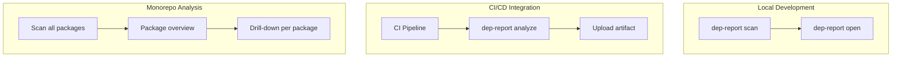
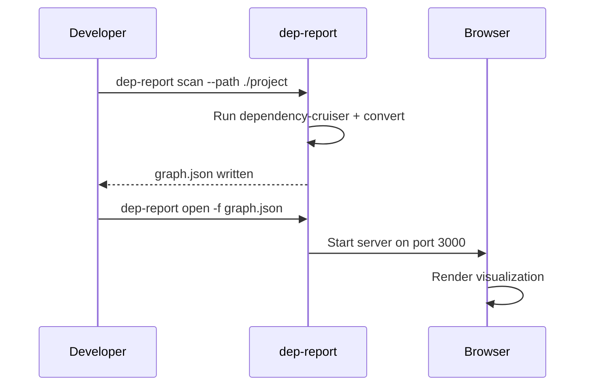
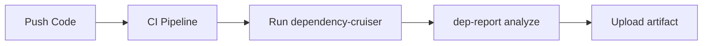
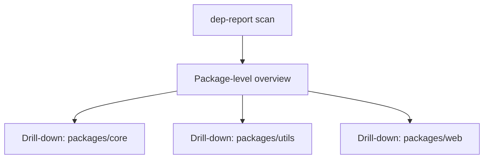

# Usage Scenarios

## Scenario Overview



---

## Scenario A: Quick Local Scan

The simplest workflow — scan and view in two commands.



```bash
# 1. Scan the project
dep-report scan --path ./my-project

# 2. Open the result
dep-report open -f my-project-graph.json
```

---

## Scenario B: CI/CD Integration

Generate reports in CI pipeline for artifact storage.



```bash
# In CI (GitHub Actions example)
steps:
  - name: Install dependencies
    run: npm ci

  - name: Run dependency-cruiser
    run: npx dependency-cruiser --output-type json src/ > cruise.json

  - name: Generate report
    run: dep-report analyze -i cruise.json -o graph.json

  - name: Upload artifact
    uses: actions/upload-artifact@v4
    with:
      name: dependency-report
      path: graph.json
```

Or use the `scan` command directly:

```bash
- name: Scan and generate report
  run: dep-report scan -p ./src -o graph.json
```

---

## Scenario C: Monorepo Analysis

Analyze multiple packages in a monorepo.



```bash
# Scan entire monorepo (auto-selects package-level aggregation for large repos)
dep-report scan --path ./packages -o overview-graph.json
dep-report open -f overview-graph.json

# Drill-down on a specific package
dep-report scan --path ./packages/core -o core-graph.json
dep-report open -f core-graph.json
```

Or use `analyze` with explicit level:

```bash
# Generate overview with package-level aggregation
npx dependency-cruiser --output-type json packages/ > cruise.json
dep-report analyze -i cruise.json -l package -o overview.json

# Drill-down on specific package
npx dependency-cruiser --output-type json packages/core/ > core.json
dep-report analyze -i core.json -l directory -o core-detail.json
```

---

## Scenario D: Pre-commit Hook

Block commits with new violations.

```bash
# .husky/pre-commit
#!/bin/sh

# Scan for violations
dep-report scan -p ./src -o .tmp/graph.json

# Check if the scan succeeded
if [ $? -ne 0 ]; then
  echo "dependency-cruiser scan failed"
  exit 1
fi
```

---

## Common Workflows

| Role | Workflow |
|------|----------|
| Developer | `dep-report scan` + `dep-report open` before commit |
| Tech Lead | Review architecture compliance in PR reviews |
| DevOps | CI/CD pipeline with `dep-report analyze` + artifact upload |
| Architect | Generate package-level overview for documentation |

---

## Tips

1. **Start with scan**: Use `dep-report scan` for the simplest workflow
2. **Focus on errors**: Check Report view for `error` severity violations
3. **Use explicit levels**: Override aggregation level with `-l` for specific views
4. **Integrate early**: Add to CI before issues accumulate
