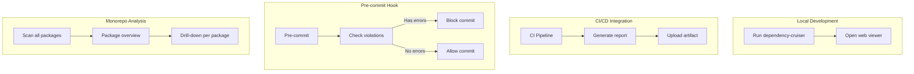
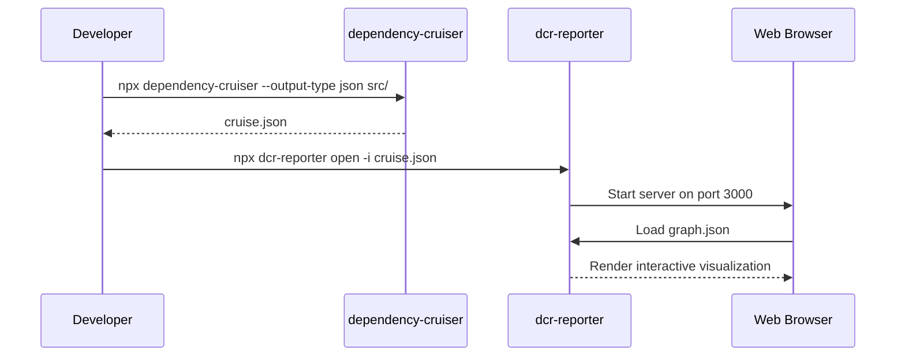
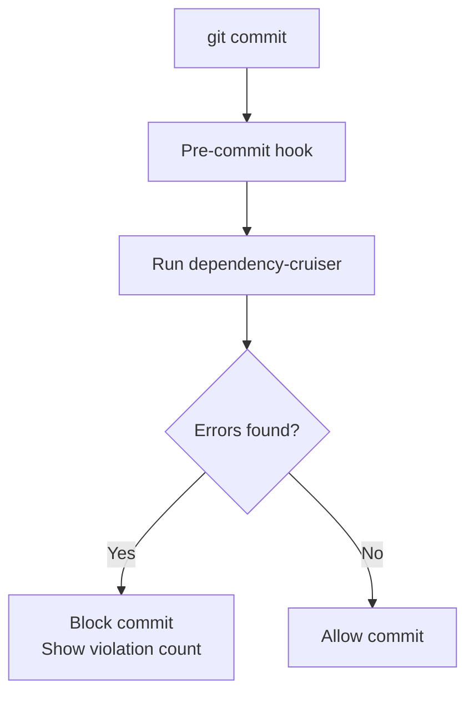
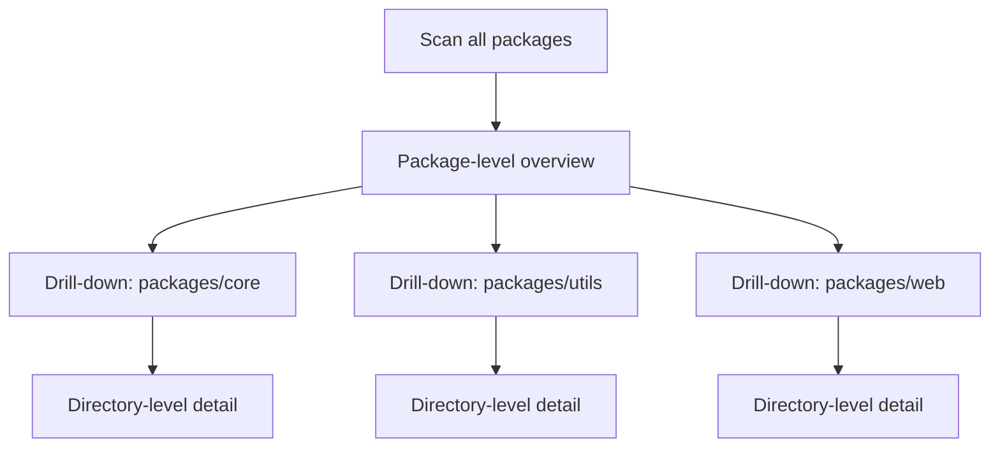
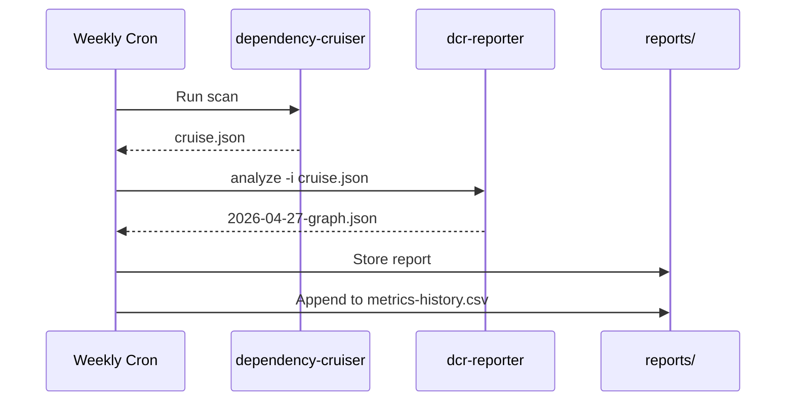

# Usage Scenarios

## Scenario Overview



---

## Scenario A: Local Development

Quick visualization during development.



```bash
# 1. Run dependency-cruiser on your project
npx dependency-cruiser --output-type json src/ > cruise.json

# 2. Open the web viewer
npx dcr-reporter open -i cruise.json
```

**Use Case:**

- Check for circular dependencies
- Identify unused dependencies
- Verify architecture constraints

---

## Scenario B: CI/CD Integration

Generate reports in CI pipeline for artifact storage.

```mermaid
flowchart LR
    Code[Push Code] --> CI[CI Pipeline]
    CI --> DC[Run dependency-cruiser]
    DC --> Report[Generate report]
    Report --> Upload[Upload artifact]
    Upload --> Deploy[Deploy to hosting\n(optional)]
```

```bash
# In CI (GitHub Actions example)
steps:
  - name: Install dependencies
    run: npm ci

  - name: Run dependency-cruiser
    run: npx dependency-cruiser --output-type json src/ > cruise.json

  - name: Generate report
    run: npx dcr-reporter analyze -i cruise.json -o graph.json

  - name: Upload artifact
    uses: actions/upload-artifact@v4
    with:
      name: dependency-report
      path: graph.json
```

**Optional: Deploy to static hosting**

```bash
# After generating graph.json
npx dcr-reporter build -f graph.json -o dist/
npx surge dist/ https://my-project-deps.surge.sh
```

---

## Scenario C: Pre-commit Hook

Block commits with new violations.



```bash
# .husky/pre-commit
#!/bin/sh

# Run dependency-cruiser
npx dependency-cruiser --output-type json src/ > .tmp/cruise.json

# Check for errors
ERROR_COUNT=$(npx dcr-reporter analyze -i .tmp/cruise.json --format count-errors)

if [ "$ERROR_COUNT" -gt 0 ]; then
  echo "Found $ERROR_COUNT dependency violations"
  echo "Run 'npx dcr-reporter open -i .tmp/cruise.json' to view details"
  exit 1
fi
```

---

## Scenario D: Monorepo Analysis

Analyze multiple packages in a monorepo.



```bash
# Project structure
# packages/
#   ├── core/
#   ├── utils/
#   └── web/

# Analyze all packages
npx dependency-cruiser --output-type json packages/ > cruise.json

# Force package-level aggregation for overview
npx dcr-reporter analyze -i cruise.json -l package -o overview.json

# Drill-down on specific package
npx dependency-cruiser --output-type json packages/core/ > core.json
npx dcr-reporter analyze -i core.json -l directory -o core-detail.json
```

---

## Scenario E: Historical Comparison

Track dependency health over time.



```bash
# Weekly cron job
DATE=$(date +%Y-%m-%d)
npx dependency-cruiser --output-type json src/ > reports/$DATE-cruise.json
npx dcr-reporter analyze -i reports/$DATE-cruise.json -o reports/$DATE-graph.json

# Store metrics
npx dcr-reporter metrics -i reports/$DATE-graph.json >> metrics-history.csv
```

---

## Scenario F: Architecture Documentation

Generate diagrams for documentation.

```bash
# High-level overview for README
npx dcr-reporter analyze -i cruise.json -l package -L -o docs/architecture.json

# Include in documentation
npx dcr-reporter render -i docs/architecture.json -o docs/architecture.svg
```

(Note: SVG export is a planned feature)

---

## Common Workflows

| Role | Workflow |
|------|----------|
| Developer | Run before commit, check for violations |
| Tech Lead | Review architecture compliance in PR reviews |
| DevOps | CI/CD pipeline with artifact upload |
| Architect | Generate documentation diagrams |

---

## Tips

1. **Start with overview**: Use `package` level first, then drill down
2. **Focus on errors**: Check Report view for `error` severity violations
3. **Track trends**: Save reports over time for comparison
4. **Integrate early**: Add to CI before issues accumulate